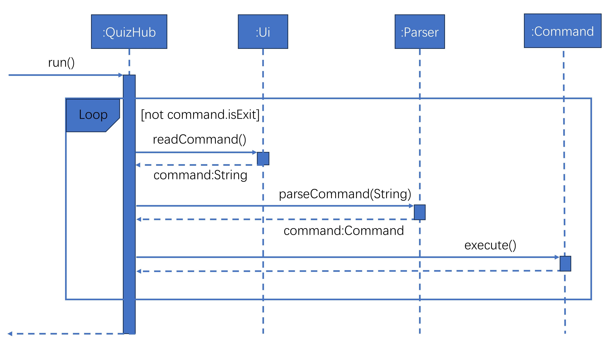

# Developer Guide

## Table of Contents
* [Acknowledgements](#acknowledgements)
* [Design and Implementation](#design--implementation)
  * [Application Lifecycle](#application-lifecycle)
* [Product Scope](#product-scope)
* [Non Functional Requirements](#non-functional-requirements)
* [Glossary](#glossary)
* [Instructions for Manual Testing](#instructions-for-manual-testing)

## Acknowledgements

1. For the main structure of the program, we have adapted the project structure
from the Individual Project of Man JunCheng at [Link](https://github.com/spinoandraptos/ip/tree/master) </li>
2. For JUnit testing, we hava adapted the testing codes from the AddressBook level-2
codes at [Link](https://github.com/se-edu/addressbook-level2)</li>
3. For the developer's guide, we have reverenced the developer's guide from AddressBook
level-3 [Link](https://se-education.org/addressbook-level3/DeveloperGuide.html)

## Design & implementation

### Application Lifecycle
The main execution of the QuizHub application will concern 4 components which
are the QuizHub, Ui, Parser and Command packages.

The program will begin through the `run()` call to QuizHub class, with the
necessary classes to be interacted throughout the execution.

The `run` function contains a loop that accepts user inputs through the `Ui`
class. The input is captured and passed to the `parseCommand()` function of the
Parser class. A command object is returned by the Parser class to be executed.
If the command is of Exit type, the Loop will exit.

## Product scope

### Our Product
QuizHub

### Target user profile

Our target users are 
* NUS Students preparing for exams
* Like to take notes in class
* Fear to miss out of important knowledge
* Like to test their understanding of knowledge
* Want to be better prepared for exams
* Majoring in computing or engineering where there are lots of exams
* Coders and tech geeks who enjoy using the CLI interface

### Value proposition

Allow NUS Students to easily take notes in class and allow them to 
generate quizzes to test their knowledge of understanding. By using the 
QuizHub application, students can input notes taken in class in a question form,
which they could use to take quizzes to ensure their understanding of the topic.

## User Stories

| Version |                As a ...               |                                   I want to ...                                   |                             So that I can ...                             |
|:-------:|:-------------------------------------:|:---------------------------------------------------------------------------------:|:-------------------------------------------------------------------------:|
| v1.0    | New student user                      | I can access the tutorial on how to operate the app                               | Easily use the app effectively for my studies                             |
| v1.0    | Efficient student                     | I can add a question and its answer easily to my question and answer bank         | Build my question and answer bank quickly                                 |
| v1.0    | Organized student                     | I can view all the questions and answers in my question and answer bank           | Review my study materials comprehensively                                 |
| v1.0    | Detail-oriented student               | I can edit the content of a question or its answer                                | Correct any mistakes or make improvements                                 |
| v1.0    | Student focused on clarity            | I can delete a question and its answer from my question and answer bank           | Maintain a clean and relevant set of questions for revision               |
| v1.0    | Student focused on revising for tests | I can start and end a quiz which tests me on questions in my question bank        | Consolidate understanding of my learnt knowledge through rigorous testing |
| v1.0    | Student focused on revising for tests | I can see my final quiz score and whether I have answered each question correctly | Identify areas of weakness to be improved upon for my tests               |
| v2.0    | User seeking efficiency               | I can search for a specific question within a flashcard deck                      | locate information quickly.                                               |
| v2.0    | User with diverse interests           | I can categorize questions by topic or subject                                    | tailor my quizzes                                                         |
| v2.0    | User seeking variety                  | I can shuffle the order of questions in a flashcard deck                          | keep my quizzes engaging.                                                 |
| v2.0    | User aiming for improvement           | I can mark a question as "difficult" or "easy" for later review                   | optimize my learning.                                                     |
| v2.0    | User seeking a challenge              | I can practice questions in a random order                                        | test my knowledge comprehensively.                                        |
| v2.0    | User seeking structure                | I can practice questions in a sequential order                                    | follow a specific learning path.                                          |
| v2.1    | user aiming for accuracy              | I can see how many questions I've answered correctly                              | track my proficiency.                                                     |
| v2.1    | user tracking progress                | I can reset the progress of a specific flashcard deck                             | start fresh.                                                              |
| v2.1    | time-conscious user                   | I can set a timer for each flashcard question during practice                     | manage my study sessions effectively.                                     |
| v2.1    | goal-oriented user                    | I can view my overall progress and performance statistics                         | gauge my improvement.                                                     |
| v2.1    | user aiming for improvement           | I can see how many questions I've answered incorrectly                            | focus on weak areas.                                                      |
| v2.1    | user committed to learning            | I can review the questions I've answered incorrectly                              | reinforce my knowledge.                                                   |

## Non-Functional Requirements

{Give non-functional requirements}

## Glossary

* *glossary item* - Definition

## Instructions for manual testing

{Give instructions on how to do a manual product testing e.g., how to load sample data to be used for testing}
