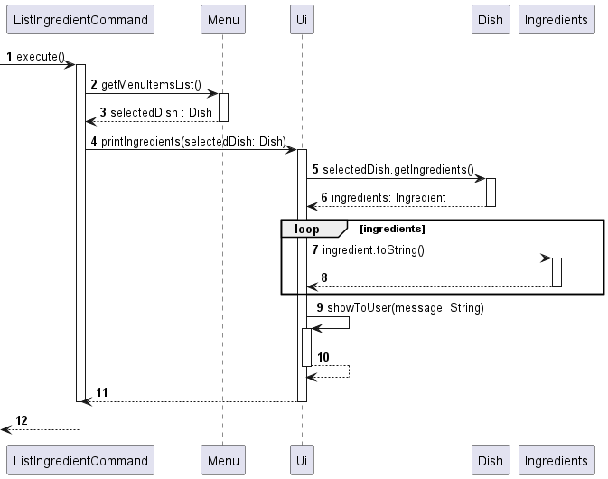

# Developer Guide

## Acknowledgements

{list here sources of all reused/adapted ideas, code, documentation, and third-party libraries -- include links to the original source as well}

## Design & implementation

## Design

### Parser

*Figure 1: Parser Parsing User Input Sequence Diagram*

API: [Parser.java]({repoURL}src/main/java/seedu/cafectrl/parser/Parser.java)

When user input a string to `Main`,  it passes the full user input to `Parser` via `parseCommand`. In `parseCommand`,  it finds the matching keyword for different command from the user input, then it calls the respective `prepareCommand` method within `Parser`. `prepareCommand` then generates the corresponding command class and return it to `parseCommand`, which returns the `Command` back to `Main` for execution.

## Feature
### Adding a Dish

### List Menu

### List Ingredients

*Figure 2: Execution of list_ingredient command*

API: [ListIngredientCommand.java]({repoURL}src/main/java/seedu/cafectrl/command/ListIngredientCommand.java)

| No | Step                          | Description                                                                                                                                                                                                                                                                                                                                                                              |
|----|-------------------------------|------------------------------------------------------------------------------------------------------------------------------------------------------------------------------------------------------------------------------------------------------------------------------------------------------------------------------------------------------------------------------------------|
| 1  | Initialization                | The sequence begins with the `Main` class invoking the `execute` method of the `ListIngredientCommand` after parsing a user command.                                                                                                                                                                                                                                                     |
| 2-3  | Interaction with 'Menu'       | The `ListIngredientCommand` communicates with the `Menu` class, invoking the `getMenuItemsList()` method to retrieve a list of menu items. The function returns an ArrayList of objects of 'Dish' type.                                                                                                                                                                                  |
| 4  | Interaction with 'Ui'         | The `ListIngredientCommand` communicates with the `Ui` class, invoking the `printIngredients()` method to print out the list of ingredients used for the selected dish.   * The function returns an ArrayList of objects of 'Dish' type. The `get()` method is then invoked to get the dish of the specified index. However, this is ommitted to prevent unnecessary sophistication. |
| 5-6  | Interaction with 'Dish'       | The `Ui` class communicates with the `Dish` class, invoking the `getIngredients()` method to obtain the list of ingredients for the selected dish. The `Dish` class responds with an ArrayList of objects of 'Ingredient' type to the `Ui` class.                                                                                                                                        |
| 7-8  | Iteration through Ingredients | There is a loop that iterates through each ingredient in the list. The `Ui` class interacts with the `Ingredients` class, converting each ingredient to a string containing the ingredient and quantity needed.                                                                                                                                                                          |
| 9-10  | Display to User               | The `Ui` class showcases the information to the user through the `showToUser()` method.                                                                                                                                                                                                                                                                                                  |

### Delete Dish

### Edit Price

*Figure 3: Execution of edit_price command*

API: [EditPriceCommand.java]({repoURL}src/main/java/seedu/cafectrl/command/EditPriceCommand.java)

When the `execute()` method of `EditPriceCommand` is invoked in `Main`, it subsequently calls the `setPrice()` method on the `Dish` object to modify the price of the specific dish. Following this, the `showEditPriceMessages()` method in the Ui component is triggered to display a message related to the successful execution of the price modification process. This sequence of actions orchestrates the flow of information and operations between the `Main`, `EditPriceCommand`, `Dish`, and `Ui` components, ensuring the seamless handling of the price editing functionality within the application.

## Product scope
### Target user profile

{Describe the target user profile}

### Value proposition

{Describe the value proposition: what problem does it solve?}

## User Stories

|Version| As a ... | I want to ... | So that I can ...|
|--------|----------|---------------|------------------|
|v1.0|new user|see usage instructions|refer to them when I forget how to use the application|
|v2.0|user|find a to-do item by name|locate a to-do without having to go through the entire list|

## Non-Functional Requirements

{Give non-functional requirements}

## Glossary

* *glossary item* - Definition

## Instructions for manual testing

{Give instructions on how to do a manual product testing e.g., how to load sample data to be used for testing}
