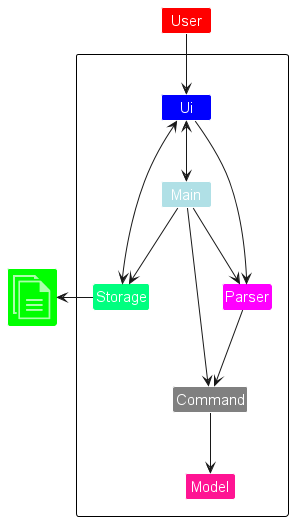
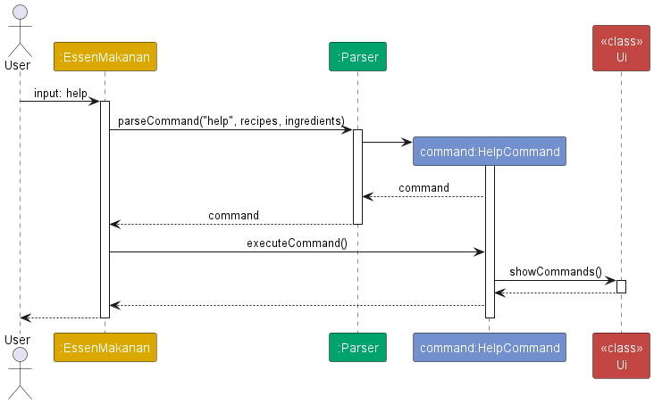
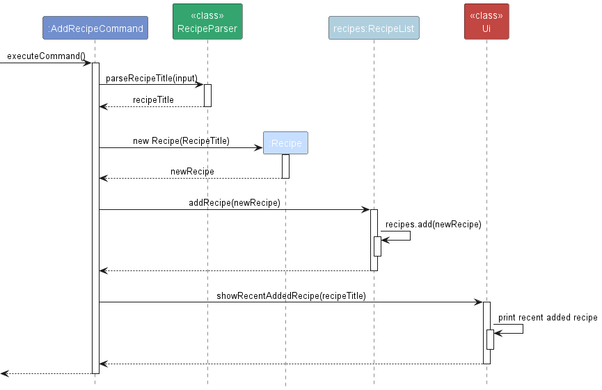
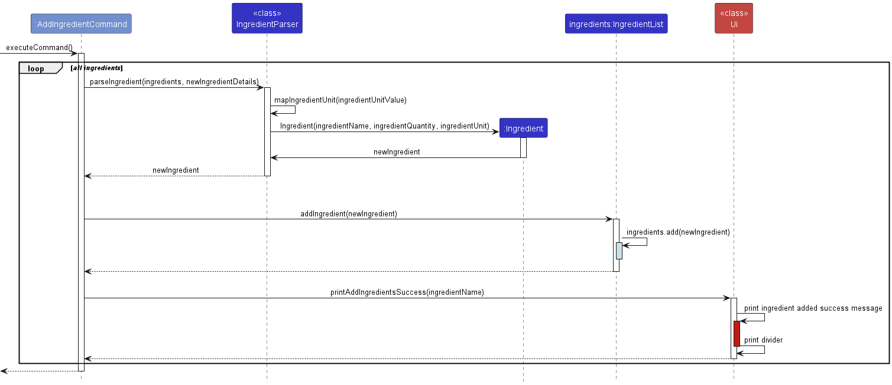

* Table of Contents
  {:toc}

--------------------------------------------------------------------------------------------------------------------

# Developer Guide

## Acknowledgements

{list here sources of all reused/adapted ideas, code, documentation, and third-party libraries -- include links to the original source as well}

References
1. Developer Guide: https://se-education.org/addressbook-level3/DeveloperGuide.html 
2. User Guide: https://se-education.org/addressbook-level3/UserGuide.html
3. 

## Design & implementation

## Design

### Architecture

The ***Architecture Diagram*** given above explains the high-level design of the App.

Given below is a quick overview of main components and how they interact with each other.

**Main components of the architecture**

### UI component

### Logic component

### Model component

### Storage component

## Implementation
### Help Feature
The help feature is facilitated by the `HelpCommand` class. By calling `executeCommand` on the class, it will invoke the `Ui` class to print the user help commands.

### Add Recipe feature

The add recipe feature is facilitated by the `AddRecipeCommand` class. By calling `executeCommand` on the class, the steps will
be executed as follows:
- **Step1**
  
  `AddRecipeCommand` will parse the recipe title using `RecipeParser`. Then, it will return the recipe title.

- **Step2**

  `AddRecipeCommand` will create a new `Recipe` with the obtained title.

- **Step3**

  `AddRecipeCommand` will add newly created `Recipe` into `RecipeList`. Then, the recipe will be added into an
  `ArrayList` inside `RecipeList`.

- **Step4**

  `AddRecipeCommand` will call `Ui` class to print out the title of the recently added recipe.

### Add Ingredient feature

The add Ingredient feature is used by a `AddIngredientCommand` class. By calling `executeCommand` on the class, the steps will
be executed as follows:
- **Step1**

  `AddIngredientCommand` will use the "split" method of `String` to get an array of the descriptions of ingredients and iterate all the elements in this array

- **Step2**

  `AddIngredientCommand` will get a new `Ingredient` by invoking the method "parseIngredient" of `IngredientParser` for each element of the obtained array

- **Step3**

  `AddIngredientCommand` will add this `Ingredient` into `IngredientList`. Then, the ingredient will be added into an
  `ArrayList` inside `IngredientList`.

- **Step4**

  `AddIngredientCommand` will call `Ui` class to print out the name of the recently added ingredient.

### Delete feature

{Describe the design and implementation of the product. Use UML diagrams and short code snippets where applicable.}

## Product scope
### Target user profile

{Describe the target user profile}

This product is for people who share kitchen space and ingredients with other cooks.

### Value proposition

{Describe the value proposition: what problem does it solve?}

Easy and intuitive way to keep track of ingredients you have in your kitchen. This helps avoid buying duplicated ingredients, reminds you of the ingredients you need, and gives a visualisation of the recipe timeline to ensure that advance preparation is done in time, eg marinating.

## User Stories

| Version | As a ...      | I want to ...                     | So that I can ...                            |
|---------|---------------|-----------------------------------|----------------------------------------------|
| v1.0    | beginner user | see all recipes                   | learn and try all recipes                    |
| v1.0    | beginner user | add new recipes into the list     | learn and try out new recipes                |
| v1.0    | beginner user | see all ingredient I have         |                                              |
| v1.0    | beginner user | add ingredients to the empty list | add an item to my kitchen inventory          |
| v2.0a   | amateur       | delete some recipes               | remove a recipe that I no longer want to use |

## Non-Functional Requirements

{Give non-functional requirements}
1. Should work on any mainstream OS as long as it has Java 11 or above installed.
2. Should be able to hold up to 1000 recipes and ingredients without a noticeable sluggishness in performance for typical usage.
3. A user with above average typing speed for regular English text (i.e. not code, not system admin commands) should be able to accomplish most of the tasks faster using commands than using the mouse.

## Glossary
* *glossary item* - Definition
- Mainstream OS: Windows, Linux, Unix, OS-X

## Instructions for manual testing
{Give instructions on how to do a manual product testing e.g., how to load sample data to be used for testing}
