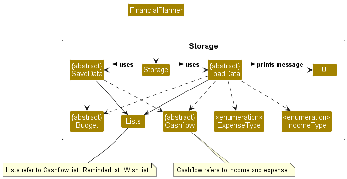
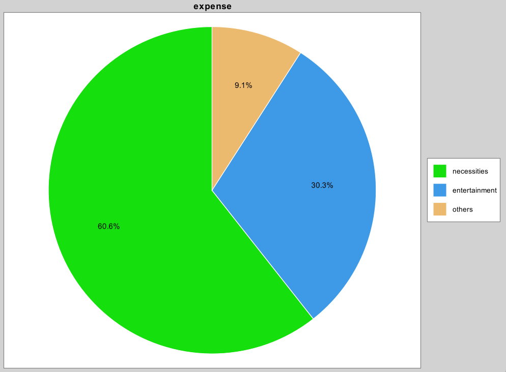
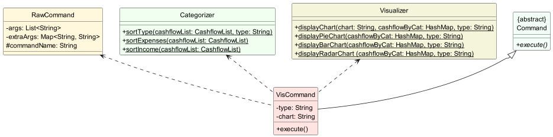
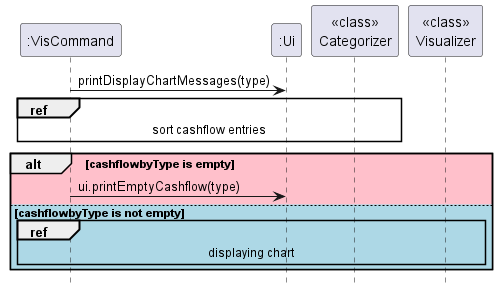
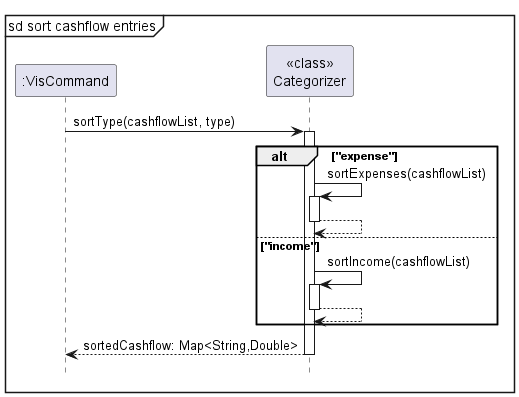
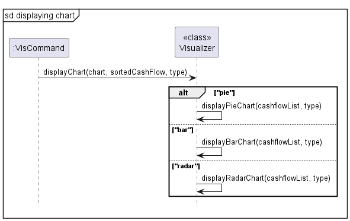
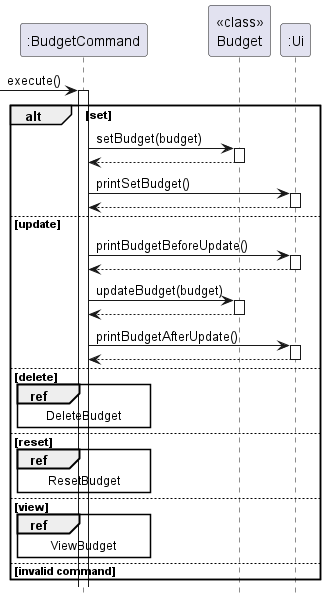
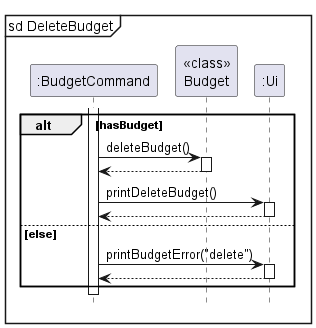
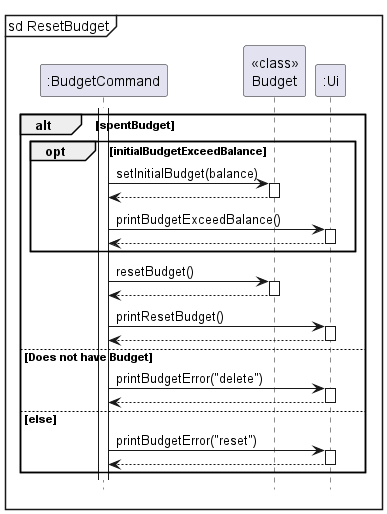
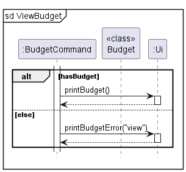

# Developer Guide

## Acknowledgements

**Xchart (A Simple Charting Library for Java)**
- author: KNOWN
- source: https://knowm.org/open-source/xchart/

**JSON Simple (simple Java toolkit for encoding and decoding JSON)**
- author: Yidong Fang (Google Code)
- source: https://code.google.com/archive/p/json-simple/

**Apache Common Langs 3**
- author: Apache Commons
- source: https://commons.apache.org/proper/commons-lang/

**Alpha Vantage Stock Market API**
- author: Alpha Vantage
- source: https://www.alphavantage.co/

**round() method in Cashflow.java**
  - author: mhadidg
  - source: https://stackoverflow.com/questions/2808535/round-a-double-to-2-decimal-places

**capitalize() method in Cashflow.java**
  - author: Nick Bolton
  - source: https://stackoverflow.com/questions/1892765/how-to-capitalize-the-first-character-of-each-word-in-a-string
    
**DG adapted from**

* [Addressbook-level3](https://github.com/se-edu/addressbook-level3)

{list here sources of all reused/adapted ideas, code, documentation, and third-party libraries -- include links to the original source as well}

## Design & implementation

{Describe the design and implementation of the product. Use UML diagrams and short code snippets where applicable.}

### Storage Component

API: `Storage.java`



* The storage component loads data from the saved text files when the application starts, and saves the data to the
  text files when the application exits.
* The storage class uses the static methods in LoadData and SaveData to load and save data respectively.
* The `load` method in LoadData reads the `data.txt` file and loads any existing Income, Expense and Budget into the application.
* The `save` method in SaveData saves all Incomes, Expenses and existing Budget into the `data.txt` file.

#### Design considerations:

* There are 2 main ways to implement the storage, one is to save the data after every command, and the other is to save 
the data one upon exiting the program with the `exit` command.
* Saving the data once upon exit (Currently implemented):
  * Advantage: Better efficiency and performance of the program.
  * Disadvantage: If the program crashes or exits incorrectly, data will not be saved.
* Saving the data after every command:
  * Advantage: Changes are saved after every command.
  * Disadvantage: Executing command might slow down the program when there is a large amount of data to be saved.

### Visualization Feature 

This feature is implemented with the help of [XChart](https://knowm.org/open-source/xchart/), a simple charting library for Java by Knowm.

By typing in the vis command with the appropriate arguments (/s and /t), users will be able to visualize their income or expense 
using visualization tools (Piechart, Bar Chart)

Demo: 

`vis /t expense /c pie`

Output

`Displaying piechart for expense`
A message will be shown telling you that the chart is being displayed



This feature was implemented with the help of three different classes.
They are namely: Visualizer, Categorizer, VisCommand (Inherits from abstract Command Class)

VisCommand's Role: 
1) Read the parameters of the vis command entered by the user
- `/t` Reads the type of cashflow that the user wants to visualize (income/expense)
- `/c` Reads the type of visualization tools the user wants (piechart/barchart)

2) Calls the Cateorgizer to sort cashflow (Income/Expense) according to type

3) Calls the Visualizer to display the chart to the user

Categorizer's Role: 

According to the cashflow type (Income/Expense) arugment passed in, the Categorizer sorts the 
specified cashflow entry according to type using a Hashmap which is returned and used by the Visualizer

Visualizer's Role: 

According to the chart type (Pie/Bar) argument and the Hashmap obtained from the categorizer passed in, 
the visualizer displays the specified visualization chart by calling the charting library Xchart.

### Class Diagram



### Sequence Diagram 

Overall 



Categorizer



Visualizer



### Add income/expense feature

The add income/expense command has 2 compulsory arguments `/t` and `/a` and 1 optional argument `/r`.

Example:
```
add income /a 100 /t salary /r 30
```
Below are the steps that shows the implementation of add income/expense.
#### Step 1
An instantiated AddCashflowCommand class gets the instance of CashflowList.

This allows the AddCashflowCommand instance to access the methods of CashflowList.
#### Step 2
The AddCashflowCommand instance then calls addIncome() or addExpense(), depending on what `category` is initialised as.

addIncome() or addExpense() instantiates an Income or Expense object respectively.

Example:
```
switch (category) {
        case INCOME:
            cashflowList.addIncome(amount, incomeType, recur);
            break;
        case EXPENSE:
            cashflowList.addExpense(amount, expenseType, recur);
            break;
        default:
            ui.showMessage("Unidentified entry.");
            break;
        }
```
#### Step 3
The instantiated income/expense then updates the overall balance through addIncomeValue() or addExpenseValue().

The income/expense object is also added to the list in Cashflowlist which contains all incomes/expenses.
#### Step 4
The added income/expense is then displayed to the user through the Ui.

#### Diagrams
Given below is the class diagram showing the class structure of the add income/expense mechanism:


Given below is the sequence diagram showing the add income/expense mechanism:


### Budget Feature

This feature has 5 functions, `set`, `update`, `delete`, `reset`, and `view`.



The BudgetCommand will execute the appropriate command and print through `Budget.java` and prints any message to the user through `Ui.java`.

#### Set and update budget:

Example:
```
budget set /b 500
budget update /b 1000
```
The '/b' is followed by the budget amount. The first line will set the budget by calling `setBudget(500)` method in `Budget.java`.
The second line updates the budget by adding or subtracting the difference between the initial and updated amount to the 
initial and current budget. This is done through `updateBudget(500)` method in `Budget.java`. Both functions can be seen 
in the diagram above

#### Delete budget:



The budget will be deleted by setting the initial and current budget to 0 through the `deleteBudget()` method in `Budget.java`.

Example: `budget delete`

#### Reset budget:



The budget will be reset by resetting the current budget to the initial budget through the `resetBudget()` method in `Budget.java`.

Example: `budget reset`

#### View budget:



The current budget will be shown to the user through the `Ui`.

Example: `budget view`


## Product scope
### Target user profile

{Describe the target user profile}

### Value proposition

{Describe the value proposition: what problem does it solve?}

## User Stories

|Version| As a ... | I want to ... | So that I can ...|
|--------|----------|---------------|------------------|
|v1.0|new user|see usage instructions|refer to them when I forget how to use the application|
|v2.0|user|find a to-do item by name|locate a to-do without having to go through the entire list|

## Non-Functional Requirements

{Give non-functional requirements}

## Glossary

* *glossary item* - Definition

## Instructions for manual testing

{Give instructions on how to do a manual product testing e.g., how to load sample data to be used for testing}
