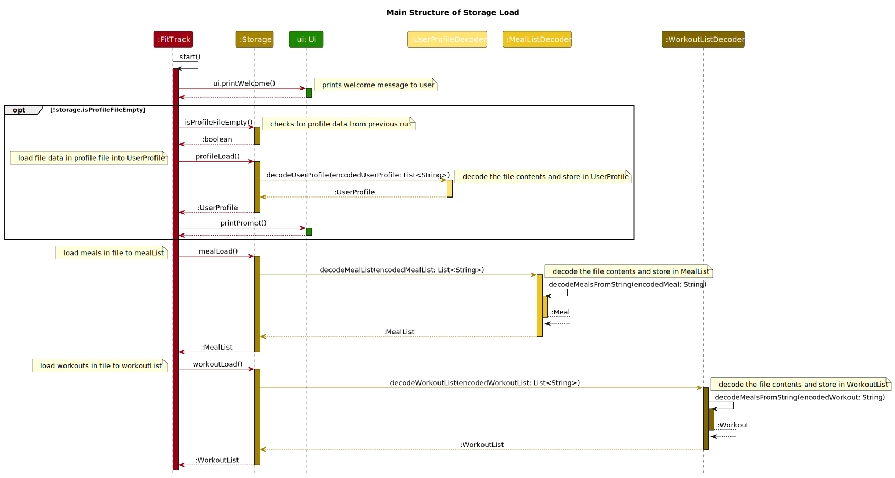

# Developer Guide

## Acknowledgements

{list here sources of all reused/adapted ideas, code, documentation, and third-party libraries -- include links to the original source as well}

Main structure of the code and the parse feature is adapted from [here](https://github.com/se-edu/addressbook-level2).

## Design & implementation

### Main structure

### Architecture
{insert diagram to show architecture of code}

The ***Architecture Diagram*** above shows the high-level overview and design of the FitTrack app. 
Given below is a quick overview of each component.

:bulb: **Tip:** The '.puml' files used to create the diagrams in this document can be found in [diagrams](./diagrams) 
folder. Refer to the [_PlantUML Tutorial_ at se-edu/guides](https://se-education.org/guides/tutorials/plantUml.html) 
to learn how to create and edit diagrams.

The **`Main`** class is called [`FitTrack`](../src/main/java/fittrack/FitTrack.java)

The App consists of eight components.
* [**`UI`**](#ui-component): The UI of the App.
* [**`MealList`**](#meal-list-component): Stores all meals.
* [**`UserProfile`**](#user-profile-component): The class which handles all profile data.
* [**`WorkoutList`**](#workout-list-component): Stores all workouts.
* [**`Storage`**](#storage-component): Reads data from, and writes data to, the hard disk.
* [**`Parser`**](#parser-component): Handles user input.
* [**`Data`**](#data-component): Holds the data of the app in memory.
* [**`Command`**](#command-component): The command executor.

### Core sequence
Core sequence of code is written in [`FitTrack`](../src/main/java/fittrack/FitTrack.java) class.

### Storage Component
Storage load and save functions are written in [`Storage`](../src/main/java/fittrack/storage/Storage.java) class.

The sequence diagram of the code for loading the file contents into each class.

The sequence diagram of the code for saving data into file

The `Storage` component,
* can save user profile data in text format and load it back
* can save meals in text format and load it back
* can save workouts in text format and load it back

## Product scope
### Target user profile

People who want to be healthy by managing their diet and workout.

### Value proposition

Fittrack is a health management application which allows users to record their diet and activity, and help them to reach the goal they have set.

Fittrack also allows it's users to calculate their total calories spent in a day and receive suggestions
on possible changes to their exercise, diet and lifestyle.

Users will also be able to calculate key parameters of their profile like 
BMI, ideal weight for their height and so on.

## User Stories

|Version| As a ... | I want to ...                                          | So that I can ...                                             |
|--------|----------|--------------------------------------------------------|---------------------------------------------------------------|
|v1.0|new user| know how to use the product                            | use the product                                               |
|v1.0|new user| add my height and weight                               | keep track of my height and weight                            |
|v1.0|new user| add my calorie intake for a meal                       | record my calorie intake                                      |
|v1.0|new user| add my daily workout                                   | track my calories burnt                                       |
|v1.0|new user| set my daily calorie surplus limit                     | know whether my calorie surplus has exceeded the limit or not |
|v1.0|new user| delete my daily workout                                | track my calorie usage                                        |
|v1.0|new user| delete my calorie intake for a meal                    | track my calorie intake                                       |
|v1.0|new user| edit my height and weight information                  | apply my changed height and weight                            |
|v1.0|new user| view my calorie intake for a meal                      | know my calorie intake                                        |
|v1.0|new user| view my daily workout                                  | know my previous daily workouts                               |
|v1.0|new user| view my height, weight, and daily calorie surplus limit | know my height, weight and calorie surplus limit              |
|v2.0|user| find a to-do item by name                              | locate a to-do without having to go through the entire list   |
|v2.0|user| Calculate my ideal weight for my height                | maintain my weight in the healthy range                       |

## Non-Functional Requirements

{Give non-functional requirements}

## Glossary

* *BMI* - Body Mass Index (BMI) is a person’s weight in kilograms (or pounds) 
divided by the square of height in meters (or feet).

## Instructions for manual testing

{Give instructions on how to do a manual product testing e.g., how to load sample data to be used for testing}
