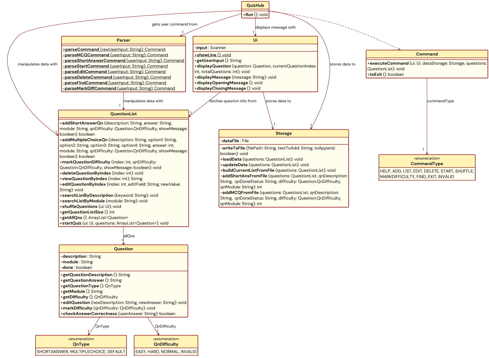
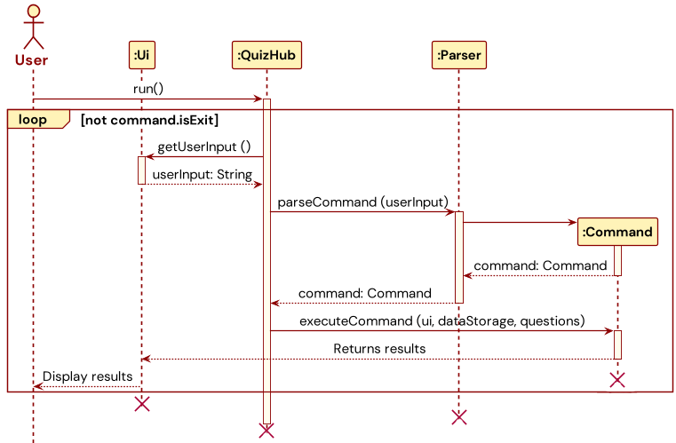
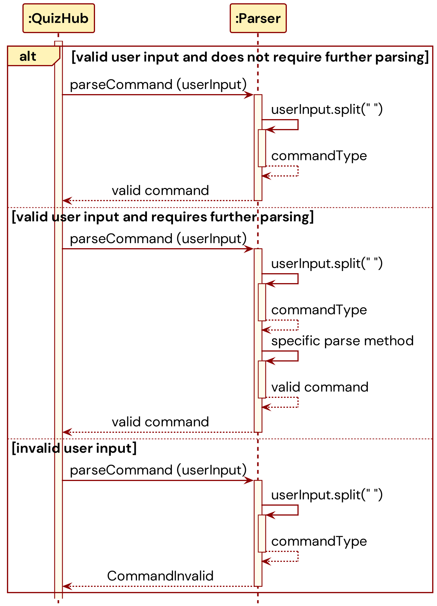
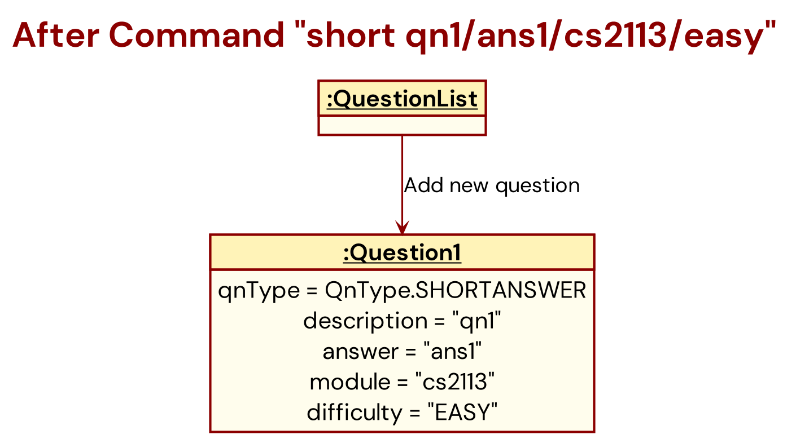
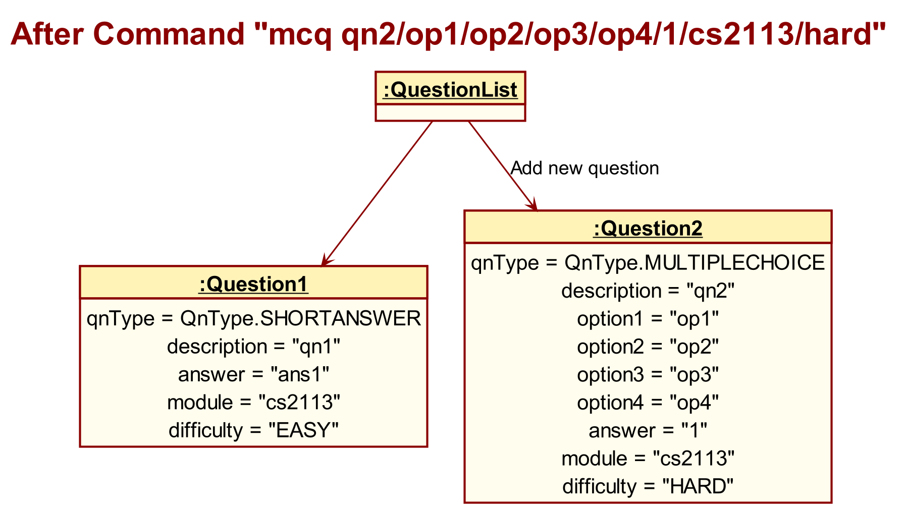
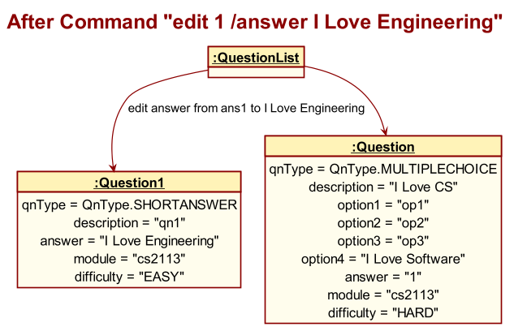
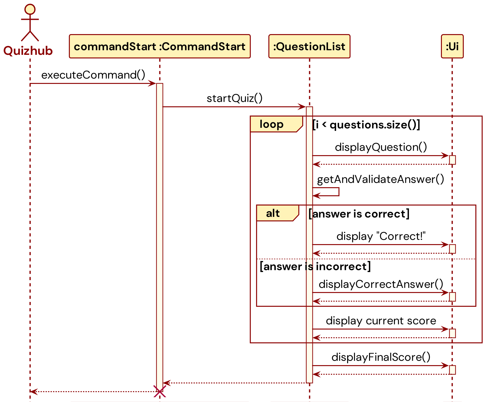

# Developer Guide

## Table of Contents
* [Acknowledgements](#acknowledgements)
* [Design and Implementation](#design--implementation)
  * [Application Lifecycle](#application-lifecycle)
  * [Parser Component](#parser-component)
  * [Command Component](#command-components)
  * [Storage Component](#storage-component)
  * [UI Component](#ui-component)
* [Product Scope](#product-scope)
* [Non Functional Requirements](#non-functional-requirements)
* [Glossary](#glossary)
* [Instructions for Manual Testing](#instructions-for-manual-testing)

## Acknowledgements

1. For the main structure of the program, we have adapted the project structure
from the [Individual Project](https://github.com/spinoandraptos/ip/tree/master) of Man Juncheng
2. For JUnit testing, we have adapted the testing codes from the [AddressBook level-2
codes](https://github.com/se-edu/addressbook-level2)
3. For the developer's guide, we have referenced the [developer's guide](https://se-education.org/addressbook-level3/DeveloperGuide.html) from AddressBook
level-3

<div style="page-break-after: always"></div>

# Design & implementation

## Overall Architecture
The execution of the QuizHub application will concern 6 main components which
are the `QuizHub`, `Ui`, `Parser`, `Commands`, `Storage` and `UtilityClasses` packages.


`QuizHub` is the "main" class, which is responsible for starting the program,
initialising all other objects, executing commands, and shutting down.

`Ui` is the component that interacts with the user, taking inputs and displaying
the results of the executed commands.

`Parser` acts as a multiplexer to determine which command to run, and what parameters
it has, based on the user input read in.

`Commands` refer to a package of individual commands with complex and specific
logic, which are executed by `QuizHub` and which results are displayed by `Ui`.

`Storage` takes care of saving questions data onto and loading questions data from the hard drive.

`UtilityClasses` refer to any other miscellaneous classes used by the components for program execution.

While the above diagram provides a quick and simple high-level overview of the execution of QuizHub, it does not
reflect the finer relationships between the components as well as the features within the various components. A more 
comprehensive description of QuizHub is provided in the following **condensed class diagram**. It describes the 
classes corresponding to the main components of the application and their relationships with each other. Only the 
**most important** methods and attributes of each class are shown for simplicity. Here, "most important" means 
these methods and attributes directly control the critical flow and operation of the application. <br/><br/>

<br/><br/>

<div style="page-break-after: always"></div>

## Application Lifecycle




The program begins with the `run()` call to `QuizHub` class.

This starts a loop in which
user input is continuously read in from CLI for the user command to be extracted and executed.
In each iteration of the loop, `QuizHub` makes a call to `Ui.getUserInput()` and returns the
entire user input as a String object. Following which, `QuizHub` makes a call to
`Parser.parseCommand()` to extract the user command from the String object and returns a
`Command` object. Finally, `QuizHub` makes a call to `Command.executeCommand()` and performs
the requested action. Upon complete command execution, the results will be displayed to the user
through `Ui`.

If `Command` is of `Exit` type, the loop will exit, and the program terminates.

## Parser Component

The `Parser` component is the backbone behind the program, functioning as the API
between the CLI user interface and the core functionalities of the program. It supports
the direct communication between the program and user by converting user input into `Command`
objects which can be interpreted by the program.

### Design Considerations

As the `Parser` functions as the API between user and program, it must be designed with a clear
consideration of both human and machine requirements.

Our target users are NUS students preparing for exams who wish to use our program to facilitate
their practice. Considering that time is of the essence for revising students, the `Parser` must
prioritise efficiency of use to not cause time delays to users' revision. With this in mind,
we based our design off the following points for inputs taken in by the `Parser`.

1. **Ease of use**: Simple and short command structure <br>
2. **Ease of familiarisation**: No excessive or complicated commands

Consideration must also be given to the developers and machine executing the code. The exact
mechanism behind the `Parser` must be able to effectively extract the relevant information from
user inputs in a non-arbitrary way to be used by other classes. Hence, we also need to strike a balance with the
following point for inputs taken in by the `Parser`.

1. **Ease of processing and validation**: Hierarchical command structure

### Alternative Design Considerations

In designing the `Parser`, an alternative design we considered is to follow that of `Unix`
command interface. The `Unix` parser is designed such that input commands are required to
have the syntax of ```command -[option1] [argument1] -[option2] [argument2] ...``` where the order of arguments
does not matter. While this is a clean and neat parser design, we have decided not to adopt this
design as we see a strong need of having a hierarchical command structure for our program.

1. A hierarchical structure introduces logical sequence and flow to the command used,
   facilitating a quick familiarisation process for users to quickly learn the command syntax.
   This is in line with our design consideration to minimise learning and familiarisation time
   for users. This is in addition to the ease of processing and validation of commands.
   ```short [question]/[answer]/[module]/[difficulty]```, for one, is a command that has a
   logical sequence to which the details of a question is entered. It is more intuitive to
   follow a structure instead of entering such details without a fixed order, which can easily
   lead to confusion. <br><br>
2. The use of the delimiter `/` also better helps to introduce the concept of hierarchy than the
   delimiter `-` used in `Unix` commands as `/` can be more easily associated with layering and
   stacking, processes which create structures possessing hierarchy.

### Parser Command Syntax

Our final design  seeks to optimise both user experience and program effectiveness.
We have hence chosen the following general syntax for commands to be input into the `Parser`.
All commands require a starting commandType, but some commands do not require the subsequent arguments and payloads. 

```
commandType [payload] [/argument1 [payload1] /argument2 [payload2] ... ]
```
The command structure is simple, short, and intuitive. With commands rarely requiring more
than 2 arguments, typing and inputting the command in CLI is fast and efficient, allowing
revising students to quickly utilise the program. The hierarchical and logical structure to
the arrangement of arguments and payloads allows students to quickly familiarise with the
syntax and minimise delays to their learning schedule.

The hierarchical structure also allows for the respective payload to be easily extracted
with little ambiguity. Command validation can then be performed sequentially, facilitating
efficient checks.

### Implementation

The main function of `Parser` is to decode user input and extract relevant information to be
used by other classes. Hence, it supports 3 main method types as listed below.
1. `parseCommand` and other `parse` methods to assemble specific commands 
2. `extract` methods which extract information from different segments of user input
3. `handle` methods which handle exceptions thrown during parsing <br/><br/>

`parseCommand`

This is arguably the most critical method of the `Parser` component. It processes raw user input from CLI to extract 
information to be assembled into a `Command` object. Where necessary, this is accomplished by calling the other `parse` 
methods. It determines the type of `Command` to be created by reading the commandType from the very start of the user 
input.

The following sequence diagram builds upon the application lifecycle sequence diagram to show the different behaviours
of `parseCommand`. For simplicity, not all possible paths are covered, instead showing the 3 main pathways possible: 
parsing valid commands that can be returned immediately, parsing valid commands that require further parsing, and 
parsing invalid commands. <br/><br/>


<br/><br/>


`extract` methods

Methods of this type are helper methods created to assist in extracting payloads in the user input. They are used in 
the construction of `Command` objects when command-specific information need to be extracted from the arguments.

These methods break up an entire ```commandType [payload] [/argument1 [payload1] /argument2 [payload2] ... ]``` String 
into segments and depending on the segment of user input they are extracting information from, zone in on a 
specific segment to find the information they are looking for.

`handle` methods

Methods of this type are helper methods created to handle any exceptions that can arise during any stage of parsing.
Typically, there is one `handle` method for every `extract` method, designed to catch exceptions raised during the
extraction of information from each segment of the user input.

<div style="page-break-after: always"></div>


## Command Components

The following is a detailed sequence diagram demonstrating how commands are executed after the parsing stage.
This may differ slightly for different commands.


Essentially, the parser will create and return a Command object with appropriate 
arguments to QuizHub, where it will be executed. When the Command executes, it 
interacts with the QuestionList object to read / manipulate a Question /
the QuestionList itself.

<hr>

### Help Command - Display Commands

#### Brief Description of Help Command
- When executed, this command will execute a standard Final String containing all
the commands available for the user to use, as well as the format they are meant
to be written in.
- This same String is also displayed when an invalid command is used.

#### Command Syntax
`help`

#### Expected invalid commands for Help Command
- `help 123`
  - Shows help string
  - Reason: the help command ignores the string after the initial `help` command
- `hep` or `help123`
  - Please enter a valid command. Shows help string
  - Reason: Treated as an invalid command - shows the invalid command string which happens to be the help command

<hr>

### Short Command - Add Short Answer Question to the Quiz

#### Brief Description of Short Command
One of the supported question formats is the Short Answer Question, in which a question
can be answered with a phrase of a few words, which will be matched to a corresponding answer
of sufficient similarity.

#### Command Syntax of Short Command
`short [question]/[answer]/[module]/[difficulty]`
1. `[question]` is the question, phrased as asking the user (i.e. What is 2 + 2? )
2. `[answer]` is the answer or possible answer(s) that the user must
   input to count as correct. It is case-insensitive. (i.e. 4, four)
3. `[module]` is the module that the question belongs in (i.e. CS2113)
4. `[difficulty]` is the difficulty of the question for sorting later (i.e. Hard) <br/><br/>

#### Class Structure of Short Command
Attributes
- `description`: A `String` representing the description or text of the question to be added.
- `answer`: A `String` representing the answer to the question.
- `module`: A `String` indicating the module or category that the question belongs to.
- `qnDifficulty`: An `enum` of type `Question.QnDifficulty` representing the difficulty level of the question.

Constructor
- `public CommandShortAnswer(String description, String answer, String module, Question.QnDifficulty qnDifficulty)`:
    - Initializes a new instance of `CommandShortAnswer` with the provided question description, answer, module, and difficulty level.

Methods
- `public void executeCommand(Ui ui, Storage dataStorage, QuestionList questions)`:
    - Implements the abstract method from the base `Command` class.
    - Adds a new short answer question to the `QuestionList`.
    - Updates the `Storage` with the new question list.

Usage in the QuizHub Application
- **User Interface (`Ui`) Interaction**: Utilizes `Ui` for any user interaction required during the execution of the command.
- **Data Storage (`Storage`) Interaction**: Interacts with `Storage` to update the saved data whenever a new question is added.
- **Question List Management (`QuestionList`)**: Modifies the `QuestionList` by adding the new short answer question.


#### Implementation of Short Command
 <br/>

Thereafter, the command is returned to the QuizHub component and executed,
to add a Question object to the corresponding QuestionList object
using the `addToQuestionList` method. This method will analyse the arguments above
and add the Question to the appropriate list.



#### Expected invalid commands for Short Command 
- `short What is the capital of France?`
  - Please format your input as short [question]/[answer]/[module]/[difficulty]! 
  - Reason: Missing fields
- `short What is 2+2? /4 /Math /Easy ExtraArgument`
  - Invalid Difficulty, Entry will not be added to list!
  - Reason: Too many arguments. The proper input should be without the ExtraArgument
- `short [What is the capital of France?]/[Paris]/[Geography]/[Easy]`
  - Invalid Difficulty, Entry will not be added to list!
  - Reason: The command uses square brackets, which deviates from the expected format
- `short What is 2+2? /4 /Math`
  - Please format your input as short [question]/[answer]/[module]/[difficulty]!
  - Reason: The difficulty level of the question is missing in this command.
- `short Who wrote Hamlet? /Shakespeare /Literature /VeryHard` or `short What is H2O? /Water /Chemistry /Water`
  - Invalid Difficulty, Entry will not be added to list!
  - Reason: VeryHard and Water are invalid difficulty
- `short What is the capital of Japan, Tokyo, Geography, Easy`
  - Please format your input as short [question]/[answer]/[module]/[difficulty]!
  - Reason: Incorrect separators
- `short What is 2+2? /4 /Math /Easy` then `short What is 2+2? /5 /Math /Easy`
  - You have a duplicated input, please fill add a different input!
  - Reason: The program does not allow duplicated questions regardless of the other
- `short /Easy /Paris /Geography What is the capital of France?`
  - You have one or more field missing!
    Please format your input as short [question]/[answer]/[module]/[difficulty]!
  - Reason: The program strictly conforms to the order of question/answer/module/difficulty
- `short easy / easy / easy /easy`
  - This is not an invalid command because it conforms to the structure.
<hr> 

### MCQ Command - Add Multiple Choice Question to the Quiz

#### Brief Description of MCQ Command
One of the supported question formats is the Multiple Choice Question (MCQ), 
in which a question can be answered from 4 available options, by answering the 
index of the corresponding option. 

#### Command Syntax of MCQ Command
`mcq [question]/[option 1]/[option 2]/[option 3]/[option 4]/[answer index]/[module]/[difficulty]`
1. `[question]` is the question, phrased as asking the user (i.e. What is the capital of Australia? )
2. `[optionX]` is a String storing a possible answer. 
Three of the options has to be incorrect, and one option correct. (i.e. Option1: Melbourne, Option2: Canberra, etc.)
3. `[answer index]` is an integer from 1 to 4 corresponding to the correct option. (i.e. 2)
4. `[module]` is the module that the question belongs in (i.e. CS2113)
5. `[difficulty]` is the difficulty of the question for sorting later (i.e. Hard) <br/><br/>


#### Class Structure of MCQ Command
Attributes
- `description`: A `String` representing the text of the question to be added.
- `option1`, `option2`, `option3`, `option4`: Strings representing the four options for the multiple-choice question.
- `answer`: An `int` indicating the index of the correct answer (1, 2, 3, or 4).
- `module`: A `String` indicating the module or category that the question belongs to.
- `qnDifficulty`: An `enum` of type `Question.QnDifficulty` representing the difficulty level of the question.

Constructor
- `public CommandMultipleChoice(String description, String option1, String option2, String option3, String option4, int answer, String module, Question.QnDifficulty qnDifficulty)`:
    - Initializes a new instance of `CommandMultipleChoice` with the specified question details, options, correct answer index, module, and difficulty level.

Methods
- `public void executeCommand(Ui ui, Storage dataStorage, QuestionList questions)`:
    - Implements the abstract method from the `Command` superclass.
    - Adds a new multiple-choice question to the `QuestionList`.
    - Updates the `Storage` with the new question list.

Usage in the QuizHub Application
- **User Interface (`Ui`) Interaction**: Utilizes `Ui` for user interactions required during the execution of the command.
- **Data Storage (`Storage`) Interaction**: Interacts with `Storage` to update the saved data when a new question is added.
- **Question List Management (`QuestionList`)**: Adds the new multiple-choice question to the `QuestionList`.

#### Implementation of MCQ Command
Thereafter, the command is returned to the QuizHub component and executed,
to add a Question object to the corresponding QuestionList object
using the `addToQuestionList` method. This method will analyse the arguments above
and add the Question to the appropriate list.



#### Expected invalid commands for MCQ Command
- `mcq What is the capital of France?`
  - Please format your input as mcq [question]/[option 1]/[option 2]/[option 3]/[option 4]/[answer index]/[module]/[difficulty]!
  - Reason: missing fields
- `mcq What is 2+2? /2 /4 /3 /1 /1 /Math /Easy ExtraArgument`
  - Invalid Difficulty, Entry will not be added to list!
  - Reason: ExtraArgument will be treated as the same string as Difficulty and hence be invalidated. The program is very strict with difficulty: Easy, Normal or Hard
- `mcq [What is the capital of France?]/[Paris]/[London]/[Berlin]/[Madrid]/[1]/[Geography]/[Easy]`
  - Please enter valid integer question index!
  - Reason: The inputs for question, options and module allow for [] but not the answer index which requires a integer and not the difficulty level which only accepts Easy, Normal or Hard
- `mcq What is 2+2? /2 /4 /3 /1 /1 /Math`
  - Please format your input as mcq [question]/[option 1]/[option 2]/[option 3]/[option 4]/[answer index]/[module]/[difficulty]!
  - Reason: no difficulty input
- `mcq Who wrote Hamlet? /Shakespeare /Marlowe /Chaucer /Milton /5 /Literature /Medium`
  - Ono! The answer index you entered is not a integer in the range of the options
  - Reason: invalid answer index (1-4). 5' is not a valid answer index as there are only four options.
- `mcq What is H2O? /Water /Aqua /Water /Liquid /1 /Chemistry /Easy`
  - You have duplicate options!
    Please format your input as mcq [question]/[option 1]/[option 2]/[option 3]/[option 4]/[answer index]/[module]/[difficulty]!
  - Reason: Duplicated water options
- `mcq What is the capital of Japan, Tokyo, Kyoto, Osaka, Sapporo, 1, Geography, Easy`
  - Please format your input as mcq [question]/[option 1]/[option 2]/[option 3]/[option 4]/[answer index]/[module]/[difficulty]!
  - Reason: Invalid separators
- `mcq What is 2+2? /4# /4 /3 /2 /1 /Math /Easy`
  - This is a valid command
- `mcq What is 2+2? /4# /4 /3 /2 /1# /Math /Easy`
  - Please enter valid integer question index!
  - Reason: 1# is not a valid integer
- `mcq /Easy /1 /Geography What is the capital of France? /Paris /London /Berlin /Madrid`
  - You have one or more field missing!
    Please format your input as mcq [question]/[option 1]/[option 2]/[option 3]/[option 4]/[answer index]/[module]/[difficulty]!
  - Reason: The program takes in input via a very strict order. Users must conform to this.
<hr>

### List Command - Show all Questions with Index

#### Brief Description of List Command
Lists all the questions in the current QuestionList. 

When executed, the command will invoke the QuestionList.printQuestionList method. 
This method first checks whether the list is empty and prints and error message if empty, 
else it will invoke the QuestionList.printQuestion method on each Question object, 
with the asList parameter set as true. The QuestionList.printQuestion method will then
print each question with a given index, and indicate the question's type and completion status
(obtained through Question.getQuestionType() and Question.questionIsDone() methods)

#### Expected invalid commands for List Command
- `list all` or `list 1` or any string input after `list`
  - Valid command. The program ignores all input after the valid command `list`
- `listall` or `list1` or `lst`
  - Invalid command. Triggers help string
  - Reason: Invalid command word, mispelled. 
- `list /module CS1010`
  - Valid command but will not show intended module. Will list all modules
  - If user wants to list just module CS1010 (assuming that it's in the storage), make use of `find /module CS1010`

<hr>

### Delete Command - Delete a Question

#### Brief Description of Delete Command
Deletes a question by its index.

#### Command Syntax of Delete Command
`delete [question index]`

#### Implementation of Delete Command

The Command first invokes the QuestionList.viewQuestionByIndex method to determine if 
the index refers to a valid question, failing which it will return an error message.

Otherwise, it will then invoke the QuestionList.deleteQuestionByIndex method to remove
the question from the QuestionList.


Afterward, the storage is updated to reflect the newest QuestionList.

#### Expected invalid commands for Delete Command
List of questions: <br>
1: [S][ ] New description / \\exitquiz | number | EASY <br>
2: [M][ ] question2 / 1.4 / 2 / 3 / 1.6 / 3 | number | EASY <br> 
3: [S][ ] What is 2+2? / 4 | Math | EASY <br> 
4: [S][ ] Who wrote Hamlet? / Shakespeare | Literature | HARD <br>
5: [S][ ] easy / easy | easy | EASY <br>
- `delete /1` or `delete 1!`
  - Please enter valid integer question index!
  - Reason: Adding a slash prefix to the index (like '/1') or special characters is not the expected format for the delete command.
- `delete 0`
  - Please enter valid integer question index!
  - Reason: 1-based input. a 1-based index system, using '0' as an index is invalid
- `delete easy`
  - Please enter valid integer question index!
  - Reason: Does not support deleting questions as we do not discriminate mcq / short type questions
- `delete 1 extraArgument` or `delete 1, 2` or `delete 1 2`
  - Please enter only 1 question index!
  - Reason: Program only support deleting 1 question at a time. 
- `delete 999` - if there's less than 999 questions in list
  -  Please enter valid integer question index!
  - Reason: No question index 999 in list
- `delete three`
  - Please enter valid integer question index!
  - The command uses a non-numeric index ('three'). The index should be a number.
<hr>

### Find Command - Look for a matching question

#### Brief Description of Find Command
QuizHub supports searching for specific questions, by searching matching keywords. 

#### Command Syntax of Find Command
`find /[description]` OR `find /[module]`
i.e. `find /description buffalo`, `find /module CS2113`

#### Implementation of Find Command
This command is passed to the corresponding QuestionList where the `searchList` method
is called. 
This method go down the existing QuestionList of questions and use the Java contains method
(along with the toLower method to ensure the search is case-insensitive)
to determine if the search term is located that question. If the contains method returns true
for a given question, that question's contents and index will be copied to a 
new ArrayList of questions, and subsequently print them.

#### Expected invalid commands for Find Command
List of questions: <br>
1: [S][ ] New description / \\exitquiz | number | EASY <br>
2: [M][ ] question2 / 1.4 / 2 / 3 / 1.6 / 3 | number | EASY <br>
3: [S][ ] What is 2+2? / 4 | Math | EASY <br>
4: [S][ ] Who wrote Hamlet? / Shakespeare | Literature | HARD <br>
5: [S][ ] easy / easy | easy | EASY <br>
- `find /topic Literature` 
  - Please format your input as find /description [description] or find /module [module]!
  - Reason: using incorrect keyword `/topic` instead of `/module`
- `find /module Literature extraArgument`
  - Here are questions that matched your search:
    No results found :< Check your keyword is correct?
  - Reason: the module that's read will be `Literature extraArgument` and there's none matching that
- `find description question2`
  - Ono! You did not indicate if you are searching by description or module :<
    Please format your input as find /description [description] or find /module [module]!
  - Reason: The command does not use the required prefix '/' before the criteria ('description').
- `find /description /module Literature`
  - Here are questions that matched your search:
    No results found :< Check your keyword is correct?
  - Reason: Program does not support find using both /module and /description simultaneously
<hr>

### Edit Command - Edit Question / Answer
#### Brief Description of Edit Command
The CommandEdit class in the quizhub application is responsible for handling user commands to edit the description or answer of a question. The CommandEdit class supports 2 edit commands for short answer questions and 3 edit commands for multiple choice questions: 

#### Command Syntax
- `edit [question number] /description [newDescription]` - Edits the text description of the specified question.
- `edit [question number] /answer [newAnswer]` - Updates the answer for the specified question.
- `edit [question number] /option[1...4] [newAnswer]` - Edits a specified option of a multiple-choice question.

Special Formatting Notes:
- Use ` \slash ` instead of the `/` character within the command.
- The `pipe` character is not allowed and will be automatically removed from any input fields.

For short answer questions:
- `edit [question number] /description [description]` - edits the description of the question with the specified number
- `edit [question number] /answer [answer]` - edits the answer to the question with the specified number
i.e. `edit 1 /description new description`,  `edit 2 /answer new answer`

For multiple choice questions:

- `edit [question number] /description [description]` - edits the description of the question with the specified number
- `edit [question number] /answer [answer index]` - edits the answer index to the question with the specified number
- `edit [question number] /option[option number] [new value]` - edits the option specified by the option number
i.e. `edit 1 /description new description`,  `edit 2 /answer 3`, `edit 3 /option4 new option 4`

#### Class Structure of Edit Command
The `CommandEdit` class is specialized for performing edit operations on questions in the QuizHub application. It extends the base `Command` class and carries out the modification of either a question's description or its answer based on the user's input.

Attributes:
- `qnIndex`: An integer representing the index of the question in the question list to be edited.
- `editField`: A string indicating which field of the question to edit, such as "description", "answer", or "option[number]" for multiple-choice questions.
- `newValue`: A string containing the new text to replace the current content of the `editField`.

Constructor:
- `CommandEdit(int qnIndex, String editField, String newValue)`: Instantiates a new `CommandEdit` object with the given question index, the field to edit, and the new value for that field.

Methods:
- `executeCommand(Ui ui, Storage dataStorage, QuestionList questions)`: Executes the edit command by updating the specified question's `editField` with `newValue`. After editing, it uses `ui` to display a success message and `dataStorage` to persist changes.

The class uses the following components from the QuizHub application:
- `Ui`: For user interaction, displaying prompts, and confirmation messages.
- `Storage`: To save the updated state of the question list after the edit has been made.
- `QuestionList`: To access and update the specific question based on the `qnIndex`.

Upon execution, the `CommandEdit` class first checks that both `editField` and `newValue` are not null. It then calls `editQuestionByIndex` on the `QuestionList` to perform the actual edit. After a successful edit, a message is displayed to the user, and the `Storage` component is used to ensure the edited question's new state is saved.

#### Implementation of Edit Command




### Operational Flow of Edit Command

1. **User Initiation:**
    - The user enters the `edit` command along with the question number and either a new description or answer into the QuizHub application.

2. **Command Parsing:**
    - QuizHub passes the user input to the `Parser` component to interpret the command.
    - The `Parser` creates an instance of `CommandEdit` and invokes the `parseEditCommand` method with the user's input.

3. **Command Execution:**
    - Once the command is parsed, `Parser` returns the `CommandEdit` object to QuizHub.
    - QuizHub calls the `executeCommand` method on the `CommandEdit` instance, providing the necessary UI, data storage, and question list.

4. **Editing Process:**
    - `CommandEdit` communicates with `QuestionList` to locate the specific question by index.
    - `QuestionList` then calls the `editQuestion` method on the relevant `Question` instance, passing the new description or answer.

5. **Question Modification:**
    - The `Question` object updates its state with the new information provided.
    - Upon successful update, `Question` notifies `QuestionList` of the edit completion.

6. **Completion Acknowledgement:**
    - `QuestionList` sends an acknowledgment back to `CommandEdit` confirming the completion of the edit operation.

7. **User Feedback:**
    - `CommandEdit` reports back to QuizHub that the editing process is complete.
    - QuizHub then communicates the successful edit to the user via the UI.

8. **Resource Cleanup:**
    - After the edit is complete and the user has been notified, the `CommandEdit` object is destroyed to free up resources.

Each step in the flow ensures that the user's request to edit a question is processed accurately and efficiently, with the system providing feedback at the end of the operation.

#### User Interaction Examples
- Editing the description of a question:
    - Command: `edit 1 /description What is the value of Pi to 3 decimal places?`
    - Output: Acknowledgment that the question has been edited.
- Updating the answer to a question:
    - Command: `edit 1 /answer 3.142`
    - Output: Confirmation message with the updated question details.
- Changing an MCQ option:
    - Command: `edit 3 /option1 2.713`
    - Output: Confirmation message with the updated MCQ question details.

#### Notes for Developers
- The application restricts edits to one attribute of the question at a time.
- Validation checks must be robust to handle user errors and prevent incorrect data entry.
- Special character rules must be enforced to maintain command syntax integrity.

#### Expected Invalid Input for Command Edit
Assuming 2 current questions: <br>
1: [S][ ] question / answer | number | EASY <br>
2: [M][ ] question2 / 1 / 2 / 3 / 4 / 1 | number | EASY
- `edit 999 /description New description`
  - Ono! The question index you entered is not in the range of the question list :<
    Please format your input as:
    edit [question number] /description [new description] or /answer [new answer]! for short answer questions and
    edit [question number] /description [new description] or /answer [new answer] or /option[number] [new value] for multiple choice questions
  - Reason: Invalid question number (out of range)
- `edit two /answer New answer`
  - Please enter valid integer question index!
    Please format your input as:
    edit [question number] /description [new description] or /answer [new answer]! for short answer questions and
    edit [question number] /description [new description] or /answer [new answer] or /option[number] [new value] for multiple choice questions
  - Reason: Non-numeric question number not allowed for this program
- `edit 1/description` or `edit 1/answer`
  - Ono! You did not enter the new value :<
    Please format your input as:
    edit [question number] /description [new description] or /answer [new answer]! for short answer questions and
    edit [question number] /description [new description] or /answer [new answer] or /option[number] [new value] for multiple choice questions
  - Reason: No changes specified
- `edit 1 /description New description /answer New answer`
  - Ono! You tried to edit using more than 1 question fields :<
    Please format your input as:
    edit [question number] /description [new description] or /answer [new answer]! for short answer questions and
    edit [question number] /description [new description] or /answer [new answer] or /option[number] [new value] for multiple choice questions
  - Reason: Multiple edits in one command is not allowed
- `edit 1 /answer \exitquiz`
  - Invalid new value: \exitquiz
  - Reason: should not allow \exitquiz to be an answer field
- `edit 2 /option5 New option`
  - Ono! You tried to edit by an unknown criteria :<
    Please format your input as:
    edit [question number] /description [new description] or /answer [new answer]! for short answer questions and
    edit [question number] /description [new description] or /answer [new answer] or /option[number] [new value] for multiple choice questions
  - Reason: Limited to only option1-4
- `edit 2/ option4 1.9` or `edit 1 / description New de`
  - Ono! You did not enter the new value :<
  - Reason: white space after / is not ignored
<hr>

### Start Command - Start Quiz

#### Brief Description of Start Command

The start quiz feature allows users to start quizzing themselves with customizable characters to define which modules
to quiz themselves on alongside whether to randomize the questions or use their pre-defined question order.

#### Command Syntax
- `start /[quiz mode] [start details] /[qn mode] /[qn type]`

#### Class Structure of Start Command
The `CommandStart` class is integral to the QuizHub application, facilitating the initiation of a quiz session. It inherits from the abstract `Command` superclass and specializes in handling the 'start' command functionality.

Attributes:
- `startMode`: A string that denotes the quiz mode, which dictates how questions are selected for the quiz. It can be 'all' to include all questions or 'module' for module-specific questions.
- `startDetails`: A string providing supplementary information for the `startMode`. If `startMode` is 'module', `startDetails` will specify the particular module.
- `startQnMode`: A string indicating how the quiz questions should be arranged; either 'random' for a shuffled order or 'normal' for sequential order.
- `startQnType`: A string that filters the quiz questions by type, which can be 'short' for short-answer questions, 'mcq' for multiple-choice questions, or 'mix' for a combination of both.

Constructor:
- `CommandStart(String startMode, String startDetails, String startQnMode, String startQnType)`: Constructs a new `CommandStart` instance with the specified modes and details for the quiz.

Methods:
- `executeCommand(Ui ui, Storage dataStorage, QuestionList questions)`: Executes the start quiz command by preparing the list of questions according to the specified modes and initiating the quiz through the `QuestionList`.

The class utilizes the following components from the QuizHub application:
- `Ui`: For user interaction, providing prompts, and displaying messages.
- `Storage`: To potentially save any quiz-related data or state changes.
- `QuestionList`: To retrieve and organize the list of questions based on the user's chosen modes.

Upon execution, the `CommandStart` class will first gather the matching questions using the `startMode` and `startDetails`, filter them by `startQnType`, arrange them according to `startQnMode`, and then proceed to start the quiz session via the `QuestionList`. It handles any errors or invalid input by providing feedback through the `Ui`.

#### Sequence Diagram of Start Command


#### Implementation of Start Command

The CommandStart class, located within the quizhub.command package, is responsible for initiating quizzes. It leverages 
functionalities from quizhub.questionlist.QuestionList and extends the Command class with additional prompts and 
user input fields. The command is structured as follows:

`start` to initiate the start command 

`/[quiz mode]`

- Supports two configurations: `/module` and `/all`.
- `/module` must be followed by a module name to fetch questions from that specific category.
  - Invokes categoriseListByModules from quizhub.questionlist.QuestionList to retrieve questions categorized under the 
  specified module from the storage list.
- `/all` does not require additional input and fetches all questions.
  - Invokes getAllQns() from quizhub.questionlist.QuestionList to retrieve all questions.

`[start details]`
- Specifies the module category with `/module`, e.g., `/module number` to start a quiz using questions tagged under the "number" category.
- When `/all` is used for `/[quiz mode]`, this field is left blank, signalling that the quiz should include all stored questions.

`/[qn mode]`
- Offers two configurations: `/random` and `/normal`.
- `/random` shuffles the question list using java.util.Collections.shuffle and stores it in a temporary array to avoid altering the original storage list.
- `/normal` requires no additional action, using the list as determined by `/[quiz mode]` and [start details].

`/[qn type]`
- Supports three configurations: `/short` for short answer, `/mcq` for multiple-choice questions and `/mix` for a mixed set of all question types.

#### User Interactions for Start Command
- Short Answer Questions: Users enter the case-insensitive exact answer and press enter.
- Multiple Choice Questions: Users select the index corresponding to the correct answer.
- To terminate the quiz prematurely, users can input `\exitquiz` when prompted with "Your Answer: "
  - Do utilise the backslash \ before exitquiz

#### Operational Flow of Start Command

1. **Command Invocation:**
    - The user inputs the `start` command with the necessary options (`[quiz mode]`, `[start details]`, `[qn mode]`, `[qn type]`) into the CLI.

2. **Quiz Mode Processing:**
    - The `CommandStart` class receives the input and identifies the `[quiz mode]`:
        - If `/module` is specified, followed by a module name, it fetches questions for that module using `categoriseListByModules`.
        - If `/all` is specified, it retrieves all questions using `getAllQns()`.

3. **Start Details Handling:**
    - The `[start details]` provides additional specificity for the `/module`, identifying the exact category of questions to be used.

4. **Question Mode Configuration:**
    - The command processes the `[qn mode]`:
        - `/random` applies a random shuffle to the questions using `java.util.Collections.shuffle`.
        - `/normal` retains the existing order of questions.

5. **Question Type Selection:**
    - The `[qn type]` is evaluated to filter questions based on type:
        - `/short` for short answers.
        - `/mcq` for multiple-choice questions.
        - `/mix` for a mix of both types.

6. **Quiz Execution:**
    - The `startQuiz()` method from `quizhub.questionlist.QuestionList` is called to begin the quiz.
    - Questions are presented one by one, with the CLI hiding the answers.
    - Users submit their answers via the CLI, receiving feedback after each submission.

7. **User Responses:**
    - For Short Answer Questions, users type the answer and press enter.
    - For Multiple Choice Questions, users input the index of the correct answer.
    - The command supports early termination through the `\exitquiz` command.

8. **Scoring and Feedback:**
    - Correct answers increase the user's score.
    - Immediate feedback is provided for each answer.

9. **Quiz Completion:**
    - The quiz automatically ends after all questions are attempted.
    - The user's final score is calculated and displayed.

10. **Post-Quiz Actions:**
    - Any actions required to finalize the quiz session, such as updating progress or logs, are performed.


#### Expected Invalid Input for Start Command
Assuming 2 current questions: <br>
1: [S][ ] question / answer | number | EASY <br>
2: [M][ ] question2 / 1 / 2 / 3 / 4 / 1 | number | EASY
- `start /modulenumber /normal /mix`: 
  - Quiz mode must be either 'all' or 'module'
    Please format your input as start /[quiz mode] [start details] /[qn mode] /[qn type]!
  - Reason: invalid quiz mode
- `start /module numbers /normal /mix`:
  - No question found in list / no question found pertaining to module. Add questions before starting the quiz
  - Reason: Invalid start details. Expecting 'number' instead of 'numbers'
- `start /module number /normall /mix`:
  - Question mode must be either 'random' or 'normal'
    Please format your input as start /[quiz mode] [start details] /[qn mode] /[qn type]!
  - Reason: Invalid spelling for qn mode
- `start /module number /normal /essay`:
  - Question type must be '/short', '/mcq', or '/mix'
  - Reason: Invalid question type
- `start /normal /module number /mix`:
  - Quiz mode must be either 'all' or 'module'
    Please format your input as start /[quiz mode] [start details] /[qn mode] /[qn type]!
  - Reason: The program is very strict on the order of the command and hence treat `normal` as the `/quiz mode` and will 
  thus display the error message for invalid quiz mode
- `start /module /normal`:
  - Ono! You did not indicate start details for the quiz mode that you have chosen :<
    Please format your input as start /[quiz mode] [start details] /[qn mode] /[qn type]!
  - Reason: Incomplete command
- **After deleting the only short answer qn via `delete 1`**, call `start /module number /normal /short`:
  - No question found in list / no question found pertaining to module. Add questions before starting the quiz
  - Reason: No more short answer in list, hence there's no questions to be quizzed
- `start /module number /normal /mix /extra`:
  - Ono! You gave too many arguments :<
    Please format your input as start /[quiz mode] [start details] /[qn mode] /[qn type]!
  - Reason: Extra parameters are given - hence too many arguments
- `start /module number /normal /mix \exitquiz`
  - Invalid command: Extra input detected after question type.
    Question type must be '/short', '/mcq', or '/mix'
  - Reason: Extra input after qn type is not allowed

<hr>

### Shuffle Command

#### Brief Description of Shuffle Command
The Shuffle command in QuizHub is designed to **PERMANENTLY** randomize the order of questions within the question list.
This contrasts with the temporary randomization available in the Start Command's /random mode.

#### Command Syntax
`shuffle` 

#### Class Structure of Shuffle Command
The `CommandShuffle` class is tasked with executing the shuffle operation within the QuizHub application. 
It inherits from `Command`: As a subclass, it inherits methods and attributes from the `Command` superclass.

Constructor:
- `CommandShuffle()`: Initializes the `CommandShuffle` object with the `SHUFFLE` command type.

Methods:
- `executeCommand(ui : Ui, dataStorage : Storage, questions : QuestionList) : void`: This method is called to execute the shuffle command. It invokes the `shuffleQuestions` method on the `QuestionList` object to randomly reorder the questions.

The `CommandShuffle` class does not have its own attributes but utilizes those from its superclass. It interacts with the following components:

- `Ui`: Used to interact with the user and potentially display messages or shuffle results.
- `Storage`: If the shuffle should result in a permanent change, `Storage` would be used to persist the new question order.
- `QuestionList`: Contains the list of questions that will be shuffled.

#### Operational Flow

1. **Command Invocation:**
   - The user issues the shuffle command through the CLI (Command Line Interface).
   - QuizHub's main control flow receives the command and prepares to execute it.
2. **Execution:**
   - The CommandShuffle class is instantiated and invoked.
   - It calls upon the shuffleQuestions() method from the QuestionList class.
3. **Shuffling Process:**
   - The shuffleQuestions() method utilizes java.util.Collections.shuffle to randomize the order.
   - The shuffling process is completely random and **THERE IS A CHANCE THAT THE RESULT IS NOT RANDOMISED**
   - This method directly alters the storage list within QuestionList.
4. **Storage Update:**
   - Once shuffled, the new order of questions is written back to the persistent storage.
   - This action ensures that the shuffled order is retained across sessions.
5. **User Feedback:**
   - Upon successful shuffling, a confirmation message is displayed to the user through the CLI.

**NOTE:** Unlike the temporary array used in the Start Command's /random mode, the shuffled sequence in the Shuffle Command is committed to storage, meaning that the new order becomes the default arrangement for all subsequent quiz activities.

#### Expected Invalid Commands for Command Shuffle
- `shuffle 123`: 
  - Questions are now shuffled!
  - Reason: Input detached and after the initial `shuffle` is ignored
- `shuffle123` or `shuffl`:
  - Help command shown
  - Reason: invalid or incomplete commands that do not conform specifically to `shuffle`

<hr>

### Markdiff Command - mark difficulty of entry

#### Brief Description of Markdiff Command
The CommandMarkDifficulty class within the QuizHub application facilitates the marking of questions with a difficulty level. 
This feature allows for the categorization of questions by difficulty, aiding in targeted quiz preparation.

#### Command Syntax
- `markdiff [question number] /[question difficulty]`

#### Class Structure of Markdiff Command

The `CommandMarkDifficulty` class is responsible for the command operation that marks a question with a specified difficulty level in the QuizHub application. It extends the base `Command` class and includes specific attributes and methods for the marking process.

- `qnIndex`: An integer representing the index of the question whose difficulty is to be marked.
- `qnDifficulty`: An enumeration of type `Question.QnDifficulty` representing the difficulty level to be assigned to the question.

The class interacts with the following components:

- `Ui`: Used to interact with the user for input and to display messages.
- `Storage`: Handles the persistence of changes made to the question list after the difficulty level has been marked.
- `QuestionList`: Contains the list of questions and provides methods to update the difficulty level of a question.

Constructor:
- `CommandMarkDifficulty(int qnIndex, Question.QnDifficulty qnDifficulty)`: Initializes a new command with the given question index and difficulty level.

Methods:
- `executeCommand(Ui ui, Storage dataStorage, QuestionList questions)`: Executes the mark difficulty command. It validates the difficulty level and, if valid, calls the `markQuestionDifficulty` method on the `QuestionList` to update the question's difficulty. The `Storage` component is then used to save the updated question list.

#### Operational Flow of Markdiff Command
1. **Command Reception:**
    - The `CommandMarkDifficulty` class receives the command input via the CLI.
2. **Input Parsing:**
    - The input is parsed to extract the question number (`qnIndex`) and the difficulty level (`qnDifficulty`).
3. **Input Validation:**
    - The extracted values are validated to ensure they match expected formats and that the difficulty level is one of the predefined options.
4. **Difficulty Marking:**
    - Upon validation, the specified question's difficulty is marked using the provided level by updating the `Question` object in the `QuestionList`.
5. **Storage Update:**
    - Changes are persisted to the storage system to ensure that the new difficulty level is retained.
6. **User Feedback:**
    - The user is provided with feedback indicating the successful marking of the question's difficulty.

#### Expected Invalid Commands for Command Markdiff
Assuming 2 current questions: <br>
1: [S][ ] question / answer | number | EASY <br>
2: [M][ ] question2 / 1 / 2 / 3 / 4 / 1 | number | EASY
- `markdiff 1/easy` or `markdiff 1 /easy`: Question is already set as easy ! No changes made!
  - Reason: The previous difficulty is easy, no further changes is required. Whitespace before and after the delimiter is ignored.
- `markdiff 1/hard easy` or `markdiff 1/hard/easy`: 
  - Ono! You tried to assign more than 1 difficulty level :<
    Please format your input as markdiff [qn number] /[qn difficulty]!
  - Reason: There should only be a singular difficulty mode specified after [question index]/
- `markdiff 0/hard`: 
  - Please enter valid integer question index!
    Please format your input as markdiff [qn number] /[qn difficulty]!
  - Reason: 0 is out outside of the range of question numbers. 
- `markdiff one/easy`: 
  - Please enter valid integer question index!
    Please format your input as markdiff [qn number] /[qn difficulty]!
  - Reason: the index should be specified using integer type - 1, 2 ... instead of strings
- `markdiff 1 easy`:
  - Ono! You tried to mark more than 1 question :<
    Please format your input as markdiff [qn number] /[qn difficulty]!
  - Reason: The program requires a delimeter `/` to know where to stop reading the question index
- `markdiff 1 //easy`:
  - Ono! You did not indicate difficulty to be assigned the question :<
    Please format your input as markdiff [qn number] /[qn difficulty]!
  - Reason: The field for difficulty will be read as null as there is nothing within `//`
- `markdiff /easy` or `markdiff /easy 1`:
  - Ono! You did not indicate index of question to be marked :<
    Please format your input as markdiff [qn number] /[qn difficulty]!
  - Reason: Program captured that there is a missing argument - question index
- `markdiff 1/easy; bye`: 
  -   Ono! You tried to assign more than 1 difficulty level :<
      Please format your input as markdiff [qn number] /[qn difficulty]!
  - Reason: Accidential exit commands will be ignored similar to how commands after the 2nd argument will be ignored

<hr>

### Command Exit - Exit Program

#### Brief Description of Command Exit

Command Exit is responsible for exiting the program

#### Command Syntax
- `bye` - to exit program

#### Expected Invalid Commands for Command Exit
- `bye123`: Invalid Command - display help
- `bye 123`: 123 will be ignored and the program shut down per normal
- `<white-space> bye`: <white-space> here signify any empty blanks before bye. White-space is stripped, so it will be considered a valid command here

<hr>

<div style="page-break-after: always"></div>


## Storage Component

The Storage class is a critical component of the QuizHub application, responsible for managing the storage, retrieval, and updating of question data. It represents a hard disk storage system for storing, reading, and updating question data. It interacts with question data in a file specified by the user and integrates with the `QuestionList` class for effective storage and retrieval of questions.

Developers need to be aware of the two main methods for loading and updating data:

- `public void loadData(QuestionList questions)`
- `public void updateData(QuestionList questions)`

The details of the data loading and updating process are explained in details below.

### Constructor

#### `public Storage(String filePath)`

- **Parameters:**
  - `filePath`: The path to the file where question data is stored and read from.

### Loading data

The process of loading data from the storage file specified in the constructor takes places in a few steps. To illustrate the overall flow on loading data, refer to the sequence diagram below.


:exclamation: This sequence diagram emphasizes the process of loading data into storage, and has therefore omitted details of more trivial and/or non-related methods as well as exception handling logic. To find out more about the details, please refer to the complete code and header comments.

In addition to the main `loadData` method, the process involves the following 3 helper methods:
- `private void addQuestionFromFile(QuestionList questions, String currentQuestion, int questionIndex, String questionType, String questionDescription, String questionDoneStatus, String questionDifficulty, String questionModule)`
- `private void parseQuestionsFromStrings(ArrayList<String> rawQuestions, QuestionList questions)`
- `public void buildCurrentListFromFile(QuestionList questions)`

The general idea is that when the program is first initiated, the `loadData` method is called from within the `Ui` class, which passes in an empty `QuestionList`. Within the method itself, the helper method `buildCurrentListFromFile()` will take in this empty `QuestionList` object and populate it with `question` objects according to textual information stored within the specified file. This is done by first extracting each question stored line by line into a new `Arraylist<String> rawQuestions`, then calling another helper method `parseQuestionsFromStrings()` to add each question into the `QuestionList` via a third helper method `addQuestionFromFile()`.

The process is refactored into these methods to avoid deep nesting of code to achieve clearer logical flow and more readability and easier debugging process.

**Note**: 
Due to the different formats of storage for short answer questions and multiple choice questions, `addQuestionFromFile()` method actually serves as a multiuplexer of two helper method `addShortAnsFromFile()` and  `addMCQFromFile()`, each designed to add a short answer question and a multiple choice quesiton specifically. They also help to check if the question data stored is corrupted, and will increment the count of invalid data upon detecting a data corruption.

### Updating data

The process of updating data is done in a similar fashion compared to that of loading data, but in the reverse order logically.

Apart from the main `updateData()` method, it involves the use of 2 other helper methods:
- `private void writeToFile(String filePath, String textToAdd, boolean toAppend)`
- `private void storeQuestionToFile(Question question)`

Upon exiting the program, the `Ui` class will call the `updateData()` method and passing in the current `QuestionList` of the program. Within the method, the `writeToFile()` helper method is first called to determine whether texts are to replace existing content of the file or to be appended at the back. Then, each question is stored in the appropriate format into the destination file using the method `storeQuestionToFile()` which parses a `Question` object into the correct string format for storage.

<div style="page-break-after: always"></div>

## UI Component

The UI class in the QuizHub application is responsible for handling the user interface interactions in a command-line interface (CLI). It provides methods for displaying messages or questions as well as getting user
input.

### Constructor

#### `public Ui(Storage dataStorage, QuestionList questions)`

- **Parameters:**
  - `dataStorage`: An instance of the `Storage` class, which handles the storage of quiz data on the hard disk.
  - `questions`: An instance of the `QuestionList` class, which represents a record of all questions documented in the application.

### Implementation Details

#### Design Coniderations
The `Ui` class is meticulously designed to serve as the exclusive channel for displaying information on the screen in the QuizHub application. This design choice ensures a clean and organized separation of concerns, centralizing the responsibility of user interface interactions within this class. By encapsulating display functionality, it imposes a clear interface for other classes to communicate with the user. Any information that needs to be presented on the screen, whether it be opening or closing messages, the display of questions, feedback on user commands, or updates on the number of questions, must go through the Ui class. This class offers a set of pre-designed methods like `displayMessage()` and `displayCorrectAnswer()` that provide a standardized way for other components to present information to the user, thus enhanceing maintainability, readability, and modularity, as changes to the user interface can be localized to the Ui class without affecting the internal logic of other components.

In addition, the class defines numerous string literals and constants for various feedback messages, error notifications, and command instructions. By encapsulating these generic messages  within constants like `INVALID_COMMAND_MSG` and `INVALID_QUESTION_DIFFICULTY_MSG`, it not only bolsters code readability and maintainability but also facilitates effortless updates to the user interface while preventing repetitive hard-coding of these messages.   

#### Overall Flow


When the program is first initiated, the `displayOpeningMessage()` method is called to display a welcome message while also calling the `loadData()` method of the `dataStorage` to display all the questions stored in the storage file if any.

Afterward, in the main loop of the program execution, the `getUserInput()` method is called at the start of the loop to capture user input as a `String` object, which is then used by the `Parser` and various `Command` classes to parse and execute the appropriate commands. This process is terminated only upon execution of a `CommandExit`.

Finally, the `displayClosingMessage()` method is called to display a farewell message while also calling the `updateData()` method of the `dataStorage` to update the data stored in the storage file with the latest ones.

#### Displaying Quizzes



The `Ui` class also has a `displayQuestion(Question question, int currentQuestionIndex, int totalQuestions)` method, which is used to render a question from the list of stored questions in the specific format and prompt the user for an answer when a `CommandStart` is executed to signal the start of a quiz. This method will be called in a loop for each question until the end of the list of questions. For each question, the `Ui` class will display `"Correct!"` if the answer matches that of the correct answer using the  `displayMessage()` method, or display `"Wrong!"` along with the correct answer by calling the helper method `displayCorrectAnswer()`. At the end of the quiz, the `displayFinalScore()` method will be called to display the final score obtained by the user in that particular quiz.

<div style="page-break-after: always"></div>

# Product scope

## Our Product
QuizHub

## Target user profile

Our target users are
* NUS Students preparing for exams
* Like to take notes in class
* Fear to miss out of important knowledge
* Like to test their understanding of knowledge
* Want to be better prepared for exams
* Majoring in computing or engineering where there are lots of exams
* Coders and tech geeks who enjoy using the CLI interface

## Value proposition

Allow NUS Students to easily take notes in class and allow them to
generate quizzes to test their knowledge of understanding. By using the
QuizHub application, students can input notes taken in class in a question form,
which they could use to take quizzes to ensure their understanding of the topic.

## User Stories

| Version |                As a ...               |                                   I want to ...                                   |                             So that I can ...                             |
|:-------:|:-------------------------------------:|:---------------------------------------------------------------------------------:|:-------------------------------------------------------------------------:|
| v1.0    | New student user                      | I can access the tutorial on how to operate the app                               | Easily use the app effectively for my studies                             |
| v1.0    | Efficient student                     | I can add a question and its answer easily to my question and answer bank         | Build my question and answer bank quickly                                 |
| v1.0    | Organized student                     | I can view all the questions and answers in my question and answer bank           | Review my study materials comprehensively                                 |
| v1.0    | Detail-oriented student               | I can edit the content of a question or its answer                                | Correct any mistakes or make improvements                                 |
| v1.0    | Student focused on clarity            | I can delete a question and its answer from my question and answer bank           | Maintain a clean and relevant set of questions for revision               |
| v1.0    | Student focused on revising for tests | I can start and end a quiz which tests me on questions in my question bank        | Consolidate understanding of my learnt knowledge through rigorous testing |
| v1.0    | Student focused on revising for tests | I can see my final quiz score and whether I have answered each question correctly | Identify areas of weakness to be improved upon for my tests               |
| v2.0    | User seeking efficiency               | I can search for a specific question within a flashcard deck                      | locate information quickly.                                               |
| v2.0    | User with diverse interests           | I can categorize questions by topic or subject                                    | tailor my quizzes                                                         |
| v2.0    | User seeking variety                  | I can shuffle the order of questions in a flashcard deck                          | keep my quizzes engaging.                                                 |
| v2.0    | User aiming for improvement           | I can mark a question as "difficult" or "easy" for later review                   | optimize my learning.                                                     |
| v2.0    | User seeking a challenge              | I can practice questions in a random order                                        | test my knowledge comprehensively.                                        |
| v2.0    | User seeking structure                | I can practice questions in a sequential order                                    | follow a specific learning path.                                          |

## Non-Functional Requirements

1. Program should work on any typical OS as long as it has Java 11 installed and configured.
2. A user with average or above typing speed for regular English text (not program code) in the CLI should not 
experience any significant delays to their revision as compared to using a GUI program.

## Glossary

1. **Typical OS**: Windows, Linux, Unix, macOS.
2. **CommandType**: The first word input in the CLI, indicates the type of instruction the program should execute.
`e.g. start, delete, short`
3. **Argument**: A parameter word identified by a leading `/`, arguments indicate the start of information
to be extracted from a command in addition to the command type.
4. **Payload**: A sequence of additional information immediately following the command type or arguments, they
provide information for executing complex instructions.
5. **Hierarchical**: Possesses logical sequencing or order, such as in order of decreasing subsets or importance.

## Instructions for manual testing

### Launch

1. Ensure you have Java 11 or above installed in your Computer.
2. Download the latest `QuizHub.jar` from [here](https://github.com/AY2324S1-CS2113-W12-1/tp/releases/).
3. Copy the file to the folder you want to use as the home folder for your QuizHub.
4. Open a command terminal, cd into the folder you put the `QuizHub.jar` file in
5. Use the `java -jar QuizHub.jar` command to run the application in the command-line interface.
