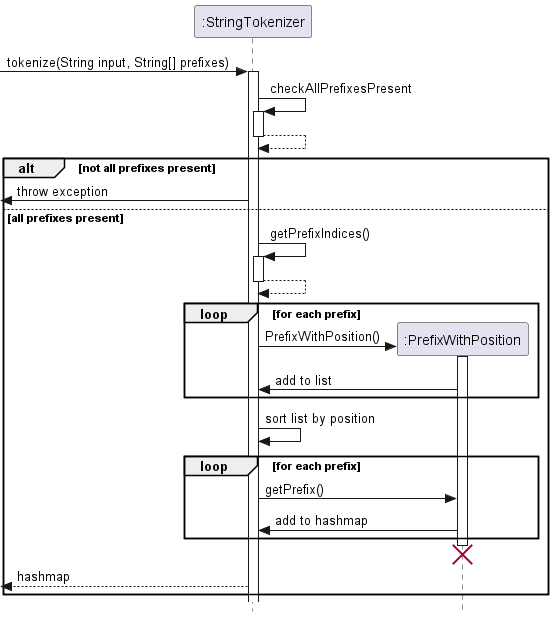

# Developer Guide

## Acknowledgements

{list here sources of all reused/adapted ideas, code, documentation, and third-party libraries -- include links to the original source as well}

## Design & implementation

### Budget Handler

### String Tokenizer

The String Tokenizer assists in the parsing of user input. It is used to split the user input into a hashmap according to the delimiter/prefix of each command. This allows the developer to more easily customize the commands and add new commands without having to worry about the parsing of the user input.

> **Example**:\
> `addIncome money /amt 1000 /date 2021-10-10` with prefixes array `{"addIncome", "/amt", "/date"}` will be tokenized into a hash map with the following key-value pairs:\
> `addIncome: money`\
> `amt: 1000`\
> `date: 2021-10-10`

Delimiters can also be specified as optional by adding ":optional" to the end. This allows the user to omit the prefix when entering the command.

#### Implementation

The tokenize function is implemented by the StringTokenizer class. It takes in the user input and the prefixes array and returns a hashmap of the user input.

**Step 1**\
Check if all necessary prefixes are present in the user input. If not, throw an exception.

**Step 2**\
Generate list of PrefixWithPosition (containing the prefix/delimiter and the position in the string) for the delimiters in the user input

**Step 3**\
Sort the list of PrefixWithPosition by position in order to get the prefixes in the correct order

**Step 4**\
Create a hashmap of the user input by splitting the string using the prefixes' positions and adding the key-value pairs to the hashmap

### Transaction Filter
The filter function assists in filtering both expenses and incomes according to the specified criterion from user's input.

#### Implementation

**Step 1**\
The filterBy() method is called, returning a FindParser object

**Step 2**\
A FilterTransaction object is constructed, with the FindParser object as one of its parameters

**Step 3**\
From the expenseStatement and incomeStatement, the financialStatement is constructed. 

**Step 4**\
Execution of the FilterTransaction class calls method findTransaction(), which prints expenses and incomes that match the provided criterion

## Product scope
### Target user profile

* CashLeh? is a CLI program 
* It is designed to work for a single user
* CashLeh?'s target audience mainly comprises younger working adults and students who have limited incomes and need to 
carefully plan out their expenses and account for their earnings

### Value proposition

CashLeh? is a financial tracker made specifically for working adults who have just began to earn their first salaries
and wages and might need some support finding the correct spending balance. College students and young workers often
struggle with their countless expenses ranging from rent, utilities, groceries and food, tax etc. CashLeh?, though
very simple and intuitive, is supposed to make the process of financial management seamless for them and help them avoid
unnecessary expenses.

## User Stories

| Version | As a ...          | I want to ...                                      | So that I can ...                                                    |
|---------|-------------------|----------------------------------------------------|----------------------------------------------------------------------|
| v1.0    | new user          | see usage instructions                             | refer to them when I forget how to use the application               |
| v1.0    | user              | be able to add my incomes and earnings             | easily manage them and obtain access to an overview                  |
| v1.0    | user              | be able to add my expenses                         | easily keep track of my spending                                     |
| v1.0    | user              | be able to delete my incomes/ expenses             | correct any mistakes and errors                                      |
| v1.0    | user              | be able to view the sum of my incomes/ expenses    | be fully aware of my income/ expense situation and manage my money   |
| v2.0    | user              | be able to view both incomes and expenses together | have an overview of my net financial situation                       |
| v2.0    | parsimonious user | be able to set an overall budget                   | have an upper limit for my relative expenses                         |
| v2.0    | user              | be able to view my budget                          | view my financial situation and organise myself                      |
| v2.0    | user              | be able to delete my previously set budget         | not care about an upper limit or eventually set a new budget         |
| v2.0    | user              | be able to filter my transactions                  | better understand my financial history and easily access information |

## Non-Functional Requirements

1. Should work on any mainstream OS as long as it has Java 11 or above installed.

## Glossary

* *Mainstream OS*: Windows, Linux, Unix, OS-X

## Instructions for manual testing

### Launch and shutdown

#### 1. Initial launch

1. Download the jar file and copy it into an empty folder
2. Open the terminal and run the command `java javac- FILENAME.jar`
3. CashLeh? should launch and you can start interacting with the application

