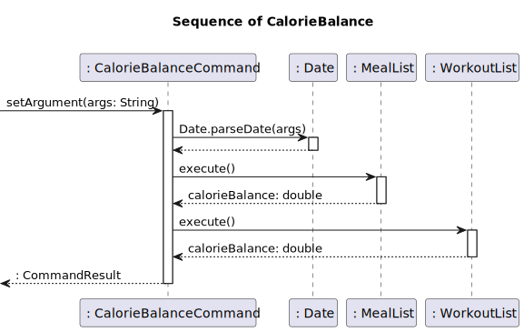
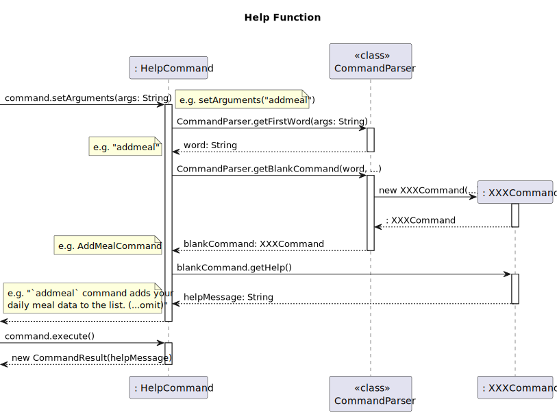

# Developer Guide

---
## Acknowledgements

---
<!--
    {list here sources of all reused/adapted ideas, code, documentation, and third-party libraries 
    -- include links to the original source as well} 
-->
Main structure of the code and the parse feature is adapted from [here](https://github.com/se-edu/addressbook-level2).

---
### Table of Contents

---

* [Design & implementation](#design--implementation)
  * [Architecture](#architecture)
  * [Core Sequence](#core-sequence)
  * [Storage Component](#storage-component)
  * [Parser Component](#parser-component)
  * [Command Component](#command-component)
* [Main Data Structures](#main-data-structures)
* [Commands](#commmands)
  * [Add Function](#1-add-function)
  * [Delete Function](#2-delete-function)
  * [View Function](#3-view-function)
  * [Find Function](#4-find-function)
  * [Calories Function](#5-calories-function)
  * [Help Function](#6-help-function)
* [Product Scope](#product-scope)
  * [Target user profile](#target-user-profile)
  * [Value proposition](#value-proposition)
* [User stories](#user-stories)
* [Non-functional requirements](#non-functional-requirements)
* [Glossary](#glossary)
* [Instructions for manual testing](#instructions-for-manual-testing)

---
## Design & implementation

___

### Main structure

### Architecture
{insert diagram to show architecture of code}

The ***Architecture Diagram*** above shows the high-level overview and design of the FitTrack app. 
Given below is a quick overview of each component.

**Tip:** The '.puml' files used to create the diagrams in this document can be found in [diagrams](./diagrams) 
folder. Refer to the [_PlantUML Tutorial_ at se-edu/guides](https://se-education.org/guides/tutorials/plantUml.html) 
to learn how to create and edit diagrams.

The **`Main`** class is called [`FitTrack`](../src/main/java/fittrack/FitTrack.java).


### Core Sequence
Core sequence of code is written in [`FitTrack`](../src/main/java/fittrack/FitTrack.java) class.


The App consists of five components.
* [**`Storage`**](#storage-component): Reads data from, and writes data to, the hard disk.
* **`UI`**: The UI of the App.
* [**`Parser`**](#parser-component): Handles user input.
* **`Model`**: Holds the data of the app in memory.
* [**`Command`**](#command-component): The command executor.

### Storage Component
API: `Storage.java`

Storage load and save functions are written in [`Storage`](../src/main/java/fittrack/storage/Storage.java) class.


The sequence diagram of the code for loading the file contents into each class.


The sequence diagram of the code for saving meal list data into mealList.txt file

The `Storage` component,
* can save user profile data in text format and load it back
* can save meals in text format and load it back
* can save workouts in text format and load it back

**Design Considerations**
* There are two methods to implement saving of data. Either save data after every command or save everything upon exiting the program.
* Option 1 (Currently implemented): Saving data after every command
  * Advantage: Data does not get lost if program suddenly exits. Changes are saved after every command.
  * Disadvantage: Slows the program down when there is large amount of data to be saved.
* Option 2: Save data once upon exit
  * Advantage: More efficient and better performance of the program.
  * Disadvantage: If program crashes, no data is saved.

### Parser Component
API: `CommandParser.java`

The [`CommandParser`](../src/main/java/fittrack/parser/CommandParser.java) is responsible for interpreting user inputs and converting it into executable commands.
It plays the role of connecting the user interface and the command execution components.

Refer to the core structure diagram in [Core Sequence](#core-sequence).

**Design Considerations**
* Had to make general methods for all commands.
  * CommandParser.parseCommand()
  * CommandParser.getBlankCommand()
  * Command.setArguments()
  * Command.execute()
* Method for parsing the data is written in each data classes.
  * Height.parseHeight()
  * Meal.parseMeal()
  * ...
* But not all methods.
  * CommandParser.parseIndex()
  * CommandParser.parseKeyword()
* Exception handling is crucial.
  * Users can type literally **anything** in CLI, so all possibilities must be checked.


### Command Component
API: `Command.java`

The command component is responsible for executing specific commands and return a command result.

{sequence or class diagram}

**Design Considerations**
* Write considerations here

Given below is the Sequence Diagram for interactions within the Logic component for the execute("deletemeal 1") call.


---
## Main Data Structures

---
### Implementation

**User Profile**

The user profile class basic deals with all profile settings and data. Storing, organising and calculating data related 
to the user's personal data is done in this class. All first time users are required to enter their height, weight, max 
daily calorie intake and gender before they can begin. For the categorisation of BMI, a hashmap is used.

**MealList**

The meal list class is used to keep track of meals and calories consumed by the user. It uses an arraylist to store the 
meals that the user has eaten, including the calories and the date.

**WorkoutList**

Similar to the meal list class, the workoutlist class is used to keep track of all workouts done by the user. It also uses an
arraylist to store the workouts, including the calories burnt and the date of the workout.

**StepList**

The steplist keeps track of the steps the user has made and store it in an arraylist. The user
inputs the number of steps as well as the date.

---
## Commmands

---
### 1. Add Function
The add function has three commands - `addmeal`, `addworkout` and `addsteps`. The three commands allows
the user to add their meals, workouts and number of steps respectively.

**Design Considerations**

**Implementation**

Here is an example of addmeal command which has 2 compulsory arguments `name` and `c/` and one optional argument `d/`.

Example:
```
addmeal chicken c/200 d/2023-11-11
```

Below are the steps that shows the implementation of addmeal/workout/steps.

*Step 1:*

The addmeal command instance calls ...

Example:
```
{insert code snippet}
```
*Step 2:*

Meal is added to mealList...

*Step 3:*

The added meal is then displayed to the user through the Ui


The diagram below shows the class/sequence structure of the addmeal mechanism:


### 2. Delete Function
The delete function has three commands - `deletemeal`, `deleteworkout` and `deletesteps`. The three commands allows
the user to delete their meals, workouts and number of steps respectively.

**Design Considerations**

**Implementation**

Here is an example of deletemeal command which has 1 compulsory argument `index`.

Example:
```
deletemeal 1
```

Below are the steps that shows the implementation of deletemeal/workout/steps.

*Step 1:*

The deletemeal command instance calls ...

Example:
```
{insert code snippet}
```
*Step 2:*

Meal is deleted from mealList...

*Step 3:*

The deleted meal is then displayed to the user through the Ui


The sequence diagram for deletemeal mechanism is shown [here](#command-component):

### 3. View Function
The view function has four commands - `viewmeal`, `viewworkout`, `viewsteps` and `viewprofile`. The four commands allows
the user to view their meals, workouts, number of steps and user profile respectively.

**Design Considerations**

**Implementation**
Here is an example of viewmeal command.

Example:
```
viewmeal
```

Below are the steps that shows the implementation of viewmeal/workout/steps/profile.

*Step 1:*

The viewmeal command instance calls ...

Example:
```
{insert code snippet}
```
*Step 2:*

The list of meals are displayed to the user through the Ui.


The diagram below shows the class/sequence structure of the {view} mechanism:
{Insert sequence or class diagram}

### 4. Find Function
The find function has two commands - `findmeal` and `findworkout`. The two commands allows
the user to view their meals, workouts, number of steps and user profile respectively.

**Design Considerations**

**Implementation**
Here is an example of findmeal command which has 1 compulsory argument `keyword`. The keyword is the word
the user wishes to search for.

Example:
```
findmeal chicken
```

Below are the steps that shows the implementation of findmeal/workout.

*Step 1:*

The findmeal command instance calls ...

Example:
```
{insert code snippet}
```

*Step 2:*

Search mealList for the keyword...

*Step 3:*

The list of meals with the keyword will be shown to the user through the Ui.

The diagram below shows the class/sequence structure of the {find} mechanism:
{Insert sequence or class diagram}

### 5. Calories Function
{description}

**Design Considerations**

**Implementation**

{description of the command}

{example of input} 

*Step 1:*

*Step 2:*

*Step 3:*

The diagram below shows the class/sequence structure of the caloriebalance mechanism:


### 6. Help Function
Help command outputs general help message if there's no argument,
and outputs the help of the given command if certain command is given as an argument.

For example, `help` outputs general help message, and `help addmeal` outputs
help message for `addmeal` command.

**Design Considerations**

The design has to differentiate between the cases which has no argument and has an argument
looking for help. Also, when developer adds more commands, it's better to work less.
So I wanted the help function to behave well if a developer writes only a description and
a usage of the command.

**Implementation**

*Step 1:*
From the given argument, get the first word of the argument, which is the command word.
If the argument is an empty string, set help message with a general help message.

*Step 2:*
Get the blank command instance based on the command word.

*Step 3:*
Get the help message from the blank command instance. It uses getHelp() method. If you want to
add new command, then you have to implement getHelp() method for the help function.

*Step 4:*
The result of command execution is the help message in step 3.

The diagram below shows part of the class/sequence structure of the {help} mechanism:


### 7. Step Function
The step functionality has a suite of commands namely `addsteps`, `deletesteps`, `viewsteps`, `totalsteps`
and `getstepssuggestions`. 

The commands allow the user to add, delete, view, get total steps and get suggestions (based on the calories
they walk and their daily calorie goal) respectively.

**Design Considerations**

**Implementation**

Here is an example of the step command. For `addsteps` and `viewsteps`, the command has 2 compulsory arguments `steps` and `date`.
If a date is not provided, it will default to the current date.

```
addsteps 2000 d/2023-10-23
totalsteps 2023-10-23
viewsteps
deletesteps 1
getstepssuggestions 2023-10-23
```
As all of these are commands that perform a specific task, they inherit the Command class (like all other commands).
The steps command will specifically interact with the `stepList` in the superclass

- `addsteps` will add a new `Step` object to the `stepList`.
- `totalsteps` will iterate through the list and sum up all the steps taken on the specified date.
- `viewsteps` will iterate through the stepList and display all the steps taken in a list form.
- `deletesteps` will remove a specified step from the `stepList` based on its index.
- `getstepssuggestions` will calculate the calories burnt based on the steps taken and the user's weight. It 
will then suggest how many more steps they need to take to meet their daily calorie goal.

The below sequence diagram shows the sequence of the `addsteps` command: 


...and `deletesteps` command.


### 8. Handling an Invalid Input
If user enters invalid input, the app uses `InvalidCommand` class to handle it.

**Design Considerations**

Designed to provide an information why the user input is invalid.
Also, help of command is provided if the input command is known.

**Implementation**

*Step 1:*
If input command fails matching, command word is invalid, or any of command arguments is invalid,
CommandParser.getInvalidCommand() method is called.

*Step 2:*
Create `HelpCommand` instance to get a help message for the invalid input.

*Step 3:*
Use `HelpCommand`'s execution result and exception message to make a feedback to user.

Refer to [`CommandParser`](../src/main/java/fittrack/parser/CommandParser.java), [`InvalidCommand`](../src/main/java/fittrack/command/InvalidCommand.java),[`HelpCommand`](../src/main/java/fittrack/command/HelpCommand.java) classes for more information.

The diagram below shows the class/sequence structure of the {help} mechanism:


---
## Product scope

---
### Target user profile

People who want to be healthy by managing their diet and workout.

### Value proposition

Fittrack is a health management application which allows users to record their diet and activity, and help them to reach the goal they have set.

Fittrack also allows its users to calculate their total calories spent in a day and receive suggestions
on possible changes to their exercise, diet and lifestyle.

Users will also be able to calculate key parameters of their profile like 
BMI, ideal weight for their height and so on.

---
## User Stories

---

| Version | As a ... | I want to ...                                                                                     | So that I can ...                                            |
|---------|----------|---------------------------------------------------------------------------------------------------|--------------------------------------------------------------|
| v1.0    | new user | know how to use the product                                                                       | use the product                                              |
| v1.0    | new user | add my height and weight                                                                          | keep track of my height and weight                           |
| v1.0    | new user | add my calorie intake for a meal                                                                  | record my calorie intake                                     |
| v1.0    | new user | add my daily workout                                                                              | track my calories burnt                                      |
| v1.0    | new user | set my daily calorie surplus limit                                                                | know whether my calorie surplus has exceeded the limit or not |
| v1.0    | new user | delete my daily workout                                                                           | track my calorie usage                                       |
| v1.0    | new user | delete my calorie intake for a meal                                                               | track my calorie intake                                      |
| v1.0    | new user | edit my height and weight information                                                             | apply my changed height and weight                           |
| v1.0    | new user | view my calorie intake for a meal                                                                 | know my calorie intake                                       |
| v1.0    | new user | view my daily workout                                                                             | know my previous daily workouts                              |
| v1.0    | new user | view my height, weight, and daily calorie surplus limit                                           | know my height, weight and calorie surplus limit             |
| v2.0    | user     | find a to-do item by name                                                                         | locate a to-do without having to go through the entire list  |
| v2.0    | user     | Calculate my ideal weight for my height                                                           | maintain my weight in the healthy range                      |
| v2.0    | user     | see the total calories I have consumed on a particular date                                       | track my daily calories intake                               |
| v2.0    | user     | see the total calories I have burnt on a particular date                                          | track my daily calories burnt                                |
| v2.0    | user     | find a meal or workout                                                                            | quickly search my past meals or workouts                     |
| v2.1    | user     | add my daily step count                                                                           | record my daily steps walked                                 |
| v2.1    | user     | delete my daily step count                                                                        | remove the entry of my daily steps walked                    |
| v2.1    | user     | view daily step count                                                                             | view the total number of daily steps walked in a list        |
| v2.1    | user     | Get a suggestion to walk more steps based on my calories burned walking and my daily calorie goal | see how my walking is helping me meet my calorie goals       |


## Non-Functional Requirements

- Should be OS diagnostic as long as it runs Java 11
- Should be able to handle 1000+ workouts and meals
- Does not require internet connection to run
- Should be usable for an average typist.
- Should be able to handle incorrect user input and provide feedback to the user.

## Glossary

* *BMI* - Body Mass Index (BMI) is a person’s weight in kilograms (or pounds) 
divided by the square of height in meters (or feet).
* People can lose or gain weight through a calorie deficit/surplus,
by providing them with a platform to easily monitor their calories 
throughout the day, this can make their weight loss/gain journey
easier.


## Instructions for manual testing

Given below are the instructions to test the app manually.

Note: These instructions only provide a foundation for testers to work on.

### Launch and Shutdown
1. Initial Launch
   1. Download the jar file and copy the file into an empty folder.
   2. Open up a terminal or command prompt and run the command `java -jar fittrack.jar`.
      You should see a welcome message with the large FitTrack word.
2. Closing the Application
   1. Type `exit` into the terminal
   2. Expected: FitTrack will exit with a goodbye message and save your data.
      Inside the data directory is where the files are stored.