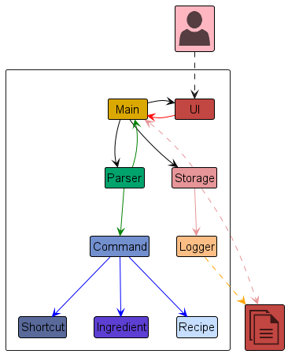
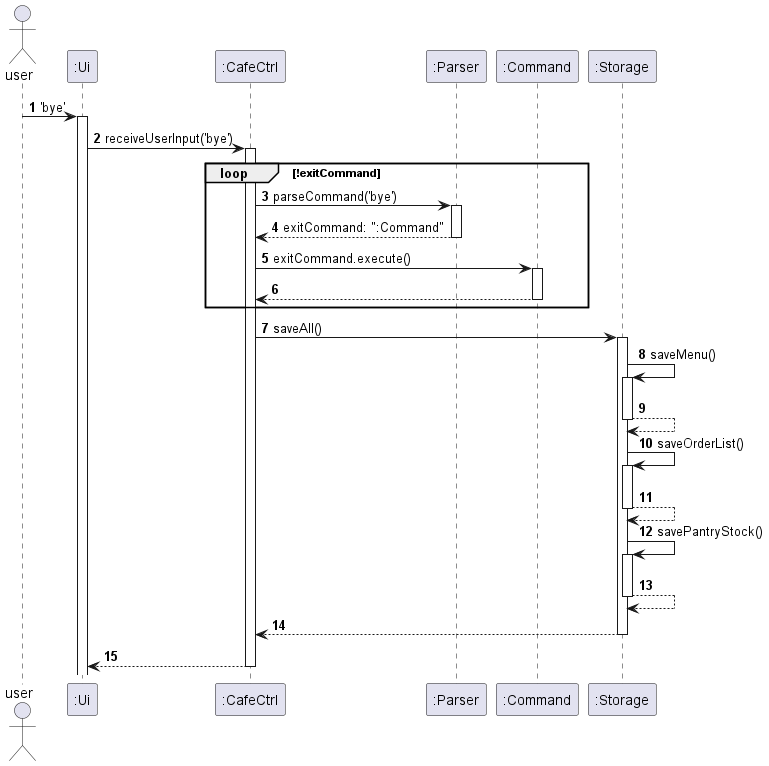
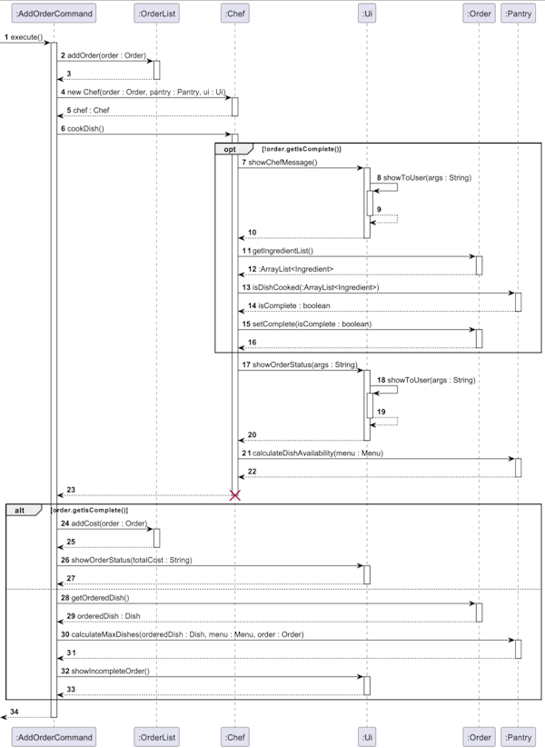
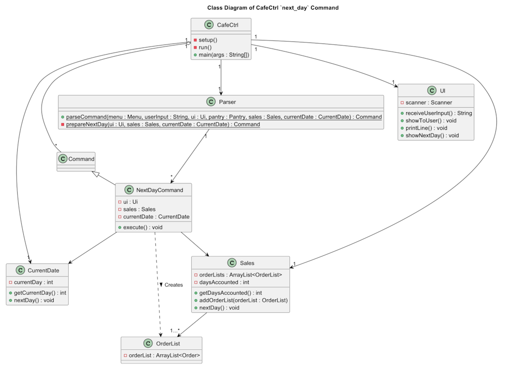
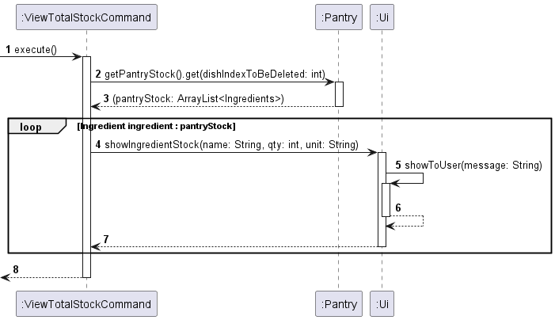
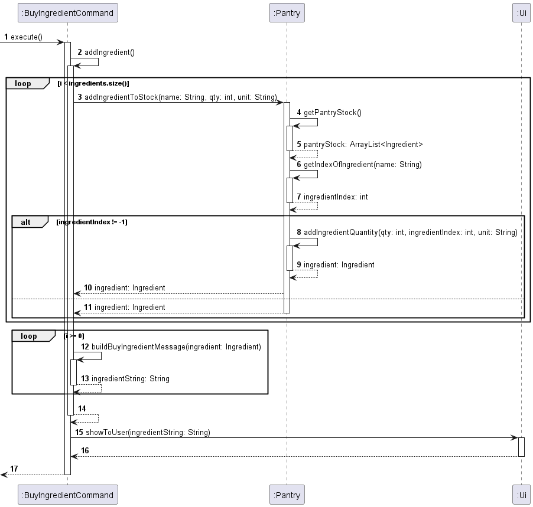

# Developer Guide
* Table of Contents
<!-- TOC -->
* [Developer Guide](#developer-guide)
  * [**Acknowledgements**](#acknowledgements)
  * [**Setting up, getting started**](#setting-up-getting-started)
  * [**General notes**](#general-notes)
  * [**Design**](#design)
    * [Architecture](#architecture)
    * [How the architecture components interact with each other](#how-the-architecture-components-interact-with-each-other)
    * [Ui component](#ui-component)
    * [Parser component](#parser-component)
    * [Storage component](#storage-component)
    * [Data component](#data-component)
  * [**Feature**](#feature)
    * [Add Dish](#add-dish)
    * [List Menu](#list-menu)
    * [Add Order](#add-order)
    * [Next Day](#next-day)
    * [Previous Day](#previous-day)
    * [List Ingredients](#list-ingredients)
    * [List Sale By Day](#list-sale-by-day)
    * [Pantry - isDishCooked()](#pantry---isdishcooked)
    * [Pantry - calculateMaxDish()](#pantry---calculatemaxdish)
    * [Delete Dish](#delete-dish)
    * [Edit Price](#edit-price)
    * [View Total Stock](#view-total-stock)
    * [Buy Ingredient](#buy-ingredient)
    * [Help](#help)
  * [**Future Enhancements**](#future-enhancements)
    * [Create an interface for `Pantry`](#create-an-interface-for-pantry)
    * [Make `Ui` class singleton](#make-ui-class-singleton)
  * [**Product scope**](#product-scope)
    * [Target user profile](#target-user-profile)
    * [Value proposition](#value-proposition)
  * [**Requirements**](#requirements)
    * [Non-functional requirements](#non-functional-requirements)
    * [User stories](#user-stories)
  * [**Glossary**](#glossary)
  * [**Instruction for manual testing**](#instruction-for-manual-testing)
    * [Launch and shutdown](#launch-and-shutdown)
    * [Editing the price of a dish](#editing-the-price-of-a-dish)
<!-- TOC -->

## **Acknowledgements**

[addressbook-level2](https://github.com/se-edu/addressbook-level2) <br>
[addressbook-level3](https://github.com/se-edu/addressbook-level3)

--------------------------------------------------------------------------------------------------------------------
## **Setting up, getting started**

Refer to the guide [_UserGuide_](UserGuide.md).

--------------------------------------------------------------------------------------------------------------------
## **General notes**

Only relevant attributes/associations/methods will be included in the UML diagram. Some of them are omitted to avoid confusion.

--------------------------------------------------------------------------------------------------------------------
## **Design**

### Architecture

<br>*Figure 1: Architecture Diagram*

The ***Architecture Diagram*** given above explains the high-level design of the App.
Listed below is a brief summary outlining the primary components and their interrelationships.

In summary, the user interacts with the Ui components, initiating a sequence that involves:
- `Parser` component for command interpretation
- `Command` component for execution 
- `Data` component for managing application data

The `Storage` component mainly handles interaction with external text files and main coordinates the interactions between the various Components.

The bulk of the app’s work is done by the following components:
- `Ui` : The UI of the App.
- `Storage` : Reads data from, and writes data to, the text files.
- `Data` : Consists of all the classes that are involved in execution of commands.
- `Parser` : Makes sense of user input to return the appropriate command
- `Command` : Executes the command requested by the user.

### How the architecture components interact with each other

The Sequence Diagram below shows how the components interact with each other for the scenario where the user issues the command `bye`.


<br>*Figure 2: Architecture Encode Sequence Diagram*

1. User enters the command `bye` to the `Ui`
2. `Ui` passes the command as a string through the method `receiveUserInput('bye')` in `CafeCtrl`
3. `CafeCtrl` passes the string to `Parser` through the method `parseCommand('bye')`
4. `Parser` returns a new `exitCommand` object
5. `CafeCtrl` calls the `execute()` method of `Command` and returns after execution is completed (Step 6)
6. `CafeCtrl` calls the `saveAll()` command in `Storage` before terminating the application
7. `saveMenu()`, `saveOrderList()`, and `savePantryStock` are executed within the `saveAll()` method (Steps 8 - 13)
8. Application terminates.

### Ui component
API: [Ui.java](https://github.com/AY2324S1-CS2113-T17-2/tp/blob/master/src/main/java/seedu/cafectrl/ui/Ui.java)


<br>*Figure 3: Ui Class Diagram*

The `Ui` component is responsible for interacting with the user. Within CafeCtrl, `Ui` is instantiated by `Parser`, `Command`, `Main`, `Data`, and `Storage` components to access the print methods in `Ui.java`.

In the Ui component,
- `Ui.java` consists of multiple methods that received the user input and prints messages to the system console for users to see
- `Messages.java` consists of multiple strings that contains greeting, command, and goodbye messages to be shown to user
- `ErrorMessages.java` consists of multiple strings that contain error messages to be shown to user when an incorrect command or exception has been returned

### Parser component
API: [Parser.java](https://github.com/AY2324S1-CS2113-T17-2/tp/blob/master/src/main/java/seedu/cafectrl/parser/Parser.java)


<br>*Figure 4: Parser Class Diagram*

The `Parser` component is responsible for interpreting the user's input and return appropriate `Command` for execution. If the input is unrecognisable, `Parser` will return an `IncorrectCommand` which will display error message to the user through `Ui`.

<div markdown="span" class="alert alert-info">**Note:** `CafeCtrl` only have access to the interface `ParserUtil` although the run-time type object is `Parser`. With this, we are able to decrease coupling between `CafeCtrl` and `Parser`, allowing for easier maintenance. This also ensures the testability as we could provide mock or stub dependencies during testing, we could isolate the behavior of the class and focus on unit testing without external dependencies.</div>

Below is the sequence diagram of a parser which shows how `Parser` parses user input:


<br>*Figure 5: Parser Parsing User Input Sequence Diagram*

When user input string is received through `Ui`, which passes the full user input to `Main`. `Main` then passes it to `Parser` via `parseCommand` for interpretation. In `parseCommand`,  it finds the matching keyword for different command from the user input, it calls the respective `prepareCommand` method within itself. `prepareCommand` then generates the corresponding command class and return it to `parseCommand`, which returns the `Command` back to `Main` for execution.

### Storage component
API: [Storage.java](https://github.com/AY2324S1-CS2113-T17-2/tp/blob/master/src/main/java/seedu/cafectrl/storage/Storage.java)


<br>*Figure 6: Storage Class Diagram*

The `Storage` class,
- loads and saves the list of dishes on the `Menu`, available ingredient stock in `Pantry` and orders for the day in `OrderList` in a text file.
- detects if the file is tampered by the user by reading the hash number in the storage text files
- depends on `Menu`, `Pantry` and `Sales` objects (which are found in the data package).
- is composed of `FileManager` object as the text file needs to be located first before reading or writing.

### Data component
Folder: [Data](https://github.com/AY2324S1-CS2113-T17-2/tp/tree/master/src/main/java/seedu/cafectrl/data)

<br>*Figure 7: Data Package Class Diagram*

The 'Data' package consists of all the classes that the commands interact with to perform various functions.
A summary of the class diagram is as listed below:
- Each `Dish` within the `Menu` is constructed with a set of `Ingredient` instances, forming a one-to-many relationship with `Ingredient`.
- `Pantry` is instantiated with an ArrayList of `Ingredients` (`pantryStock`), forming a one-to-many relationship with `Ingredient`.
- The `Chef` class has a one-to-one relationship with `Pantry`, ensuring access to necessary ingredients for dish preparation.
- When an order is placed, the `Order` class is instantiated with an ArrayList of `Ingredient` (`ingredientList`), forming a one-to-many relationship with `Ingredient`.
- `OrderList` is instantiated with an ArrayList of `Order`, forming a one-to-many relationship with `Order`.
- `Sales` is instantiated with an ArrayList of `OrderList`, forming a one-to-many relationship with `OrderList`.
- Lastly, the `CurrentDate` class keeps track of the current operating day of the cafe.

--------------------------------------------------------------------------------------------------------------------
## **Feature**

### Add Dish


<br><br>*Figure 8: Execution of `add` Command Sequence Diagram*

API: [AddDishCommand.java](https://github.com/AY2324S1-CS2113-T17-2/tp/blob/master/src/main/java/seedu/cafectrl/command/AddDishCommand.java)

The `add` command, add a dish to the `Menu` object and prints out a formatted message to state the name, price and ingredients entered for the dish.

when the `execute()` method from `AddDishCommand` is called in the main class `CafeCtrl`, the `addDish()` method is first called to add the `Dish` object to the `Menu`. It will then call the `printAddDishMessage()` method, which gets all the parameters of the `Dish` object (dishName, dishPrice, dishIngredients) and passes them to the `Ui` to then be printed out to the User.

Separation of Concerns was applied to ensure the `Ui` is only responsible with only displaying messages while the `Menu` deals with the logic of adding dish to the menu. This implementation also encapsulates the details of adding a dish and displaying messages. For example, The `AddDishCommand` class doesn't need to know how the internal details of the dish adding and message printing are performed.

### List Menu
A `list_menu` command can be used to display all the `Dish` objects stored in `Menu`.

The following class diagram illustrates the relationship between the respective classes involved in the creation and execution of a list_menu command.

<br>*Figure 9: Execution of `list_menu` Command Class Diagram*


<br>*Figure 10: Execution of `list_menu` Command Sequence Diagram*

API: [ListMenuCommand.java](https://github.com/AY2324S1-CS2113-T17-2/tp/blob/master/src/main/java/seedu/cafectrl/command/ListMenuCommand.java)

When the `execute()` method of ListMenuCommand is invoked in Main, it checks if the size of the menu by running `menu.getSize()`. 

1) If the menu is empty, it will call its `printEmptyMenu()` method to display to the user a `MENU_EMPTY_MESSAGE` in the Ui object and returns afterward.
2) If the menu is not empty, it will call its `printFullMenu()` method.
`printFullMenu()` will first print the top portion of the menu using the Ui object. 
It then iterates through the `Dish` objects in `Menu` in a "for" loop, using `menu.getDishFromId()` to retrieve the Dish object.
The `dishName` and `dishPrice` are both access from `Dish` Class using `getName()` and `getPrice()` respectively.
The data are then packaged nicely in a `leftAlignFormat`, with (indexNum + ". " + dishName," $" + dishPrice) such that
   e.g. (1. Chicken Rice $2.50) is shown.

### Add Order
An add_order command can be used to add `order` to an `orderList` in `Sales`.

The following class diagram illustrates the relationship between the respective classes involved in the creation and execution of an add_order command.

<br>*Figure 11: Execution of `add_order` Command Class Diagram*


<br>*Figure 12: Execution of `add_order` Command Sequence Diagram*

API: [AddOrderCommand.java](https://github.com/AY2324S1-CS2113-T17-2/tp/blob/master/src/main/java/seedu/cafectrl/command/AddOrderCommand.java)

When the `execute()` method of AddOrderCommand is invoked in Main, the parsed `order` object is added to the `orderList`.

A `Chef` object is then created to process the order by running `cookDish()`. 
This method first checks if the order has already been completed by running `order.getIsCompleted()`.
If the order has not been completed, the `showChefMesage()` in the Ui component is triggered to display a message to show the user that the dish is being 'prepared'.
An ArrayList of Ingredients, ingredientList, is retrieved from the `order` object by `order.getIngredientList()`. 
This ingredientList is passed into the `pantry` object in `pantry.isDishCook()` to process the ingredients used from the pantry stock.
This method returns a boolean, true if there is sufficient ingredients in the pantry, false is insufficient.
The order completeness status is updated by the boolean method, passing it into `order.setComplete()`

Returning to the AddOrderCommand, the `order` object is checked to be completed again by running `order.getIsCompleted()`.
This verifies that the has been successfully completed.
After verifying that the order has been completed, the cost of the order is added to the total order by `orderList.addCost()`. 
The total cost is the shown to the user using `ui.showOrderStatus`.
Lastly, the pantry checks on the remaining ingredients in stock and calculates the potential future dishes able to be made with the remaining stock, using `pantry.calculateDishAvailability()`.

If the order has been marked incomplete, the details of the orderedDish is retrieved from `Order` using `order.getOrderedDish()`.
This is then passed on to the `Pantry` to figure out the missing ingredients, by `pantry.calculateMaxDishes()`.
Lastly, the user is shown a message informing that the order has not been completed due to the lack of ingredients using `ui.showIncompleteOrder()`.

### Next Day
A `next_day` command can be used advance the current day.

The following class diagram illustrates the relationship between the respective classes involved in the creation and execution of a next_day command.

<br>*Figure 13: Execution of `next_day` Command Class Diagram*


<br>*Figure 14: Execution of `next_day` Command Sequence Diagram*

API: [NextDayCommand.java](https://github.com/AY2324S1-CS2113-T17-2/tp/blob/master/src/main/java/seedu/cafectrl/command/NextDayCommand.java)

When the `execute()` method of NextDayCommand is invoked in Main, the day in the program is advanced by 1 day, by running `currentDate.nextDay()`.

The next day data is retrieved from the `CurrentDate` object using `currentDate.getCurrentDay()`.
This next day data is compared with the days accounted for in the `Sales` object, retrieved using `sales.getDaysAccounted()`.

If the next day is more than the number of days accounted in sales, this means that there is no `orderList` prepared for the coming day.
A new `OrderList` object is created using `new OrderList()`, and added into the `Sales` object by running `sales.addOrderList()`.
Following this, the day has been accounted and this is updated through `sales.nextDay()`.

To end off the command, `ui.showNextDay()` is run to display a message to the user a prepared message for advancing the day.
The user is also shown the advanced day number.

### Previous Day
A `previous_day` command can be used to recede the current day.

The following class diagram illustrates the relationship between the respective classes involved in the creation and execution of a next_day command.

<br>*Figure 15: Execution of `previous_day` Command Class Diagram*


<br>*Figure 16: Execution of `previous_day` Command Sequence Diagram*

API: [PreviousDayCommand.java](https://github.com/AY2324S1-CS2113-T17-2/tp/blob/master/src/main/java/seedu/cafectrl/command/PreviousDayCommand.java)

When the `execute()` method of PreviousDayCommand is invoked in Main, the day in the program is receded by 1 day, by running `currentDate.previousDay()`.

To end off the command, `ui.showPreviousDay()` is run to display a message to the user a prepared message for receding the day.
The user is also shown the receded day number.

### List Ingredients

<br>*Figure 17: Execution of `list_ingredient` Command Sequence Diagram*

API: [ListIngredientCommand.java](https://github.com/AY2324S1-CS2113-T17-2/tp/blob/master/src/main/java/seedu/cafectrl/command/ListIngredientCommand.java)

The diagram above omits the showToUser() function in the Ui class to prevent unnecessary sophistication.
Although it may seem tedious the steps are essentially as listed below:
- The sequence begins with the `Main` class invoking the `execute` method of the `ListIngredientCommand` after using a parser command.
- The `ListIngredientCommand` communicates with the `Menu` class, invoking the `getMenuItemsList()` method to retrieve a list of menu items. The function returns an ArrayList of objects of 'Dish' type.
- The `ListIngredientCommand` communicates with the `Ui` class, invoking the `showListIngredients()` method to print out the list of ingredients used for the selected dish. 
- The `Ui` class communicates with the `Dish` class, invoking the `getIngredients()` method to obtain the list of ingredients for the selected dish. The `Dish` class responds with an ArrayList of objects of 'Ingredient' type to the `Ui` class.
- There is a loop that iterates through each ingredient in the list. The `Ui` class interacts with the `Ingredients` class, to obtain the name, quantity and unit of the ingredient.
- The `Ui` class showcases the information to the user through the `formatListIngredient()` method.

### List Sale By Day

<br>*Figure 18: Execution of `list_sale` Command Sequence Diagram*

API: [ListSaleByDayCommand.java](https://github.com/AY2324S1-CS2113-T17-2/tp/blob/master/src/main/java/seedu/cafectrl/command/ListSaleByDayCommand.java)

The diagram above omits the showToUser() function in the Ui class to prevent unnecessary sophistication.
The steps are essentially as listed below:
- The sequence starts with the invocation of the `execute()` method in the `ListSaleByDayCommand` class, which the invokes the `sales.printSaleByDay()` method.
- The `Sales` class interacts with the `OrderList` class to check if there are completed orders to be displayed.
- If there are no completed orders or no orders at all, a message is shown to the user via the `Ui` class and the command's execution ends.
- If there are completed orders, the process continues to display it in a table format.
  - `showSalesTop()`: Display table header
  - `orderList.printOrderList()`: The OrderList iterates over each order, aggregates orders, and prints details for each aggregated order. For each aggregated order, details like dish name, quantity, and total order cost are retrieved from the Order class and shown to the user via the Ui class.
  - `showSalesCost()`: Displays the total sales cost for the aggregated orders.
  - `showSalesBottom()`: Displays the bottom of the table

* The List Total Sales command follows a comparable sequence, and as such, it will be excluded to avoid the repetition of multiple similar diagrams.

### Pantry - isDishCooked()

<br>*Figure 19: Data Processing of `isDishCooked()` Function Used in `add_order` Command Sequence Diagram*

API: [Pantry.java](https://github.com/AY2324S1-CS2113-T17-2/tp/blob/master/src/main/java/seedu/cafectrl/data/Pantry.java)

This section briefly explains how `add_order` checks if the order added is successfully cooked.
The steps are essentially as listed below:
- The sequence starts with the invocation of `isDishCooked()` to the `Pantry` class, with a list of ingredients needed for the order.
- For each ingredient in the dish, `isDishCooked()` first obtains the quantity of the ingredients needed (`usedQty`) for the order as shown in step 4 and 5.
- The function then attempts to get the Ingredient used from the current stock in the Pantry (`stockQty`) as shown in steps 11 and 12. 
  - If `usedIngredientFromStock` is null, it means that the ingredient does not exist in the Pantry and the sequence ends with a `false` being returned.
  - If `usedIngredientFromStock` exists but the quantity is insufficient, 
  - If `usedIngredientFromStock` is found and the quantity is sufficient, the used quantity is deducted from the stock quantity in the Pantry and the sequence ends with a `true` being returned.
- A `false` indicates that the order was unsuccessful while a `true` indicates that the order was successful.

### Pantry - calculateMaxDish()

<br>*Figure 20: Data Processing of `calculateMaxDish()` Function Used in `add_order` Command Sequence Diagram*

API: [Pantry.java](https://github.com/AY2324S1-CS2113-T17-2/tp/blob/master/src/main/java/seedu/cafectrl/data/Pantry.java)

This section briefly explains how `add_order` checks if restocking of ingredients is needed.
The steps are essentially as listed below:
- The sequence starts with the invocation of `calculateMaxDish()` to the `Pantry` class.
- Steps 2 to 6 involves retrieving the ingredients used to make the dish.
- The function `calculateMaxDishForEachIngredient` returns an integer and assigns it to the variable `numOfDish` which is the maximum number of dishes that can be cooked.
- If the order is incomplete
  - ingredients that need restocking will be passed into the `handleRestock` function.
- If the order is complete, 
  - ingredients that are unable to prep the next dish will be passed into the `handleRestock` function.

### Delete Dish


<br>*Figure 21: Execution of `delete` Command Sequence Diagram*

API: [DeleteDishCommand.java](https://github.com/AY2324S1-CS2113-T17-2/tp/blob/master/src/main/java/seedu/cafectrl/command/DeleteDishCommand.java)

When the `execute()` method of `DeleteDishCommand` is invoked in `Main`, it subsequently calls `getMenuItemsList().get(dishIndexToBeDeleted)` method on the `Menu` object to retrieve the `Dish` object to be deleted.
Following this, the `showDeleteMesage()` method in the Ui component is triggered to display a message to show the user which dish is about to be deleted.
Afterward, `DeleteDishCommand` calls `removeDish(dishIndexToBeDeleted)` of the `Menu` object to remove the selected dish at the index indicated by the user.
This sequence of actions orchestrates the flow of information and operations between `Main`, `DeleteDishCommand`, `Menu`, and `Ui` components, ensuring the seamless handling of the dish deleting functionality within the application.


`DeleteDishCommand` is implemented in such a way because:
1. It promotes loose coupling between components. For instance, `Main` doesn't need to know the details of how the `execute()` of `DeleteDishCommand` is executed or how the message is displayed in `Ui`.
2. Each component has a specific role and responsibility. `Main` is responsible for receiving user input and invoking `execute()`, `DeleteDishCommand` is responsible for encapsulating the delete operation, `Menu` is responsible for managing the menu items, and `Ui` is responsible for displaying messages to the user. This separation of concerns makes the code more maintainable and easier to understand.

### Edit Price


<br>*Figure 22: Execution of `edit_price` Command Sequence Diagram*

API: [EditPriceCommand.java](https://github.com/AY2324S1-CS2113-T17-2/tp/blob/master/src/main/java/seedu/cafectrl/command/EditPriceCommand.java)

When the `execute()` method of `EditPriceCommand` is invoked in `Main`, it subsequently calls the `setPrice()` method on the `Dish` object to modify the price of the specific dish. Following this, the `showEditPriceMessages()` method in the `Ui` component is triggered to retrieve and display a message from `Messages` related to the successful execution of the price modification process. This sequence of actions orchestrates the flow of information and operations between the `Main`, `EditPriceCommand`, `Dish`, and `Ui` components, ensuring the seamless handling of the price editing functionality within the application.

### View Total Stock


*Figure 23: Execution of view_stock command*

API: [ViewTotalStockCommand.java](https://github.com/AY2324S1-CS2113-T17-2/tp/blob/master/src/main/java/seedu/cafectrl/command/ViewTotalStockCommand.java)

When the `execute()` method of `ViewTotalStock` is invoked, an ArrayList of Ingredients are retrieved through the method `getPantryStock`. For each ingredient in the ArrayList, `ViewTotalStock` calls `showIngredientStock` from `Ui` to print out the list of ingredients in the ArrayList.

### Buy Ingredient


*Figure 24: Execution of buy_ingredient command*

API: [BuyIngredientCommand.java](https://github.com/AY2324S1-CS2113-T17-2/tp/blob/master/src/main/java/seedu/cafectrl/command/BuyIngredientCommand.java)

When the `execute()` method is invoked
1. `addIngredient` in `BuyIngredientCommand` is called
2. Looping from the **first to the last** element in an ArrayList of Ingredients called `ingredients`, `addIngredientToStock` from `Pantry` is invoked
3. First, `pantryStock` is retrieved and `getIndexOfIngredient` is called to check if the new ingredient exists in `pantryStock`
4. If ingredient exists (`ingredientIndex != -1`), `addIngredientQuantity` is called to update the quantity of the existing ingredient
5. Else, a new `ingredient` object is returned
6. Looping from the **last to the first** element in `ingredients`, the ingredient is added to the string to be printed `ingredientString` using the `buildBuyIngredientMessage` method which ignores repeated ingredients in the list
7. Finally, `ingredientString` is shown to the user through `showToUser` method of `Ui`

### Help


<br>*Figure 25: Execution of `help` Command Sequence Diagram*

API: [HelpCommand.java](https://github.com/AY2324S1-CS2113-T17-2/tp/blob/master/src/main/java/seedu/cafectrl/command/HelpCommand.java)

When the `execute()` method of `HelpCommand` is invoked in `Main`, it subsequently calls the `showHelp()` method in `Ui`. In `showHelp()`, messages related to command usage will be retrieved and be printed out using by self-invoking `showToUserWithSpaceInBetweenLines(messages: String...)`.

--------------------------------------------------------------------------------------------------------------------
## **Future Enhancements**
### Create an interface for `Pantry`
   - **Problem**: `Pantry` class is used in testing of methods such as `addOrder`. With this implementation, we are unable to test the `addOrder` feature in isolation as any bugs in `Pantry` class could potentially affect the behaviour of `addOrder` feature.
   - **Solution**: Instead of using the concrete `Pantry` class, `addOrder` could use an interface `PantryUtil` to access the required methods. A hard coded class that is less prone to bugs can be used to substitute the actual `Pantry` class by implementing a `PantryUtil` interface. <br>With this, we are able to test the method in isolation as we have removed the dependency on the actual `Pantry` class.
### Make `Ui` class singleton
   - **Problem**: As we need to use the same `Ui` instance for all methods to avoid repeated instantiation of `Scanner` which could slow down the application, the same `Ui` instance is being passed to the constructor for all `Command` classes. This makes the parameters for the constructor looks too long.
   - **Solution**: Implement a static `getInstance` method in `Ui` class which, when it is called for the first time, creates a new instance of `Ui` and store it in a static constant in the `Ui` object. The method will return the `ui` object in the constant for subsequent `getInstance` call.<br>With this implementation, we no longer need to pass `ui` around as we can access the same `ui` object by calling `getInstance`.
     
     <br>
     <br>*Figure 26:  singleton Ui Class Diagram*

     <br>
     <br>*Figure 27: `getinstance` call on `Ui` Sequence diagram*
   
--------------------------------------------------------------------------------------------------------------------
## **Product scope**
### Target user profile

Café proprietors who ***love*** typing on CLI and are seeking for a software solution to optimize the management of their café's operations.

### Value proposition

Our product aims to optimize managing of inventory and cash flow in a restaurant. Our CLI platform empowers users to streamline stock inventory, menu and orders. Users will also briefly be able to gain valuable insights through comprehensive sales reporting, enabling them to analyze sales trends and calculate revenue/profit margins, eliminating the need for cross-platform management.

--------------------------------------------------------------------------------------------------------------------
## **Requirements**
### Non-functional requirements

1. This application requires the use of Java 11.
2. This application should work on most mainstream OS.
3. This application should be able to work offline

### User stories

| Priority                      | As a …​                                                               | I want to …​                                            | So that I can…​                                                                         |
|-------------------------------|-----------------------------------------------------------------------|---------------------------------------------------------|-----------------------------------------------------------------------------------------|
| `* * *`                       | cafe owner who is responsible for coming up with new dish             | add dish to the menu                                    | add new dish to the menu                                                                |
| `* * *`                       | cafe manager is responsible for managing pantry stock                 | track the inventory levels for ingredients and supplies | know what ingredients I need to restock                                                 |
| `* * *`                       | cafe manager is responsible for managing pantry stock                 | buy ingredients                                         | restock low stock ingredients                                                           |
| `* * *`                       | cafe owner who is also the chef                                       | view the ingredients needed for a dish                  | know what ingredients to use when cooking a dish                                        |
| `* * *`                       | cafe owner who wants to maximise profit                               | edit the price of the dish                              | increase the price of the dish when there is inflation                                  |
| `* * *`                       | cafe owner who cares about the sales of the cafe                      | view the sales of the cafe                              | know whether my cafe is profiting                                                       |
| `* * *`                       | cafe owner who works 7 days a week                                    | save the menu, pantry stock and order                   | have access to the same menu, pantry stock and orders when I go back to work            |
| `* * *`                       | cafe owner who is responsible for placing order                       | add order                                               | ask the chef to cook the order                                                          |
| `* *`                         | cafe manager who is responsible for drafting the menu                 | view the menu                                           | keep track of what dish we have                                                         |
| `* *`                         | cafe owner who working 7 days a week                                  | fast forward to the next day                            | close the cafe and call it a day when I am tired                                        |
| `* *`                         | clumsy cafe owner who works 7 days a week                             | go back to the previous day                             | still accept order from the previous day if I accidentally fast forward to the next day | 
| `* *` <br>(to be implemented) | cafe owner who is interested to know the popularity of the menu items | view the rank of popularity based on order history      | adjust the pricing or remove the dish that is not popular                               |

--------------------------------------------------------------------------------------------------------------------
## **Glossary**

- **Mainstream OS**: Windows, Linux, Unix, OS-X
- **Qty**: Quantity
- **CLI**: Command Line Interface

--------------------------------------------------------------------------------------------------------------------
## **Instruction for manual testing**
**Note:** These instructions only provide a starting point for testers to work on; testers are expected to do more exploratory testing. 

### Launch and shutdown
1. Initial launch
   1. Download the jar file and copy into an empty folder
   2. Double-click the jar file Expected: 
      ```
      Hello! Welcome to 
      _/_/_/                _/_/              _/_/_/    _/                _/   
      _/          _/_/_/    _/        _/_/    _/        _/_/_/_/  _/  _/_/  _/    
      _/        _/    _/  _/_/_/_/  _/_/_/_/  _/          _/      _/_/      _/     
      _/        _/    _/    _/      _/        _/          _/      _/        _/      
      _/_/_/    _/_/_/    _/        _/_/_/    _/_/_/      _/_/  _/        _/
      ------------------------------------------------------------------------
      >
      ```
2. To exit the application, input `bye` in the CLI

### Editing the price of a dish
1. Prerequisites: Have at least one dish in the menu. Dish can be added with the following command:<br>
    ```add name/chicken rice price/3.00 ingredient/rice qty/200g, ingredient/chicken qty/100g```
2. Edit price of the dish by using the following command:<br>
   ```edit_price dish/1 price/4.50```
3. Expected outcome: <br>
    ```
   Price modified for the following dish: 
   chicken rice $4.50
    ```
3. Exit the application with command: <br>
   ```bye```
4. In the menu.txt file under data folder, the following data can be found:<br>
   ```
    chicken rice | 4.5 | rice - 50 - g | chicken - 100 - g
    ```