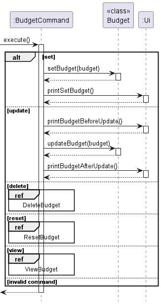

# Developer Guide

## Acknowledgements
[Addressbook-level3](https://github.com/se-edu/addressbook-level3)

## Design & implementation

{Describe the design and implementation of the product. Use UML diagrams and short code snippets where applicable.}

### Storage Component
API: `Storage.java`

- The storage component loads data from the saved text files when the application starts, and saves the data to the 
text files when the application exits. 
- The storage class uses the static methods in LoadData and SaveData to load and save data respectively. 
- The `load` method in LoadData reads the `data.txt` file and loads any existing Income, Expense and Budget into the application. 
- The `save` method in SaveData saves all Incomes, Expenses and existing Budget into the `data.txt` file.

### Budget Feature
This feature has 5 functions, `set`, `update`, `delete`, `reset`, and `view`.


The BudgetCommand will execute the appropriate command and print through `Budget.java` and prints any message to the user through `Ui.java`.

**Set and update budget:**

Example:
```
budget set /b 500
budget update /b 1000
```
The '/b' is followed by the budget amount. The first line will set the budget by calling `setBudget(500)` method in `Budget.java`.
The second line updates the budget by adding or subtracting the difference between the initial and updated amount to the 
initial and current budget. This is done through `updateBudget(500)` method in `Budget.java`. Both functions can be seen 
in the diagram above

**Delete budget:**


The budget will be deleted by setting the initial and current budget to 0 through the `deleteBudget()` method in `Budget.java`.

Example: `budget delete`

**Reset budget:**


The budget will be reset by resetting the current budget to the initial budget through the `resetBudget()` method in `Budget.java`.

Example : `budget reset`

**View budget:**


The current budget will be shown to the user through the `Ui`.

Example: `budget view`

## Product scope
### Target user profile

{Describe the target user profile}

### Value proposition

{Describe the value proposition: what problem does it solve?}

## User Stories

|Version| As a ... | I want to ... | So that I can ...|
|--------|----------|---------------|------------------|
|v1.0|new user|see usage instructions|refer to them when I forget how to use the application|
|v2.0|user|find a to-do item by name|locate a to-do without having to go through the entire list|

## Non-Functional Requirements

{Give non-functional requirements}

## Glossary

* *glossary item* - Definition

## Instructions for manual testing

{Give instructions on how to do a manual product testing e.g., how to load sample data to be used for testing}
