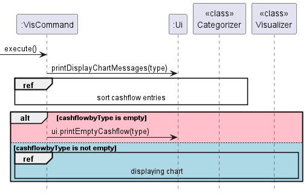
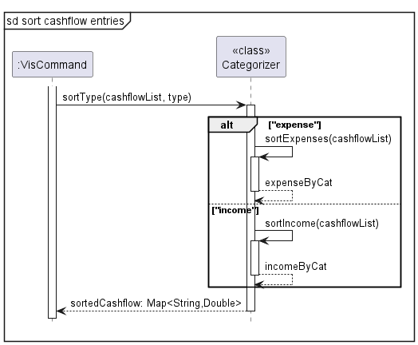
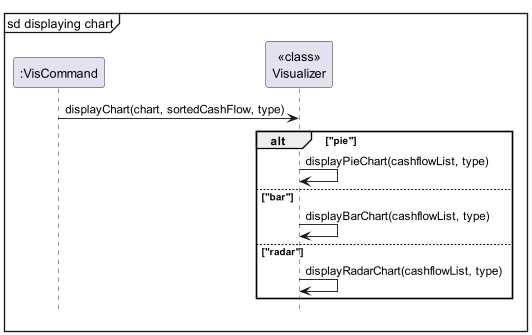
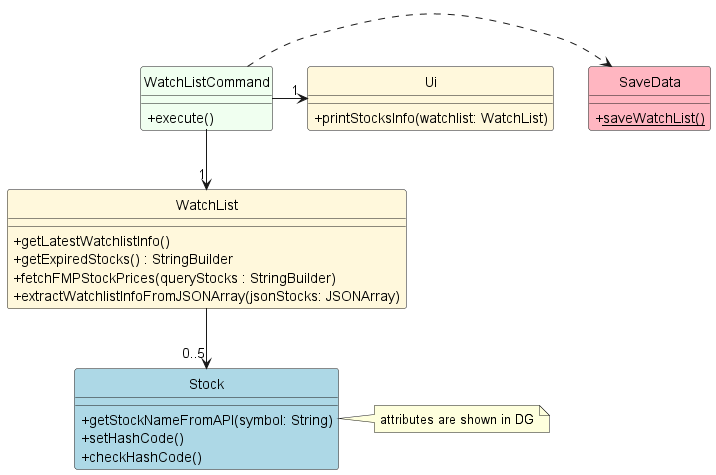
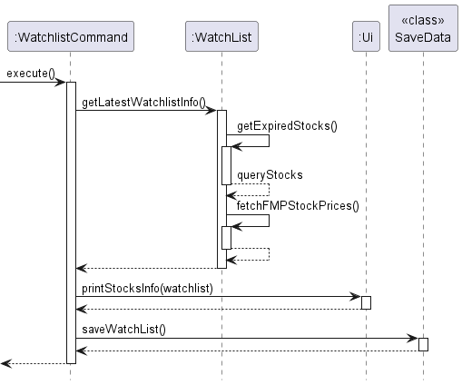
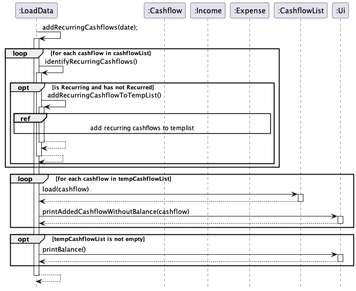
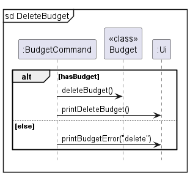

# Developer Guide

## Table of contents

* [Acknowledgements](#acknowledgements)
* [Design & implementation](#design--implementation)
  * [Architecture Diagram](#architecture-diagram)
  * [Storage Component](#storage-component)
    * [Design considerations](#design-considerations)
  * [Visualization Feature](#visualization-feature-)
    * [Class diagram](#class-diagram)
    * [Sequence diagram](#sequence-diagram-)
  * [Add Income/Expense Feature](#add-incomeexpense-feature)
    * [Class Diagram](#add-incomeexpense-class-diagram)
    * [Sequence Diagram](#add-incomeexpense-sequence-diagram)
  * [Recurring Cashflow Feature](#recurring-cashflow-feature)
    * [Class Diagram](#recurring-cashflow-class-diagram)
    * [Sequence Diagrams](#recurring-cashflow-sequence-diagrams)
  * [Budget Feature](#budget-feature)
    * [Set and update budget](#set-and-update-budget)
    * [Delete budget](#delete-budget)
    * [Reset budget](#reset-budget)
    * [View budget](#view-budget)
  * [Product Scope](#product-scope)
    * [Target user profile](#target-user-profile)
    * [Value proposition](#value-proposition)
  * [User Stories](#user-stories)
  * [Non-Functional Requirements](#non-functional-requirements)
  * [Glossary](#glossary)
  * [Instructions for manual testing](#instructions-for-manual-testing)

## Acknowledgements

**Xchart (A Simple Charting Library for Java)**
- author: KNOWM
- source: [https://knowm.org/open-source/xchart/](https://knowm.org/open-source/xchart/)

**JSON Simple (simple Java toolkit for encoding and decoding JSON)**
- author: Yidong Fang (Google Code)
- source: [https://code.google.com/archive/p/json-simple/](https://code.google.com/archive/p/json-simple/)

**Apache Common Langs 3**
- author: Apache Commons
- source: [https://commons.apache.org/proper/commons-lang/](https://commons.apache.org/proper/commons-lang/)

**Alpha Vantage Stock Market API**
- author: Alpha Vantage
- source: [https://www.alphavantage.co/](https://www.alphavantage.co/)

**Gson Java library**
- author: Google
- source: [https://github.com/google/gson](https://github.com/google/gson)

**Financial Modeling Prep Stock API**
- author: Financial Modeling Prep
- source: https://site.financialmodelingprep.com/

**round() method in Cashflow.java**
  - author: mhadidg
  - source: [https://stackoverflow.com/questions/2808535/round-a-double-to-2-decimal-places]()

**capitalize() method in Cashflow.java**
  - author: Nick Bolton
  - source: [https://stackoverflow.com/questions/1892765/how-to-capitalize-the-first-character-of-each-word-in-a-string]()
    
**DG adapted from**

* [Addressbook-level3](https://github.com/se-edu/addressbook-level3)

## Design & implementation

### Architecture Diagram


The **Architecture Diagram** given above explains the high-level design of the program.

#### Main components of the architecture

`Main` consists of the `FinancialPlanner` class, and is in charge of starting up and shutting down the app.

The program consists of five main components:

* `Ui`: User interactions.
* `Parser`: Parse user inputs.
* `Command`: The command executor.
* `Model`: Holds the data of the program in memory.
* `Storage`: Reads data from, and writes data to the hard disk.

### Storage Component

API: `Storage.java`


* The storage component loads data from the saved text files when the application starts, and saves the data to the
  text files when the application exits.
* The storage class uses the static methods in LoadData and SaveData to load and save data respectively.
* The `load` method in LoadData reads the `data.txt` file and loads any existing Income, Expense and Budget into the application.
* The `save` method in SaveData saves all Incomes, Expenses and existing Budget into the `data.txt` file.

#### Design considerations:

* There are 2 main ways to implement the storage, one is to save the data after every command, and the other is to save 
the data one upon exiting the program with the `exit` command.
* Option 1 (Currently implemented): Saving the data once upon exit
  * Advantage: Better efficiency and performance of the program.
  * Disadvantage: If the program crashes or exits incorrectly, data will not be saved.
* Option 2: Saving the data after every command:
  * Advantage: Changes are saved after every command.
  * Disadvantage: Executing command might slow down the program when there is a large amount of data to be saved.

Option 1 is chosen to prioritise the performance of the program.

### Visualization Feature 

This feature is implemented with the help of [XChart](https://knowm.org/open-source/xchart/), a simple charting library for Java by Knowm.

By typing in the vis command with the appropriate arguments (`/s` and `/t`), users will be able to visualize their 
income or expense using visualization tools (Piechart, Bar Chart or Radar Chart)

Demo: 

`vis /t expense /c pie`

Output:

`Displaying piechart for expense`
A message will be shown telling you that the chart is being displayed


This feature was implemented with the help of three different classes.
They are namely: Visualizer, Categorizer, VisCommand (Inherits from abstract Command Class)

VisCommand's Role: 
1) Read the parameters of the vis command entered by the user
- `/t` Reads the type of cashflow that the user wants to visualize (income/expense)
- `/c` Reads the type of visualization tools the user wants (piechart/barchart)

2) Calls the Categorizer to sort cashflow (Income/Expense) according to type

3) Calls the Visualizer to display the chart to the user

As with other Commands in our Financial Planner application, the constructor of VisCommand
takes RawCommand as parameter. The RawCommand would provide the arguments (chart type and cashflow type) 
for the VisCommand provided. 

The VisCommand also inherits from the abstract Command class which would provide the execute() abstract method
that would be called in main().

Categorizer's Role: 

According to the cashflow type (Income/Expense) arugment passed in, the Categorizer sorts the 
specified cashflow entry according to type using a Hashmap which is returned and used by the Visualizer

Visualizer's Role: 

According to the chart type (Pie/Bar/Radar) argument and the Hashmap obtained from the categorizer passed in, 
the visualizer displays the specified visualization chart by calling the charting library Xchart.

### Class Diagram


### Sequence Diagram 

Overall 



Categorizer (`sort cashflow entries` ref from overall sequence diagram above)



Visualizer (`displaying chart` ref from overall sequence diagram above)



### Watchlist Feature

The watchlist in financial planner is similar to that of other common watchlist online.
It contains a list of stocks that the user watches with an eye toward taking advantage of prices. It allows
users to track real time data on the stocks that they are interested in.

Simply type `watchlist` into the command line without any arguments and the watchlist will be displayed.

Example Output:


Below are the various classes involved in the implementation of watchlist.

#### WatchlistCommand

1. The WatchlistCommand instance calls the `getLatestWatchListInfo()` method from the watchlist class to update the 
stocks data in the watchlist.
2. It then calls the `printStocksInfo()` method of the Ui class to print out the watchlist.
3. Finally, it calls the static `saveWatchList()` method of the SaveData class to save the watchlist info to
watchlist.json.

#### Watchlist

The watchlist class keeps a record of the stocks that the user is interested in using a hashmap as shown.
```
private HashMap<String, Stock> stocks;
```

1. When its method `getLatestWatchListInfo()` is invoked, it calls `getExpiredStocks` to get the list
of stocks that has expired and should be renewed with latest info.
2. With the list of expired stocks, it calls `fetchFMPStockPrices` which connects to Financial Modeling API to retrieve
the latest stock prices and calls `extractWatchListInfoFromJSONArray` to update the stocks in the Hashmap 
with the latest stock data.

### Stock

Stocks class objects are the values that make up the stocks hashmap in the watchlist. They cache the stock data obtained
from the API as attributes of the class.

```
private String symbol;
private String exchange;
private String stockName;
private String price;
private String dayHigh;
private String dayLow;
private Date lastUpdated = null;
private long lastFetched = 0;
private int hashCode = 0;
```

Shown above is a complete list of attribute of the stock class.

`lastFetched` and `hashCode` are attributes that are not related to the stock financial data.
`lastFetched` is used for caching validity checking and `hashCode` is used to tell whether saved values on disk 
are corrupted.

#### Watchlist Class Diagram (Simplified)



#### Watchlist sequence Diagram (Simplified)



### Add Income/Expense Feature

The add income/expense command has 2 compulsory arguments `/t` and `/a` and 1 optional argument `/r`.

Example:
```
add income /a 100 /t salary /r 30
```
Below are the steps that shows the implementation of add income/expense.

#### Step 1
The AddCashflowCommand instance calls addIncome() or addExpense(), depending on what `category` is initialised as.

addIncome() or addExpense() instantiates an Income or Expense object respectively.

Example:
```
switch (category) {
        case INCOME:
            cashflowList.addIncome(amount, incomeType, recur);
            break;
        case EXPENSE:
            cashflowList.addExpense(amount, expenseType, recur);
            break;
        default:
            ui.showMessage("Unidentified entry.");
            break;
        }
```
#### Step 2
The instantiated income/expense then updates the overall balance through addIncomeValue() or addExpenseValue().

The income/expense object is also added to the list in Cashflowlist which contains all incomes/expenses.
#### Step 3
The added income/expense is then displayed to the user through the Ui.

#### Add Income/Expense Class Diagram
Given below is the class diagram showing the class structure of the add income/expense mechanism:

#### Add Income/Expense Sequence Diagram
Given below is the sequence diagram showing the add income/expense mechanism:

### Recurring Cashflow Feature
Cashflow refers to an income or expense.

This feature is called from the user through the `/r` argument in add income/expense command.

If a cashflow is set to be recurring, the program would add another entry of the same cashflow to the Financial Planner after a set period of time.

Below are the steps that shows the implementation of the recurring cashflow feature.

#### Step 1
Once the cashflow is set to be recurring, its corresponding `Cashflow` object would store the date at which the cashflow was added to the Financial Planner.

The `recur` variable in the object would also be instantiated according to the user's input.

An additional `boolean` variable, `hasRecurred` is stored in the object and is set to `false` by default.

Example:
```
public abstract class Cashflow {
    protected int recur;
    protected LocalDate date;
    protected boolean hasRecurred;
}
```
#### Step 2
When the Financial Planner is started again in the future, the date of startup would be obtained from the system.

After loading existing saved cashflows from data.txt, the program will check for cashflows that are set to be recurring and has not recurred.

Example:
```
if (recur > 0 && !hasRecurred) {
    ...            
}
```

#### Step 3
Once a cashflow matches the above criteria, the date of its next addition to the Financial Planner, `dateOfAddition`, would be determined.

`dateOfAddition` would be compared to the current date, and if the current date is after or equal to `dateOfAddition`, an identical cashflow would be instantiated.

This identical cashflow would then have its `date` variable set to `dateOfAddition`, then this cashflow would be added to a temporary list, `tempCashflowList`.

The original cashflow would then have its `hasRecurred` variable be set to `true`.

#### Step 4
Each cashflow in `tempCashflowList` goes through **Step 3** again, so that multiple cashflows can be added if it has recurred more than once.

Once the process is done, all cashflows in `tempCashflowList` are then added to the Financial Planner.

The added cashflows are then displayed to the user.

#### Recurring Cashflow Class Diagram
Given below is the class diagram showing the class structure of the recurring cashflow mechanism:

#### Recurring Cashflow Sequence Diagrams
Given below is the sequence diagram showing the recurring cashflow mechanism:



### Budget Feature

This feature has 5 functions, `set`, `update`, `delete`, `reset`, and `view`.


The BudgetCommand will execute the appropriate command and print through `Budget.java` and prints any message to the user through `Ui.java`.

#### Set and update budget:

Example:
```
budget set /b 500
budget update /b 1000
```
The `/b` is followed by the budget amount. 

##### Set budget:

The first line will set the budget by calling `setBudget(500)` method in `Budget.java`. The `setBudget(500)` method then sets the 
`initialBudget` and `currentBudget` variable to the input amount, in this case 500.

##### Update budget:

The second line updates the budget by adding or subtracting the difference between the initial and updated amount to `initialBudget` 
and `currentBudget`. This is done through `updateBudget(1000)` method in `Budget.java`. In the example above, since the budget is 
being updated from `500` to `1000`, `500` will be added to the variables `initialBudget` and `currentBudget`. Both functions can be seen 
in the diagram above.

#### Delete budget:



The budget will be deleted by setting the `initialBudget` and `currentBudget` variables to `0` through the `deleteBudget()` method in `Budget.java`.

Example: `budget delete`

#### Reset budget:


The budget will be reset by resetting the `currentBudget` variable to the `initialBudget` variable through the `resetBudget()` method in `Budget.java`.

Example: `budget reset`

#### View budget:


The `currentBudget` will be shown to the user through the `Ui`.

Example: `budget view`


## Product scope
### Target user profile

Our target user profile is ...
- a working adult with a source of income
- someone who dislike navigating graphic user interface
- someone who can type fast
- someone who cannot manage their finances such as income and expenses properly
- unable to reach their financial goals
- is slightly interested in the equity market
- needs reminders for tasks


### Value proposition

Our financial planner application can help individuals manage their finances effectively and achieve their financial 
goals. The purpose of such an application is to provide users with a range of tools and features to help them better 
understand their financial situation. This will enable them to make more informed decisions, and plan for their future 
financial well-being. The application will allow the user to keep track of their income, expenses and overall balance.
It also lets the user view their income and expenses using visualization tool to have a better view of their cash flow 
based on categories.  It also allows the user to set the budget for the month. It also allows users to add their financial
goals to the wishlist. Furthermore, it allows users to track the stock market if they have interest in investing in 
equities. 

## User Stories

| Version | As a ...              | I want to ...                 | So that I can ...                                                                    |
|---------|-----------------------|-------------------------------|--------------------------------------------------------------------------------------|
| v1.0    | user                  | Add my income                 | Store my income information and view/track them later                                |
| v1.0    | user                  | Delete my income              | Remove the income entry that I have mistakenly added or do not keep track            |
| v1.0    | user                  | Add my expense                | Store my expense information and view/track them later                               |
| v1.0    | user                  | Delete my expense             | Remove the expense entry that I have mistakenly added or do not keep track           |
| v2.0    | user                  | set my expense type           | Break down my expenses into different categories                                     |
| v1.0    | user                  | set my income type            | Break down my income into different categories                                       |
| v2.0    | user                  | Add recurring cash flows      | add a regular expense or income (salary, rent) easily                                |
| v2.0    | user                  | Delete recurring cash flows   | delete a regular expense of income easily                                            |
| v1.0    | user                  | list all cash flow entries    | view all my income and expenses in a comprehensive list                              |
| v1.0    | user                  | list all expenses entries     | view all my expenses in a comprehensive list                                         |
| v1.0    | user                  | list all income entries       | view all my income in a comprehensive list                                           |
| v2.0    | user                  | list all recurring cash flows | view all my recurring income or expenses in a comprehensive list                     |
| v2.0    | new user              | see usage instructions        | refer to them when I forget how to use the application                               |
| v1.0    | user                  | set a budget                  | keep track of a budget together with my cash flow and ensure I do not exceed it      |
| v1.0    | user                  | update the budget             | make changes to the budget according to my needs                                     |    
| v1.0    | user                  | reset the budget              | return to my initial budget easily                                                   |
| v1.0    | user                  | delete budget                 | remove the budget that I no longer want to keep track of                             |
| v1.0    | user                  | view budget                   | keep track of the amount of budget I have left                                       |
| v1.0    | user                  | see overview of the app       | see the overall view of all income, expense and overall balance as well as reminders |
| v1.0    | user                  | view balance                  | see my overall balance according to the income and expenses I am keeping track       |
| v1.0    | investment enthusiast | view my watchlist             | keep track of stocks that I am interested in                                         |
| v2.0    | investment enthusiast | add new stocks to watchlist   | add new stock that I am interested in investing in                                   |
| v2.0    | investment enthusiast | delete stocks from watchlist  | remove stocks that I am no longer interested in                                      |
| v1.0    | user                  | add reminder                  | add reminders (eg to pay loans) so I will not forget                                 |
| v1.0    | user                  | delete reminder               | delete reminders that I no longer want to keep track                                 |
| v1.0    | user                  | mark reminder                 | set the reminder as completed                                                        |
| v1.0    | user                  | view wishlist                 | keep track of my goals easily                                                        |
| v1.0    | user                  | set goals                     | add a new goal to my that I think of                                                 |
| v1.0    | user                  | delete goals                  | remove goals that I can no longer achieve                                            |
| v1.0    | user                  | mark goal                     | that I have achieved                                                                 |
| v1.0    | user                  | visualize my cash flow        | easily see where the distribution for my spending and earnings                       |

## Non-Functional Requirements

* Should work on main OS (Windows, Linux, Mac) that has Java 11 installed.
* This app is meant for a single user.
* This app is targeted towards users with an above-average typing speed.
* Watchlist should work reliably and not crash the application when the 3rd party dependencies are down (API is down)

## Glossary

* *Cashflow* - Refers to an income or expense.
* *WishList* - A list containing goals/targets.
* *Watchlist* - A list of stocks that the financial planner is currently tracking

## Instructions for manual testing

Given below are instructions to test the app manually

- Note: These instructions only provide a starting point for testers to work on

### Launch and shutdown 

1. Initial Launch
   1. Download the jar file and copy into an empty folder
   2. Open up the terminal and run java -jar tp.jar Expected: 
shows you the welcome screen for the financial planner app
2. Closing the application
   1. Type `exit` into the terminal. 
   2. Expected: the financial planner will exit with a goodbye message.
Under the data newly created data directory, a watchlist.json and a data.txt file will be created

