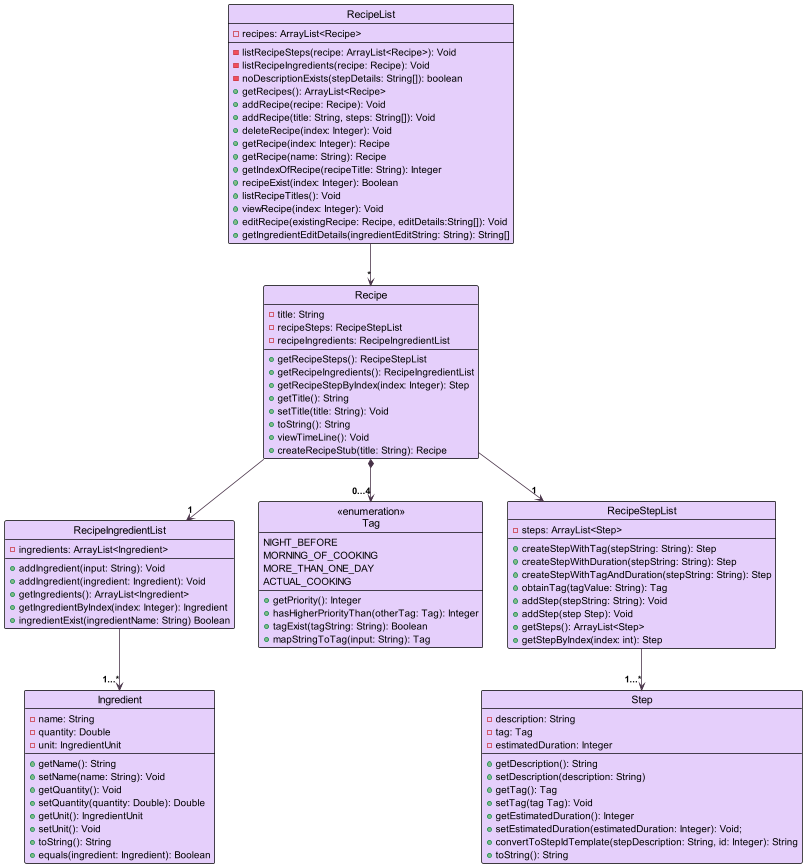
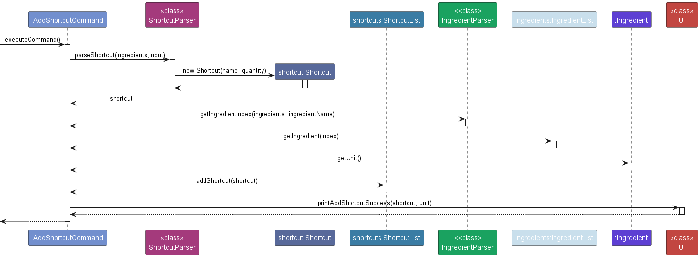

* Table of Contents

--------------------------------------------------------------------------------------------------------------------

# Developer Guide

## Acknowledgements

References
1. Developer Guide: https://se-education.org/addressbook-level3/DeveloperGuide.html 
2. User Guide: https://se-education.org/addressbook-level3/UserGuide.html

## Design & implementation

## Design

### Architecture

The ***Architecture Diagram*** given above explains the high-level design of our EssenMakanan CLI.

Given below is a quick overview of main components and how they interact with each other.


**Main components of the architecture**

- `UI`: The user interface of the app that handles all print and output commands
- `Main`: EssenMakanan main code which handles `Storage`, `Parser` and `Ui`
- `Storage`: Handles stored all `recipe`, `ingredient` and `shortcut` that the user has input
- `Parser`: Handles user input and checks for formatting/command errors and throws relevant exceptions
- `Command`: Command handles the user functionality of Essenmakanan
- `Shortcut`: Shortcuts to be used by user
- `Ingredient`: Ingredients in inventory and recipe ingredients
- `Recipe`: Recipes created by user

### UI component

### Main component

### Recipe component

1. Upon booting up the application, `RecipeList` will retrieve past recipe data by calling `restoreSavedData` 
in the Storage class. The restored `recipes` will then be stored in `RecipeList`. If the `recipes.txt` file does 
not exist, no data is retrieved and RecipeList will be empty.
2. Each `RecipeList` consists of zero to as many Recipe in it's ArrayList. 
3. Each `Recipe` in RecipeList consists of exactly one `RecipeIngredientList`, up to four `Tag` and 
exactly one `RecipeStepList`.
4. `RecipeIngredientList` consists of at least one Ingredient while `RecipeStepList` consists of at least one step.




Two main functionalities that we have are to `add` and `delete` a recipe from the recipeList. Below is an object diagram to illustrate how the add and delete function works.

1. The initial state of `recipes:RecipeList` stores 2 `Recipe`, namely, 'chicken pizza' and 'meatball noodles'


2. `Add` a new recipe 

A new recipe titled "dumpings" will be added to `recipes:RecipeList`. The number of `recipe` stored in `recipes:RecipeList` will increase from 2 to 3.


3. `Delete` an existing recipe

Recipe titled "chicken pizza" is at index 2 of the `RecipeList`. By giving the command `delete r/2`, `recipes:RecipeList` will remove `chicken pizza:Recipe` from the ArrayList of recipes.


---

### Ingredient component


### Shortcut component

1. Upon booting up the application, `ShortcutList` will retrieve past recipe data by calling `restoreSavedData` 
   in the Storage class. The restored `shortcuts` will then be stored in `ShortcutList`. If the `shortcuts.txt`
   file does not exist, no data is retrieved and RecipeList will be empty.
2. Each `ShortcutList` consists of zero to as many Shortcut in it's ArrayList.


### Storage component

In this application, it uses text files to store all data, i.e, recipes and ingredients. 


When booting up the application, `restoreSavedData` will be called to get both recipes and ingredients 
from the previous session.


When a user exits the application, `saveData` will be called and it will convert all data from recipes and
ingredients into a string which will be put in their own respective text files.


## Implementation
### Help Feature
The help feature is facilitated by the `HelpCommand` class. By calling `executeCommand` on the class, it will invoke the `Ui` class to print the user help commands.


- **Step 1**

  Input will be sent from the main `EssenMakanan` class to the `Parser` to identify the command type


- **Step 2**

  A new `HelpCommand` object will be created and will be sent back to main


- **Step 3**

  `commandObject#executeCommand()` will be called which in turn calls `Ui#showCommands()`


- **Step 4**

  Finally `Ui#showCommands()` will call `Ui#showRecipeCommands()`, `Ui#showIngredientCommands()`, `Ui#showOtherCommands()` to print all commands for recipe, ingredient and others respectively


### Exit feature
The help feature is facilitated by the `ExitCommand` class. By calling `executeCommand` on the class, it will invoke the `Ui` class to print the exit command.

- **Step 1**

  Input will be sent from the main `EssenMakanan` class to the `Parser` to identify the command type


- **Step 2**

  A new `ExitCommand` object will be created and will be sent back to main


- **Step 3**

  `commandObject#executeCommand()` will be called which in turn calls `Ui#showCommands()`


- **Step 4**

  Finally `Ui#showCommands()` will print the exit message


### Add Recipe feature

The add recipe feature is facilitated by the `AddRecipeCommand` class. By calling `executeCommand` on the class, the steps will
be executed as follows:
- **Step1**
  
  `AddRecipeCommand` will parse the recipe title using `RecipeParser`. Then, it will return the recipe title.


- **Step2**

  `AddRecipeCommand` will create a new `Recipe` with the obtained title.


- **Step3**

  `AddRecipeCommand` will add newly created `Recipe` into `RecipeList`. Then, the recipe will be added into an
  `ArrayList` inside `RecipeList`.


- **Step4**

  `AddRecipeCommand` will call `Ui` class to print out the title of the recently added recipe.


### Duplicate Recipe Feature

The duplicate recipe feature is facilitated by the `DuplicateRecipeCommand` class. By calling `executeCommand` on the
class, the steps will be executed as follows:
- **Step1**

  `DuplicateRecipeCommand` will parse the selected index using `RecipeParser` with a recipe title or index.


- **Step2**

  `DuplicateRecipeCommand` will get the specified recipe which going to be duplicated.


- **Step3**

  `DuplicatedRecipeCommand` will create using the recipe's title with a copy indicate `(copy)`, the recipe's steps
  , and the recipe's ingredients


- **Step4**

  `DuplicateRecipeCommand` will add the recently created recipe into the recipe list.


- **Step5**

  `DuplicateRecipeCommand` will call `Ui` class to print out the title of the recently duplicated recipe.


### View Ingredients feature
The view ingredient feature is facilitated by the `ViewIngredientCommand` class. Users can input
"view i" to trigger this command. Users will then be able to see all ingredients stored.
Example: 

``````
1. bread: 2pcs

2. apple: 500g
``````

- **Step 1**

  Input will be sent from the main `EssenMakanan` class to the `Parser` to identify the command type.


- **Step 2**
  
  A new `ViewIngredientCommand` object will be created and will be sent back to main 


- **Step 3**
  
  `commandObject#executeCommand()` will be called which in turn calls `Ui#printAllIngredients()`


- **Step 4**
  
  Finally `Ui#printAllIngredients()` will call `IngredientList#listIngredients()` to print all the ingredients
  to standard output


### View an ingredient feature

The view ingredient feature is facilitated by the `ViewSpecificIngredientCommand` class. Users can input
`view i/INGREDIENT_NAME` to trigger this command. Users will then be able to see the quantity and unit of specific ingredient stored.


Note that `INGREDIENT_NAME` can be replaced with `INGREDIENT_ID`.


- **Step 1**

  Input will be sent from the main `EssenMakanan` class to the `Parser` to identify the command type.


- **Step 2**

  A new `ViewSpecificIngredientCommand` object will be created and will be sent back to main


- **Step 3**

  `commandObject#executeCommand()` will be called which in turn calls `IngredientParser#getIngredientIndex()` to get the index of the ingredient.
  If the ingredient does not exist, an error will be thrown to inform the user that the ingredient does not exist.


- **Step 4**

  Finally `ViewSpecificCommand` will print `ingredient` object as there is a `toString` method within `Ingredient` class, allowing for `system.out.println(ingredient)`


### View Recipes feature
The view recipes feature is facilitated by the `ViewRecipeCommand` class. Users can input
"view r" to trigger this command

* **Step 1**

  Input will be sent from the main `EssenMakanan` class to the `Parser` to identify the command type.


* **Step 2**

  A new `ViewRecipeCommand` object will be created and will be sent back to main


* **Step 3**

  `commandObject#executeCommand()` will be called which in turn calls `Ui#printAllRecipes()`


* **Step 4**

  Finally, `RecipeList#listRecipeTitles()` will be called to print all the ingredients
  to standard output


### Add Ingredient feature

The add Ingredient feature is used by a `AddIngredientCommand` class.
Multiple ingredients can be added at the same time using the syntax
`add i/NAME,QUANTITY,UNIT i/INGREDIENT2,.. i/INGREDIENT3...`

By calling `executeCommand` on the class, the steps will
be executed as follows:
* **Step1**

  `AddIngredientCommand` will use the "split" method of `String` to get an array of the descriptions of ingredients 
   and iterate all the elements in this array


* **Step2**

  `AddIngredientCommand` will get a new `Ingredient` by invoking the method "parseIngredient" of `IngredientParser` 
  for each element of the obtained array


* **Step3**

  `AddIngredientCommand` will add this `Ingredient` into `IngredientList`. Then, the ingredient will be added into an
  `ArrayList` inside `IngredientList`.


* **Step4**

  `AddIngredientCommand` will call `Ui` class to print out the name of the recently added ingredient.


### Delete feature

### Check recipe feature

The check recipe feature is used by the `CheckRecipeCommand` class.

To view if you have all ingredients needed to start on a recipe, use the following command
`check recipe RECIPE_TITLE` or `check recipe RECIPE_ID`

By calling `executeCommand` on the class, the steps will
be executed as follows:
* **Step1**

  `CheckRecipeCommand` will get the index of recipe by calling method `getRecipeIndex()` in the `Parser` class. 
  This method will throw an error if the recipe entered is invalid or does not exist in the recipe database.


* **Step2**

  `CheckRecipeCommand` will then call its own `getMissingIngredients()` method which will create 3 different array lists - `missingIngredeints`, `insufficientIngredients` and `diffUnitIngredients`. 
  They account for ingredients that are missing, ingredients that you currently don't have enough of in your inventory, and ingredients that cannot be compared because of the difference in unit respectively.


* **Step3**

  `CheckRecipeCommand` then call the static method `printRecipeMessage()` in `UI` class to print missing ingredients, ingredients that are insufficient, and ingredients of different units. 


* **Step4**

  `Ui` will call `listIngredients()` method in `IngredientList` class to print the 3 different array lists.


### Filter recipe feature

The filter recipe feature is used by the `FilterRecipesCommand`.

To filter recipes based on ingredients that are in it,
use the command `filter recipe i/INGREDIENT_NAME [i/...]`, where `INGREDIENT_ID` can be used in place of `INGREDIENT_NAME` too.

* **Step1**

  `FilterRecipeCommand` will start a loop that filters all ingredients that the user has input


* **Step2**

  In the loop, the recipes will be filtered and be stored in `filteredRecipes` variable which is a `RecipeList` object.
  `filteredRecipes` will contain all recipes that has the specified ingredient.


* **Step3**
  
  The filteredRecipes will then be passed to the static `Ui` method `printFilteredRecipes()` to display all the recipes with the specified ingredient.


* **Step4**

  Steps 2 to 3 will repeat again until all ingredients in the input has been handled and executed. The loop will then stop and process exits the loop.


### View Shortcuts Feature

The view shortcuts feature is used by the `ViewShortcutsCommand`. By using `view sc`, users are able to see al the
current shortcuts in the application.

* **Step 1**

  Input will be sent from the main `EssenMakanan` class to the `Parser` to identify the command type.


* **Step 2**

  A new `ViewShortcutsCommand` object will be created and will be sent back to main


* **Step 3**

  `commandObject#executeCommand()` will be called which in turn calls `Ui#printAllShortcuts()`


* **Step 4**

  Finally, `ShortcutList#listShortcuts()` will be called to print all the ingredients
  to standard output.


### Add Shortcut Feature

The add shortcut feature is used by the `AddShortcutCommand`. Users can input `add sc/INGREDIENT_NAME,QUANTITY` to
add a shortcut with a specified ingredient that is **in the list** and a specified quantity to add every time 
the shortcut is used.

By calling `executeCommand` on the class, the steps will
be executed as follows:
* **Step1**

  `AddShortcutCommand` will parse a shortcut from a string. The parser will refer to the ingredient list for checking
  matching ingredient name and checks if the quantity is valid.

* **Step2**

  `AddShortcutCommand` will get a new `Shortcut` if all specifications are met, i.e. valid ingredient name and quantity.

* **Step3**

  `AddShortcutCommand` will add the newly created `Shortcut` into `ShortcutList`. Then, the ingredient will be 
  added into an`ArrayList` inside `ShortcutList`.


* **Step4**

  `AddShortcutCommand` will call `Ui` class to print out the name of the recently added shortcut.





### Edit Shortcut Feature

The edit shortcut feature is used by the `EditShortcutCommand`. Users can input `edit sc/INGREDIENT_NAME or 
SHORTCUT_INDEX n/INGREDIENT_NAME q/QUANTITY` to edit a shortcut with new ingredient name or new quantity. However, the 
changes for each attribute can only be done once per input line.

By calling `executeCommand` on the class, the steps will
be executed as follows:
* **Step1**

  `EditShortcutCommand` will parse an index of the shortcut that the input refers to. Then, `EditShortcutCommand` will
  get the shortcut from the list based on the index.

* **Step2**

  If the shortcut is found, `EditShortcutCommand` will parse the changes indicated by flags. It will go through all the
  flags and make changes based on the flags and whether the changes are valid, i.e. valid name or valid quantity.

* **Step3**

  After the changes has been made, `EditShortcutCommand` will call `Ui` class to 
  print out the changes made on the shortcut. 


### Delete Shortcut Feature

The delete shortcut feature is used by the `DeleteShortcutCommand`. Users can input `delete sc/INGREDIENT_NAME or
SHORTCUT_INDEX` to delete a shortcut on the list.

By calling `executeCommand` on the class, the steps will
be executed as follows:
* **Step1**

  `DeleteShortcutCommand` will parse an index of the shortcut that the input refers to. Then, `DeleteShortcutCommand` 
  will get the shortcut from the list based on the index.

* **Step2**

  If the shortcut is found, `DeleteShortcutCommand` will call `ShortcutList#deleteShortcut`. Then, it will remove the
  specified shortcut from the arraylist.

* **Step3**

  `ShortcutList#deleteShortcut` will call `Ui` class to print out the deleted shortcut.


### Use Shortcut Feature

The use shortcut feature is used by the `UseShortcutCommand`. Users can input `sc INGREDIENT_NAME or SHORTCUT_INDEX` to
use the shortcut. After using the shortcut, the ingredient that is being referred to will have its quantity added by
the specified amount in the shortcut.

By calling `executeCommand` on the class, the steps will
be executed as follows:
* **Step1**

  `UseShortcutCommand` will parse an index of the shortcut that the input refers to. Then, `UseShortcutCommand`
  will get the shortcut from the list based on the index.

* **Step2**

  If the shortcut is found, `UseShortcutCommand` will get the ingredient name and quantity from the shortcut. Then,
  `UseShortcutCommand` will get the unit based on the ingredient from the shortcut.

* **Step3**

  `UseShortcutCommand` will create a new ingredient with the acquired attributes. Then, `UseShortcutCommand` will call
  `IngredientList#updateIngredient` which will manage the ingredient data based on the name and quantity.


## Product scope
### Target user profile

{Describe the target user profile}

This product is for people who share kitchen space and ingredients with other cooks.


### Value proposition

{Describe the value proposition: what problem does it solve?}

Easy and intuitive way to keep track of ingredients you have in your kitchen. This helps avoid buying duplicated ingredients, reminds you of the ingredients you need, and gives a visualisation of the recipe timeline to ensure that advance preparation is done in time, eg marinating.


## User Stories

| Version        | As a ...                                                                                                      | I want to ...                     | So that I can ...                                                  |
|----------------|---------------------------------------------------------------------------------------------------------------|-----------------------------------|--------------------------------------------------------------------|
| v1.0           | beginner user                                                                                                 | see all recipes                   | learn and try all recipes                                          |
| v1.0           | beginner user                                                                                                 | add new recipes into the list     | learn and try out new recipes                                      |
| v1.0           | beginner user                                                                                                 | see all ingredient I have         |                                                                    |
| v1.0           | beginner user                                                                                                 | add ingredients to the empty list | add an item to my kitchen inventory                                |
| v2.0a          | amateur                                                                                                       | delete some recipes               | remove a recipe that I no longer want to use                       |
| v2.0a          | amateur                                                                                                       |delete ingredients| remove an ingredient from the list                                 |
| v2.0a          | 	new user                                                                                                     |	be greeted with an instruction manual	| learn how to navigate through the app                              |
| v2.0a          | beginner user	                                                                                                | view specific recipe                 |
| v2.0a          | beginner user	                                                                                                | add ingredients to recipe            |
|v2.0a| 	amateur	|edit ingredients of recipe	                                                                          |edit a recipe I have created| change recipe ingredients                                          |                                          |
|v2.0a	| amateur	edit steps of recipe                                                                                  | 	edit a recipe I have created        | change recipe steps                                                |
|v2.0a| 	beginner user                                                                                                |	type the quantity of ingredients as well as the unit of measurement| 	add an item with the quantity to my kitchen inventory             |
|v2.0a| 	amateur	                                                                                                     |change the quantity of ingredient available	| remove a fixed quantity of an ingredient from the list             |
|v2.0b| 	beginner user                                                                                                |	add milestones with tags on the steps| 	see the overview of steps to execute in the recipe                |
|v2.0b| 	Amateur	                                                                                                     |View a timeline of the cooking process, from preparation all the way till actual cooking time	| do preparations that are necessary at the time needed              |
|v2.0b| 	Amateur	                                                                                                     |See all ingredients I am lacking for a specific recipe	| get an overview of ingredients i need to buy                       |
|v2.0b| new user                                                                                                      |exploring the app	see default recipes pre-placed in the app	| get started with cooking and learn the recipe’s format             |
|v2.0b| 	Amateur	                                                                                                     |find recipes by ingredients| to give user options on what they can cook based on their cravings |
|v2.1| 	Expert|	Duplicate a recipe	| Save time for creating similar recipes                             |                                           
|v2.1| 	advanced user|	Schedule recipes for a week| 	plan for weekly grocery shopping                                  |                                  
|v2.1| 	advanced user|	cook for more if necessary| 	scale recipe based on number of pax                               |                             
|v2.1| 	advanced user|	subtract ingredients automatically when i use it| 	indicate that i have used an ingredient                           |     
|v2.1| 	Expert|	Can categorise recipes based on ingredients I have	| cook without purchasing new ingredients                            |    

## Non-Functional Requirements

1. Should work on any mainstream OS as long as it has Java 11 or above installed.
2. Should be able to hold up to 1000 recipes and ingredients without a noticeable sluggishness in performance for typical usage.
3. A user with above average typing speed for regular English text (i.e. not code, not system admin commands) should be able to accomplish most of the tasks faster using commands than using the mouse.

## Glossary
* *glossary item* - Definition
- Mainstream OS: Windows, Linux, Unix, OS-X


## Instructions for manual testing
{Give instructions on how to do a manual product testing e.g., how to load sample data to be used for testing}
