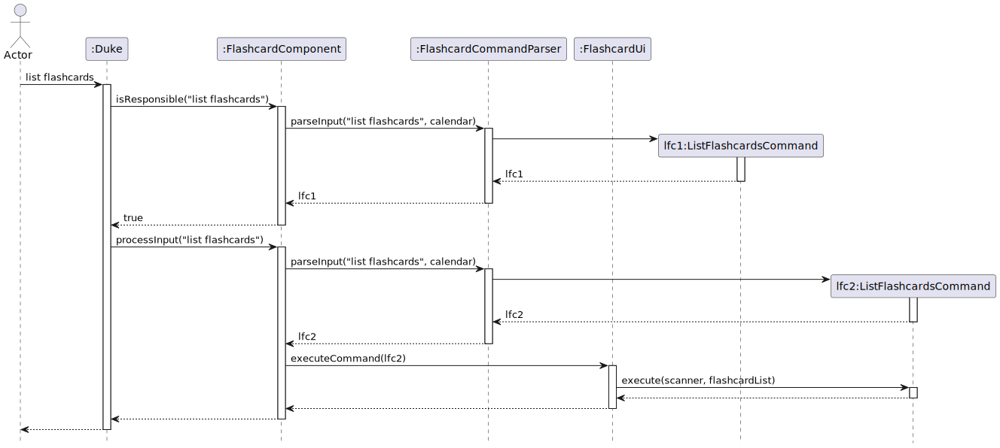

# **Developer Guide**

## **Acknowledgements**

+ Acknowledgement to the [CS2113 Website](https://nus-cs2113-ay2324s1.github.io/website/admin/tp-deliverables.html#deliverable-project-portfolio-page-ppp) for giving us design guidelines.
+ Acknowledgement to [Dr Akshay Narayan](https://www.comp.nus.edu.sg/cs/people/anarayan/), and Teaching Assistant for their guidance.
+ Acknowledgement to [team members](AboutUs.md) for their hard work.
+ Acknowledgement to the [diagram tool](https://app.diagrams.net) for facilitating drawing of diagrams
+ Acknowledgement to [Developer Guide Example](https://se-education.org/addressbook-level3/DeveloperGuide.html#acknowledgements) for illustration.

## **Design & implementation**

### **Design & Architecture**

Given below is a quick overview of main components and how they interact with each other.

**Main components of the architecture**

The two main classes of Duke are FlashcardComponent and CalendarManager.
Those two classes carry out the bulk of the application. 

Duke prompts for user input. Duke also has accesses to FlashcardComponent
and CalendarManager. So, when the user input is given, duke decided which one
to call based on the input.

As the input is processed and called by one of the two main classes, 
subsequent methods and features are called by children classes. The 
low-class explanations will be given below.

### **`flashcard` package**

#### **Package structure overview** 

The API of the `flashcard` package is defined in [`FlashcardComponent.java`](https://github.com/AY2324S1-CS2113-F11-3/tp/blob/master/src/main/java/seedu/duke/flashcard/FlashcardComponent.java).

The flashcard package is structured into multiple parts:

- [`Flashcard.java`](https://github.com/AY2324S1-CS2113-F11-3/tp/blob/master/src/main/java/seedu/duke/flashcard/Flashcard.java):
  Represents a single flashcard with front text, back text as well as 
  its unique id and current difficulty level.
- [`FlashcardCommandParser.java`](https://github.com/AY2324S1-CS2113-F11-3/tp/blob/master/src/main/java/seedu/duke/flashcard/FlashcardCommandParser.java):
  Parses user inputs into the corresponding commands.
- [`FlashcardComponent.java`](https://github.com/AY2324S1-CS2113-F11-3/tp/blob/master/src/main/java/seedu/duke/flashcard/FlashcardComponent.java):
  Encapsulates all functionality of the `flashcard` package and exposes it 
  in one single, unified API.
- [`FlashcardDirectory.java`](https://github.com/AY2324S1-CS2113-F11-3/tp/blob/master/src/main/java/seedu/duke/flashcard/FlashcardDirectory.java):
  Helper class needed for storing flashcards after TaskLinker has been 
  exited; see [the DG section about storage components](#storage-components).
- [`FlashcardList.java`](https://github.com/AY2324S1-CS2113-F11-3/tp/blob/master/src/main/java/seedu/duke/flashcard/FlashcardList.java):
  Container class for a list of flashcards. Exposes a simple, unified API 
  for dealing with a list of flashcards.
- [`FlashcardUi.java`](https://github.com/AY2324S1-CS2113-F11-3/tp/blob/master/src/main/java/seedu/duke/flashcard/FlashcardUi.java):
  Responsible for interfacing with the user: dispatches commands to be 
  executed and shows their output to the user.
- [`flashcard.command` package](https://github.com/AY2324S1-CS2113-F11-3/tp/tree/master/src/main/java/seedu/duke/flashcard/command):
  Contains classes representing the different kinds of commands (`list 
  flashcards`, `create flashcard` etc.).
- [`flashcard.exceptions` package](https://github.com/AY2324S1-CS2113-F11-3/tp/tree/master/src/main/java/seedu/duke/flashcard/exceptions):
  Contains classes representing custom exceptions that are specific to the 
  `flashcards` package.
- [`flashcard.review` package](https://github.com/AY2324S1-CS2113-F11-3/tp/tree/master/src/main/java/seedu/duke/flashcard/review):
  Contains classes representing the different flashcard review modes (random 
  mode and spaced repetition mode).

This class diagram provides a high-level overview of how the classes in the 
top-level `flashcard` package integrate with each other:

#### **Rough control flow overview**

The process of processing the initial user input and figuring out which 
command to  execute based on this user input is handled by the 
`FlashcardComponent`, `FlashcardCommandParser` and `FlashcardUi` classes.

During their operation, they create an instance of the appropriate 
`FlashcardCommand` (from the `flashcard.command` package) and then execute 
it; thereby performing the action the user wanted.

Put into a sequence diagram flow, the above-mentioned workflow looks like this:

This workflow is divided into multiple parts:

1. When the user enters text ("list flashcards" in this specific case), `Duke` 
   first tries to figure out whether the flashcard package is responsible for
   handling it. To this end, `Duke` calls the `isResponsible` method of 
   `FlashcardComponent`.
2. The `isResponsible` method works by passing the input on to 
   `FlashcardCommandParser` and checking whether it returns an 
   UnknownCommand or not. In this specific case, `FlashcardCommandParser` 
   recognizes the "list flashcards" input and returns a matching 
   `ListFlashcardsCommand`. Thus, the `FlashcardComponent` knows that it 
   can process the inputted text and thus is responsible for handling it. 
   Thus, true is returned.
3. Because `FlashcardComponent` has returned `true` as response to the call 
   of its `isResponsbile` method, `Duke` passes the user input on to 
   `FlashcardComponent` via the `processInput` method.
4. Just like when executing the `isResponsible` method, `FlashcardComponent` 
   passes the input on to `FlashcardCommandParser` and in this specific case 
   gets back a `ListFlashcardsCommand`.
5. `FlashcardComponent` now passes this `ListFlashcardsCommand` on to the 
   `FlashcardUi` by invoking the latter's `executeCommand` method.
6. The `FlashcardUi` in turn calls the `execute` method of the 
   `ListFlashcardsCommand` it has just been passed.
7. The `ListFlashcardsCommand` is executed, showing a list of all flashcards 
   to the user, before control is returned to `Duke`.

#### **`flashcard.command` package**

The `flashcard.command` package contains the classes representing the 
different flashcard commands.

These are the classes representing the different commands:
- [`CreateFlashcardCommand.java`](https://github.com/AY2324S1-CS2113-F11-3/tp/blob/master/src/main/java/seedu/duke/flashcard/command/CreateFlashcardCommand.java)
  corresponds to the `create flashcards` command
- [`DeleteAllFlashcardsCommand.java`](https://github.com/AY2324S1-CS2113-F11-3/tp/blob/master/src/main/java/seedu/duke/flashcard/command/DeleteAllFlashcardsCommand.java)
  corresponds to the `delete all flashcards` command
- [`DeleteFlashcardCommand.java`](https://github.com/AY2324S1-CS2113-F11-3/tp/blob/master/src/main/java/seedu/duke/flashcard/command/ListFlashcardsCommand.java)
  corresponds to the `delete flashcard` command
- [`ListFlashcardsCommand.java`](https://github.com/AY2324S1-CS2113-F11-3/tp/blob/master/src/main/java/seedu/duke/flashcard/command/ListFlashcardsCommand.java)
  corresponds to the `list flashcards` command
- [`StartReviewCommand.java`](https://github.com/AY2324S1-CS2113-F11-3/tp/blob/master/src/main/java/seedu/duke/flashcard/command/StartReviewCommand.java)
  corresponds to the `review flashcards` command

All these classes inherit from the abstract class `FlashcardCommand` and 
define its `execute` method. This method serves as the entire API of a 
`FlashcardCommand`: The `execute` method is passed a scanner and an instance 
of `FlashcardList` that represents the currently used flashcards and then 
performs any actions necessary to execute the respective command.

Subclasses of `FlashcardCommand` are free to implement any additional 
private or protected fields and/or methods that are required for their 
internal operation. In this regard, because the commands all achieve very 
different goals (listing flashcards vs creating new flashcards), the different 
subclasses of `FlashcardCommand` can vary quite heavily. Therefore, in the 
interest of brevity, the individual subclasses are not explained in further 
detail and the reader is instead referred to their respective source code in 
the `src/main/java/seedu.duke/flashcard/command` directory.

##### "Dual Commands": Offering different input options for beginner vs expert users

As already explained in the user guide, there are so-called "Dual Commands" 
that can be invoked in two different ways: an easy, but more time-consuming way
for  beginner users who want as much guidance as possible; or a less
time-consuming, but more complicated way for expert users who don't need
additional guidance. Such "dual commands" are implemented as subclasses of 
the abstract class `DualFlashcardCommand`.

Currently, the following commands are dual commands (and as such inherit 
from `DualFlashcardCommand`):

- [`DeleteFlashcardCommand.java`](https://github.com/AY2324S1-CS2113-F11-3/tp/blob/master/src/main/java/seedu/duke/flashcard/command/ListFlashcardsCommand.java)
- [`StartReviewCommand.java`](https://github.com/AY2324S1-CS2113-F11-3/tp/blob/master/src/main/java/seedu/duke/flashcard/command/StartReviewCommand.java)

The abstract `DualFlashcardCommand` mode contains two abstract methods that 
need to be implemented by its subclasses:

- `executeBeginnerMode`: Implementing this abstract method allows implementing 
  the beginner mode (with interactive input) that allows for easier, but 
  more time-consuming usage.
- `executeExpertMode`: Implementing this abstract method allows implementing
  the expert mode (with one-line input) that allows for less time-consuming, 
  but more complicated usage.

This class diagram depicts the internal structure of the `flashcard.command` 
package and especially highlights how `CreateFlashcardCommand`, 
`DeleteAllFlashcardsCommand` and `ListFlashcardsCommand` directly inherit 
from `FlashcardCommand`; whereas `DeleteFlashcardCommand` and 
`StartReviewCommand` inherit from `DualFlashcardCommand` which in itself 
inherits from `FlashcardCommand`:

#### **`flashcard.exceptions` package**

This package contains the `FlashcardException` base class from which all
flashcard-specific exceptions are derived.

Individual, flashcard-specific exceptions are implemented as subclasses of
the `FlashcardException` class. For further details, you can see the Javadoc
comments in their source code.

Currently, the flashcard-specific exceptions are:

- [`InvalidFlashcardIdException`](https://github.com/AY2324S1-CS2113-F11-3/tp/blob/master/src/main/java/seedu/duke/flashcard/exceptions/InvalidFlashcardIdException.java):
  Signifies that a given flashcardId is not valid, i.e. that no flashcard with
  that id appears in the list of flashcards which are currently being worked on.
- [`InvalidReviewModeException`](https://github.com/AY2324S1-CS2113-F11-3/tp/blob/master/src/main/java/seedu/duke/flashcard/exceptions/InvalidReviewModeException.java):
  Signifies that an invalid, i.e. non-existent review mode has been chosen.

#### **`flashcard.review` package**

This package contains all classes related to review modes for flashcards.

It contains the `ReviewMode` base class that provides functionalities to 
easily review flashcards that can be used by subclasses as building blocks to
implement specific kinds of reviews (e.g. random or spaced repetition reviews). 

There are two subclasses which inherit from `ReviewMode`, namely 
`RandomReviewMode` and `SpacedRepetitionReviewMode`.

In this regard, because the different review modes all use very
different revision strategies (random picking vs difficulty-based picking of 
flashcards), the different subclasses of `ReviewMode` can vary quite heavily. 
Therefore, in the interest of brevity, the individual subclasses are not
explained in further detail and the reader is instead referred to their
respective source code in the `src/main/java/seedu.duke/flashcard/review`
directory.

### **Storage Components**

API: `FlashcardStorage.java`

The `FlashcardStorage` component,
* can creates data directory and flashcards directory.
* can save flashcards in `flashcard.txt` in specific text format
* saves automatically when changes occur.
* component loads automatically when the program starts.  
* component can check if the saved txt file has been damaged.

`EventStorage` has similar structure. (It was omitted to avoid redundancy.)

### **Calendar Components**

API: `CalendarManager.java`

#### **Command Package**

The package has 7 files in it for users to command their calendar. Those files are 
AddEventCommand, DeleteAllEventsCommand, DeleteEventCommand, EventCommand, FindEventCommand
ListEventCommand, and UnknownCommand. The other 6 commands extend EventCommand, which is
an abstract class that forces other 6 commands to have an execute method.

Each command files execute its own commands. The UnknownCommand file handles the exceptions,
such as if the user commands something that doesn't exist

#### **Calendar Package**

The calendar package excluding the command package has 8 classes.
The Calendar class integrates flashcards and calendar events, allowing for interactions between the 2 packages.
The CalendarManager, EventStorage, & CalendarCommandParser manages user input, saves, and loads them.
The classes are associated with one another through instant accesses and other means. The 
CalendarManager directs the events and event list, which then are run on Duke.

Calendar package Class Diagram:

CalendarManager Sequence Diagram:

## **Product scope**

### **Target user profile**

TaskLinker is tailored towards university students who use flashcards to 
study for their courses and need an easy way to schedule and plan the 
studying of their flashcards as well as track some other tasks in their 
calendar.

TaskLinker is a CLI tool and as such, it is tailored towards students who 
type fast and prefer a functional, but bare-bones app that runs in the 
terminal over a GUI that looks more impressive but is slower to use. 

As such, computer science students represent good target users of TaskLinker.

### **Value proposition**

TaskLinker is a CLI-tool for helping university students memorize flashcards
and track their flashcard progress as well as general academic progress in
the courses they are taking.

## **User Stories**

| Version | As a ...                  | I want to ...                                                  | So that I can ...                                                                             |
|---------|---------------------------|----------------------------------------------------------------|-----------------------------------------------------------------------------------------------|
| v1.0    | user                      | Delete event from my Calendar                                  | remove unnecessary events from the Calendar                                                   |
| v1.0    | user                      | Add event to my Calendar                                       | create new necessary events on my Calendar                                                    |
| v1.0    | user                      | List all events in my Calendar                                 | keep track of all my events and deadlines                                                     |
| v1.0    | user                      | list all my flashcards                                         | get a quick overview of my flashcard collection                                               |
| v1.0    | user                      | create new flashcards                                          | add new knowledge I want to study                                                             |
| v1.0    | user                      | review my flashcards                                           | so that I can memorize their contents                                                         |
| v2.0    | new user                  | be able to invoke a help command                               | get advice/tips for how to use TaskLinker if I don' know how                                  |
| v2.0    | user reviewing flashcards | rate how hard it was to remember their content                 | see harder flashcards more often and easy flashcards less frequently during reviews           |
| v2.0    | experienced user          | use the delete and review feature by typing a one-line command | be faster than having to go through the prompt-answer workflow these features usually require |
| v2.0    | user                      | find events from my Calendar                                   | find events without listing them all                                                          |
| v2.0    | user                      | delete all events from my Calendar                             | don't need to remove events one by one                                                        |
| v2.0    | user                      | add a goal event to my Calendar                                | remember how many flashcards needs to be reviewed by a certain deadline                       |

## **Non-Functional Requirements**

+ Software Requirements:
  1. The TaskLinker should be able to run on one of Windows, macOS, or Linux operating systems.
  2. The TaskLinker must be able to run on Java 11 or above Java versions.

+ Technical Requirements:
  1. Users should not manually interact with storage files.
  2. If the input is not in acceptable format, the program shouldn't execute anything
  3. If the correct command is not given, the program should not execute any command.
  4. The application should only work with English language.

+ General Requirements:
  1. The application should not crash on any given exceptions due to exceptions handling.
  2. The dates/time should always be in yyyy-MM-ddTHH:mm:ss format.
  3. The application must be able to support as many events as needed.
  4. The application must be able to support as many flashcards as needed.
  5. The application can be used by anyone who can read and type.

## **Glossary**

* *TaskLinker* - CLI-tool for helping university students memorize flashcards
  and track their flashcard and general academic progress in the courses they are
  taking.
* *Calendar* - A place where all the events are listed with start and end time.
* *Event* - A task to be done from a given time to end time.
* *Flashcard* - A study tool to memorize a given word.
* *Storage* - A file where the calendar and flashcards are stored.
* *Goal* - A goal to be accomplished by a given date/time on the calendar.
* *Review* - Study flashcards
* *Exception* - Something abnormal that should not happen.
* *UML Diagram* - A diagram where the design of the application is explained.
* *DeveloperGuide* - A guide for other developers to read to understand the application.
* *UserGuide* - A guide for the users  to read to understand the application.

## **Instructions for manual testing**

*Given below are the instructions for manual testing the TaskLinker.*

### **Testing launching and exiting the application**
Launching the application
  1. download the jar file from the release page.
  2. open a terminal and navigate to the directory where the jar file is located.
  3. run the command `java -jar TaskLinker.jar`

Exiting the application
  1. type `exit` in the command box and press enter.
  2. the application will exit.

#### **Testing adding an event to the calendar**

Test Case #1 (Everything Works):

<pre>
Enter your command: <b>add event</b>
What's the event?: <b>Do HW</b>
When does it start?: <b>2023-12-20T12:30:30</b>
When does it end?: <b>2023-12-20T13:40:30</b>
</pre>

Test Case #2 (Start Time, End Time Error):

<pre>
Enter your command: <b>add event</b>
What's the event?: <b>Do HW</b>
When does it start?: <b>2023-12-20T12:30:30</b>
When does it end?: <b>2023-12-20T11:40:30</b>

  End time is before or equal to the start time. Please enter the correct end time.
</pre>

#### **Testing adding a goal event to the calendar**

Test Case #1 (Everything Works):

<pre>
Enter your command: <b>add goal event</b>
What's the event?: <b>Do Flashcards</b>
When does it end?: <b>2023-12-20T12:30:30</b>

Goal 'Do Flashcards' review 20 flashcards by: 2023-12-20T12:30:30 (Reviewed: 0) 
has been added to your Calendar
</pre>

Test Case #2 (Not an integer for # of flashcards):

<pre>
Enter your command: <b>add goal event</b>
What's the event?: <b>Do Flashcards</b>
When does it end?: <b>2023-12-20T12:30:30</b>
How many flashcard to review by then?: <b>r</b>

    Invalid integer input. Please try again.
</pre>

#### **Testing deleting an event from the calendar**

Test Case #1 (Everything Works):

<pre>
Enter your command: <b>delete event</b>
What's the event?: <b>hello</b>
    hello has been deleted from your Calendar!
</pre>

Test Case #2 (Incomplete command):

<pre>
Enter your command: <b>delete</b>
☹ OOPS!!! The description of a delete cannot be empty.
    Invalid integer input. Please try again.
</pre>

#### **Testing finding an event from the Calendar**

Test Case #1 (Everything Works):

<pre>
Enter your command: <b>find event</b>
What's the event?: <b>Do HW</b>
1. Event 'Do HW' From: 2023-12-20T12:30:30, To: 2023-12-20T13:30:30
    These events have been found
</pre>

Test Case #2 (Incomplete Command):

<pre>
Enter your command: <b>find</b>
☹ OOPS!!! The description of a find cannot be empty.
    Invalid integer input. Please try again.
</pre>

#### **Testing listing all events from the Calendar**

Test Case #1 (Everything Works):

<pre>
Enter your command: <b>list events</b>
    Here is a list of all your events: 
--------------------------------------------------------------------------------
1. Event 'Do User' From: 2023-12-20T12:30:30, To: 2023-12-20T13:30:30
--------------------------------------------------------------------------------
</pre>

Test Case #2 (Incomplete command):

<pre>
Enter your command: <b>list</b>
☹ OOPS!!! The description of a list cannot be empty.
    Invalid integer input. Please try again.
</pre>