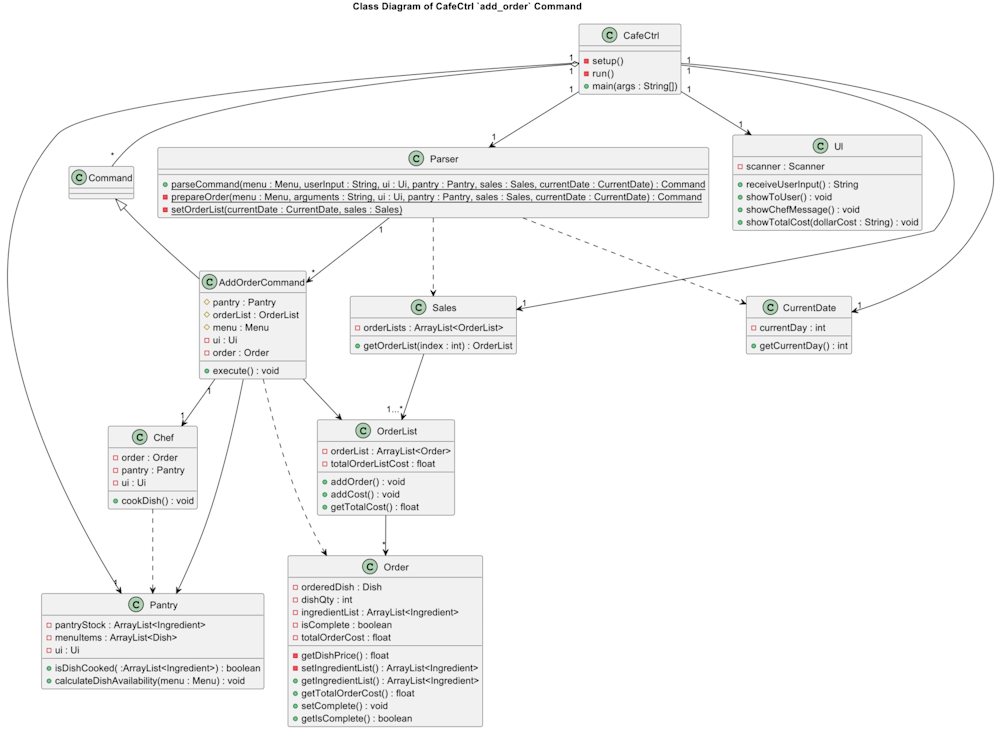

# Developer Guide

## Acknowledgements

{list here sources of all reused/adapted ideas, code, documentation, and third-party libraries -- include links to the original source as well}

## Design & implementation

## Design

### Parser

*Figure 1: Parser Parsing User Input Sequence Diagram*

API: [Parser.java]({repoURL}src/main/java/seedu/cafectrl/parser/Parser.java)

When user input a string to `Main`,  it passes the full user input to `Parser` via `parseCommand`. In `parseCommand`,  it finds the matching keyword for different command from the user input, then it calls the respective `prepareCommand` method within `Parser`. `prepareCommand` then generates the corresponding command class and return it to `parseCommand`, which returns the `Command` back to `Main` for execution.

## Features

### Add Dish

*Figure X: Execution of add_dish command*

API: [AddDishCommand.java](https://github.com/AY2324S1-CS2113-T17-2/tp/blob/master/src/main/java/seedu/cafectrl/command/AddDishCommand.java)

The `add_dish` command, add a dish to the `Menu` object and prints out a formatted message to state the name, price and ingredients entered for the dish.

when the `execute()` method from `AddDishCommand` is called in the main class `CafeCtrl`, the `addDish()` method is first called to add the `Dish` object to the `Menu`. It will then call the `printAddDishMessage()` method, which gets all the parameters of the `Dish` object (dishName, dishPrice, dishIngredients) and passes them to the `Ui` to then be printed out to the User.

Separation of Concerns was applied to ensure the `Ui` is only responsible with only displaying messages while the `Menu` deals with the logic of adding dish to the menu. This implementation also encapsulates the details of adding a dish and displaying messages. For example, The `AddDishCommand` class doesn't need to know how the internal details of the dish adding and message printing are performed.

### Adding a Dish

### List Menu
A `list_menu` command can be used to display all the `Dish` objects stored in `Menu`.

The following class diagram illustrates the relationship between the respective classes involved in the creation and execution of a list_menu command.

Figure 1: Execution of list_menu command

API: [ListMenuCommand.java]({repoURL}src/main/java/seedu/cafectrl/command/ListMenuCommand.java)

When the `execute()` method of ListMenuCommand is invoked in Main, it checks if the size of the menu by running `menu.getSize()`. 

1) If the menu is empty, it will call its `printEmptyMenu()` method to display to the user a `MENU_EMPTY_MESSAGE` in the Ui object and returns afterward.
2) If the menu is not empty, it will call its `printFullMenu()` method.
`printFullMenu()` will first print the top portion of the menu using the Ui object. 
It then iterates through the `Dish` objects in `Menu` in a "for" loop, using `menu.getDishFromId()` to retrieve the Dish object.
The `dishName` and `dishPrice` are both access from `Dish` Class using `getName()` and `getPrice()` respectively.
The data are then packaged nicely in a `leftAlignFormat`, with (indexNum + ". " + dishName," $" + dishPrice) such that
   e.g. (1. Chicken Rice $2.50) is shown.

### Add Order
A add_order command can be used to add `order` to an `orderList` in `Sales`.

The following class diagram illustrates the relationship between the respective classes involved in the creation and execution of an add_order command.

Figure 1: Execution of add_order command

API: [AddOrderCommand.java]({repoURL}src/main/java/seedu/cafectrl/command/ListMenuCommand.java)

When the `execute()` method of AddOrderCommand is invoked in Main, the parsed `order` object is added to the `orderList`.

A `Chef` object is then created to process the order by running `cookDish()`. 
This method first checks if the order has already been completed by running `order.getIsCompleted()`.
If the order has not been completed, the `showDeleteMesage()` in the Ui component is triggered to display a message to show the user that the dish is being 'prepared'.
An ArrayList of Ingredients, ingredientList, is retrieved from the `order` object by `order.getIngredientList()`. 
This ingredientList is passed into the `pantry` object in `pantry.decreaseIngredientsStock()` to process the ingredients used from the pantry stock.
The order is then marked as completed by `order.setComplete()`

Returning to the AddOrderCommand, the `order` object is checked to be completed again by running `order.getIsCompleted()`.
This verifies that the ingredientList has been successfully retrieved and passed into `pantry.decreaseIngredientsStock()` to run without errors.
After verifying that the order has been completed, the cost of the order is added to the total order by `orderList.addCost()`. 

The total sum of orders in the `orderList` object is retrieved using `orderList.getTotalCost()`.
This is then passed into Ui using `ui.showTotalCost()` to display a message to the user with the total order cost.

### List Ingredients

*Figure 2: Execution of list_ingredient command*

API: [ListIngredientCommand.java]({repoURL}src/main/java/seedu/cafectrl/command/ListIngredientCommand.java)

| No | Step                          | Description                                                                                                                                                                                                                                                                                                                                                                              |
|----|-------------------------------|------------------------------------------------------------------------------------------------------------------------------------------------------------------------------------------------------------------------------------------------------------------------------------------------------------------------------------------------------------------------------------------|
| 1  | Initialization                | The sequence begins with the `Main` class invoking the `execute` method of the `ListIngredientCommand` after parsing a user command.                                                                                                                                                                                                                                                     |
| 2-3  | Interaction with 'Menu'       | The `ListIngredientCommand` communicates with the `Menu` class, invoking the `getMenuItemsList()` method to retrieve a list of menu items. The function returns an ArrayList of objects of 'Dish' type.                                                                                                                                                                                  |
| 4  | Interaction with 'Ui'         | The `ListIngredientCommand` communicates with the `Ui` class, invoking the `printIngredients()` method to print out the list of ingredients used for the selected dish.   * The function returns an ArrayList of objects of 'Dish' type. The `get()` method is then invoked to get the dish of the specified index. However, this is ommitted to prevent unnecessary sophistication. |
| 5-6  | Interaction with 'Dish'       | The `Ui` class communicates with the `Dish` class, invoking the `getIngredients()` method to obtain the list of ingredients for the selected dish. The `Dish` class responds with an ArrayList of objects of 'Ingredient' type to the `Ui` class.                                                                                                                                        |
| 7-8  | Iteration through Ingredients | There is a loop that iterates through each ingredient in the list. The `Ui` class interacts with the `Ingredients` class, converting each ingredient to a string containing the ingredient and quantity needed.                                                                                                                                                                          |
| 9-10  | Display to User               | The `Ui` class showcases the information to the user through the `showToUser()` method.                                                                                                                                                                                                                                                                                                  |

### Delete Dish

### Delete Dish

 *Figure X: Execution of delete dish command

API: [DeleteDishCommand.java]({repoURL}src/main/java/seedu/cafectrl/command/DeleteDishCommand.java)

When the `execute()` method of `DeleteDishCommand` is invoked in `Main`, it subsequently calls `getMenuItemsList().get(dishIndexToBeDeleted)` method on the `Menu` object to retrieve the `Dish` object to be deleted.
Following this, the `showDeleteMesage()` method in the Ui component is triggered to display a message to show the user which dish is about to be deleted.
Afterward, `DeleteDishCommand` calls `removeDish(dishIndexToBeDeleted)` of the `Menu` object to remove the selected dish at the index indicated by the user.
This sequence of actions orchestrates the flow of information and operations between `Main`, `DeleteDishCommand`, `Menu`, and `Ui` components, ensuring the seamless handling of the dish deleting functionality within the application.

`DeleteDishCommand` is implemented in such a way because:
1. It promotes loose coupling between components. For instance, `Main` doesn't need to know the details of how the `execute()` of `DeleteDishCommand` is executed or how the message is displayed in `Ui`.
2. Each component has a specific role and responsibility. `Main` is responsible for receiving user input and invoking `execute()`, `DeleteDishCommand` is responsible for encapsulating the delete operation, `Menu` is responsible for managing the menu items, and `Ui` is responsible for displaying messages to the user. This separation of concerns makes the code more maintainable and easier to understand.

### Edit Price

*Figure 3: Execution of edit_price command*

API: [EditPriceCommand.java]({repoURL}src/main/java/seedu/cafectrl/command/EditPriceCommand.java)

When the `execute()` method of `EditPriceCommand` is invoked in `Main`, it subsequently calls the `setPrice()` method on the `Dish` object to modify the price of the specific dish. Following this, the `showEditPriceMessages()` method in the Ui component is triggered to display a message related to the successful execution of the price modification process. This sequence of actions orchestrates the flow of information and operations between the `Main`, `EditPriceCommand`, `Dish`, and `Ui` components, ensuring the seamless handling of the price editing functionality within the application.

## Product scope
### Target user profile

{Describe the target user profile}

### Value proposition

{Describe the value proposition: what problem does it solve?}

## User Stories

|Version| As a ... | I want to ... | So that I can ...|
|--------|----------|---------------|------------------|
|v1.0|new user|see usage instructions|refer to them when I forget how to use the application|
|v2.0|user|find a to-do item by name|locate a to-do without having to go through the entire list|

## Non-Functional Requirements

{Give non-functional requirements}

## Glossary

* *glossary item* - Definition

## Instructions for manual testing

{Give instructions on how to do a manual product testing e.g., how to load sample data to be used for testing}
