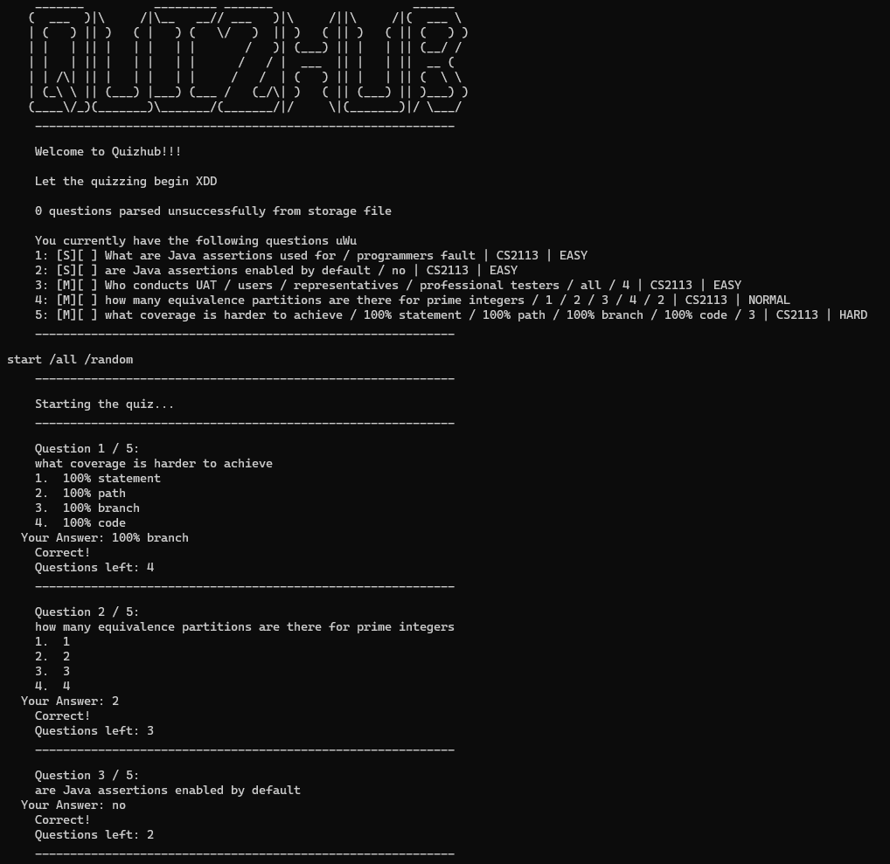

# QuizHub

QuizHUB is a local desktop app designed to help NUS students easily record examinable questions and generate quizzes
from their very own question bank to test their understanding via a Command Line Interface (CLI). Easily launch-able
on the go, QuizHUB is a versatile tool that aims to streamline and optimize the revision experience for NUS students
from all fields of study.

## Our User Interface
Lightweight and simple user interface for taking quizzes.

## Useful links:
* [User Guide](UserGuide.md)
* [Developer Guide](DeveloperGuide.md)
* [About Us](AboutUs.md)
