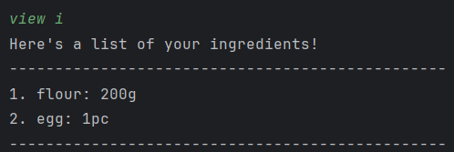
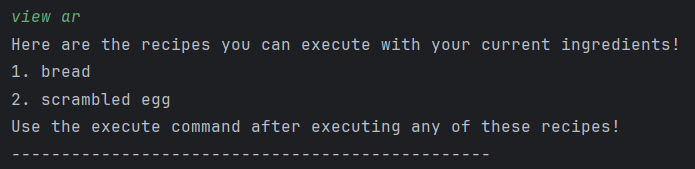
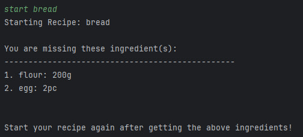
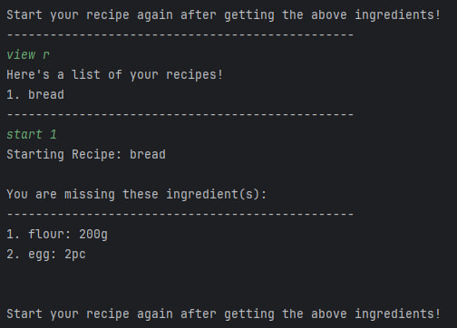
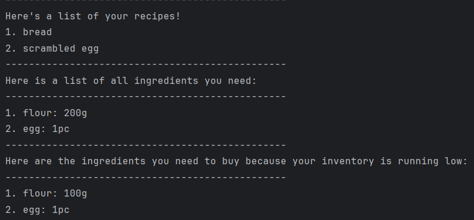
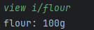

EssenMakanan is a **desktop app for managing recipes and ingredients in your inventory, optimized for use via a Command Line Interface** (CLI) while still having the benefits of a Graphical User Interface (GUI). 
If you can type fast, EssenMakanan can get your recipes and ingredients management tasks done faster than traditional GUI apps.

--------------------------------------------------------------------------------------------------------------------
# User Guide

## Introduction

EssenMakanan is an app that keeps track of ingredients that a user has in the kitchen, stores recipes and provides steps on how to cook a specific recipe. This app will include a command line interface to use the available commands in the app.

## Quick Start

1. The app requires Java 11 to be installed into your computer or laptop.
2. Download the latest `Essenmakanan.jar` from [here](https://github.com/AY2324S1-CS2113-F11-2/tp/releases)
3. Copy and move the file into the selected folder you want to put the app in.
4. Open your command line and input the command below to run the app:
`java -jar Essenmakanan.jar`

## Features
#### Notes about the command format: 
* Words in `UPPER_CASE` are the parameters to be supplied by the user. 
  e.g. in `add r/RECIPE_TITLE s/STEP i/INGREDIENT`, `RECIPE_TITLE`, `STEP` and `INGREDIENT` are parameters which 
  can be used. Example: `add r/bread s/mix flour i/flour,200,g`.

* Items in square brackets are optional. 
  e.g `edit i/INGREDIENT_NAME [n/NEW_NAME] [q/NEW_QUANTITY] `. 
        The commands`edit i/bread n/toast q/10`, `edit i/bread n/toast` or `edit i/bread q/10` are all valid.

* tags with `...` after them can be used multiple times including zero times. 
  e.g. `add i/INGREDIENT_NAME,QUANTITY,UNIT [i/...]` can be used as `i/egg,2,pc`, `i/egg,2,pc i/flour,1,kg i/oil,2,l`. 
    Any number of ingredients after `i/` is valid as long as the format is correct.

<!-- 
// To be implemented
* Parameters can be in any order. 
  e.g. if the command specifies `n/NAME p/PHONE_NUMBER`, `p/PHONE_NUMBER n/NAME` is also acceptable.
-->
* Extraneous parameters for commands that do not take in parameters (such as `help`, `list`, `exit`)
  will be ignored. 
  e.g. if the command specifies `help 123`, it will be interpreted as `help`.

### [System Summary of Commands](#feature-system)

| Action                                         | Format                                                      | Example                                                                            |
|------------------------------------------------|-------------------------------------------------------------|------------------------------------------------------------------------------------|
| [Help](#help) (list all commands available) | help                                                        | help                                                                               |

---

### [Recipes Summary of Commands](#feature-recipe)
| Action                                                                     | Format                                                                                                                                                                      | Example                                                                                                       |
|----------------------------------------------------------------------------|-----------------------------------------------------------------------------------------------------------------------------------------------------------------------------|---------------------------------------------------------------------------------------------------------------|
| [View all recipes](#view-recipes)                                          | view r                                                                                                                                                                      | view r                                                                                                        |
| [View specific recipe](#view-recipe)                                       | view r/RECIPE_ID                                                                                                                                                            | view r/1                                                                                                      |
| [View all available recipes](#available-recipe)| view ar|view ar|
| [Add recipe](#add-recipe)                                                  | add r/RECIPE_TITLE [t/TAG] s/STEP_DESCRIPTION [s/...] [d/DURATION] i/INGREDIENT_NAME,QUANTITY,UNIT [i/...]                                                                  | add r/scramble egg t/1 s/buy ingredients t/2 s/wash ingredients s/bake ingredients i/egg,2,pc                 |
| [Edit recipe](#edit-recipe)                                                | edit r/RECIPE_TITLE [n/NEW_TITLE] [s/STEP_INDEX,NEW_STEP_DESCRIPTION] [ i/INGREDIENT_INDEX, [n-NEW_INGREDIENT_NAME], [q-NEW_INGREDIENT_QUANTITY], [u-NEW_INGREDIENT_UNIT] ] | edit r/bread n/white bread s/1,new step i/1,n-new ingredient name,q-new ingredient quantity, u-new ingredient |
| [Delete Recipe](#delete-recipe)                                            | delete r/RECIPE_TITLE OR delete r/RECIPE_INDEX                                                                                                                              | delete r/meatball noodles OR delete r/2                                                                       |
| [Duplicate Recipe](#duplicate-recipe)                                      | duplicate RECIPE_NAME or duplicate RECIPE_INDEX                                                                                                                             | duplicate sandwich or duplicate 1                                                                             |                                                                                                                                           
| [Check recipe](#check-recipe)  (view missing ingredients from a recipe) | check RECIPE_TITLE   check RECIPE_ID                                                                                                                                  | check dumpling noodles    check 1                                                                       |
| [Filter recipe by ingredients](#filter-recipe)                             | filter recipe i/INGREDIENT_NAME [i/...]                                                                                                                                     | filter recipe i/chicken i/noodles                                                                             |
| [Plan recipes for the week](#plan-recipe)                                  | plan NUMBER_OF_RECIPES r/RECIPE_ID [r/...]                                                                                                                                  | filter 2 r/1 r/3                                                                                              |
| [Execute recipe](#execute-recipe)                                          | execute RECIPE_TITLE                                                                                                                                                        | execute dumpling noodles                                                                                      |

---

### [Ingredient Summary of Commands](#feature-ingredient)

| Action                                             | Format                                                            | Example                       |
|----------------------------------------------------|-------------------------------------------------------------------|-------------------------------|
| [View all ingredients](#view-ingredients)          | view i                                                            | view i                        |
| [View specific ingredient](#view-ingredient)       | view i/INGREDIENT_NAME   view i/INGREDIENT_ID               | view i/bread   view i/1 |
| [Add ingredient](#add-ingredient)                  | add i/INGREDIENT_NAME,QUANTITY,VALID_UNIT                         | add i/eggs,2,pc               |
| [Edit ingredient](#edit-ingredient)                | edit i/INGREDIENT_NAME [n/NEW_NAME] [q/NEW_QUANTITY] [u/NEW_UNIT] | edit i/bread n/toast q/3 u/pc |
| [Delete Ingredient](#delete-ingredient)            | delete r/INGREDIENT_NAME OR delete r/INGREDIENT_ID                | delete i/EGG OR delete i/1    |
| [Use Ingredient](#use-ingredient)                  | use i/INGREDIENT_NAME,QUANTITY,VALID_UNIT [i/...]                 | use i/chicken,1,kg            |

----

### [Shortcut Summary of Commands](#feature-shortcut)

| Action                                | Format                                                | Example                      |
|---------------------------------------|-------------------------------------------------------|------------------------------|
| [View all shortcuts](#view-shortcuts) | view sc                                               | view sc                      |
| [Add shortcut](#add-shortcut)         | add sc/INGREDIENT_NAME,QUANTITY                       | add sc/eggs,2                |
| [Edit shortcut](#edit-shortcut)       | edit sc/INGREDIENT_NAME [n/NEW_NAME] [q/NEW_QUANTITY] | edit sc/bread n/eggs q/3     |
| [Delete shortcut](#delete-shortcut)   | delete sc/INGREDIENT_NAME OR delete sc/SHORTCUT_ID    | delete sc/egg OR delete sc/1 |
| [Use shortcut](#use-shortcut)         | sc INGREDIENT_NAME or sc SHORTCUT_ID                  | sc chicken OR sc 1           |

----

### Tags

| Tag Index | Tag Description    |
|-----------|--------------------|
| 1         | NIGHT_BEFORE       |
| 2         | MORNING_OF_COOKING |
| 3         | MORE_THAN_ONE_DAY  |
| 4         | ACTUAL_COOKING     |

----

### Units

| Unit (to be used) | Full Unit Description |
|-------------------|-----------------------|
| g                 | Gram                  |
| kg                | Kilogram              |
| ml                | Mililitre             |
| l                 | Litres                |
| tsp               | Teaspoon              |
| tbsp              | Tablespoon            |
| cup               | Cup                   |
| pc                | Piece                 |

----

### System Commands

#### Viewing help – `help`
()

List all commands and the format and brief description of each command.

---

### Recipe Commands

#### View all recipes -  `view r` 
()

List all recipes available inside the app.

---

#### View specific recipe - `view r/RECIPE_ID`
()

View the steps of a specified recipe with RECIPE_ID
  
Examples :
  
* `view r/1` 
to show a recipe at index ‘1’ of the list.
---

### View all available recipes - `view ar`
()

View all recipes you are able to execute given the ingredients you have in your ingredient inventory. 

For example
- With the following ingredients in my inventory,

- I am able to see which recipes only require at most 200g of flour and 1 egg using the `view ar` command

- As seen, I am able to cook recipes "bread" and "scrambled egg" with my current inventory ingredients!

#### Add new recipe - `add r/RECIPE_TITLE [t/TAG] s/STEP_DESCRIPTION [s/...] [d/DURATION] i/INGREDIENT_NAME,QUANTITY,UNIT [i/...]`
()

Add a new recipe to the list of recipes. A user is able to add more than one
step and ingredient to a recipe in 1 line.

Note 
- Multiple steps and ingredients can be added
- `RECIPE_TITLE`, `STEPS` and `INGREDIENT` are compulsory fields and at least 1 field must be entered
- `DURATION (d/)` and `TAGS (t/)` is optional. [Registered tags in our app](#tags)
- `t/` must come immediately after `s/`, else defaulted as tag 4

Examples :

- **`t/` comes before the steps `\s` which belongs to the tag** : 
`add r/apple pie t/1 s/step belongs to tag 1 t/2 s/step belongs to tag 2 s/another step belongs to tag 2 i/apple,1,kg`

- **`d/` must come immediately after `s/`**

- **Full Example** : 
`add r/meatball pasta t/1 s/defrost meatballs d/30mins t/2 s/Boil pasta s/fry meatballs i/pasta,100,g i/meatball,3,pc`
    
    
   

- **Full Example 2 (default tag = 4 = ACTUAL_COOKING)** : 
  `add r/meatball pasta t/1 s/defrost meatballs d/30mins t/2 s/Boil pasta s/fry meatballs i/pasta,100,g i/meatball,3,pc`

---

#### Delete a specific recipe - `delete r/RECIPE_ID` or `delete r/RECIPE_TITLE`
()

Delete the recipe from the recipe list.

Example :
   
* `delete r/1` 

  to delete a recipe at index ‘1’

* `delete r/meatball pasta`

    to delete recipe titled "meatball pasta"

---

#### Edit a recipe - `edit r/RECIPE_TITLE [n/NEW_TITLE] [s/STEP_INDEX,NEW_STEP_DESCRIPTION] [ i/INGREDIENT_INDEX, [n-NEW_INGREDIENT_NAME], [q-NEW_INGREDIENT_QUANTITY], [u-NEW_INGREDIENT_UNIT] ]`
()

Edit a recipe to change the name, steps or ingredients of a recipe. 

Note:
- `RECIPE_TITLE` must be specified
- Choose 1 or more field from the following to edit: `n/NEW_NAME`, `s/STEP_ID,NEW_STEP` and `i/INRGEDIENT_ID,NEW_INGREDIENT_NAME`
- When editing step or ingredient of a recipe, first provide the step and ingredient id. You can check it using `view r/RECIPE_TITLE`.
In the example below, id of "meatball" is 2, as seen in the list.

- When editing an ingredient, you can choose to edit 1 or more fields: 
`n-NEW_INGREDIENT_NAME`, `q-NEW_INGREDIENT_QUANTITY` and `u-NEW_INGREDIENT_UNIT`.  **Note that the flag is a dash (-) when we are editing an ingredient of a recipe and not slash (/)**

Example :

   * `edit r/bread n/toast` to change `bread` to `toast`
   * `edit r/bread s/1,beat eggs` to change the first step to "beat eggs"
   * `edit r/bread i/1,n-flour` to change the first ingredient's name to "flour"
   * `edit r/bread i/2,q-20.0` to change the second ingredient's quantity to "20.0"
   * `edit r/bread i/3,u-kg` to change the third ingredient's unit to "kg"

Full Example :

   * `edit r/bread s/1,buy ingredients` to change the first step to `buy ingredients`

---

 
#### Duplicate a recipe - `duplicate RECIPE_NAME` or `duplicate RECIPE_INDEX`
()

Duplicate a recipe from the recipe list. The duplicated recipe with have `(copy)` within its name.

Example :

* `duplicate sandwich` to duplicate a recipe with the title `sandwich`
* `duplicate 1` to duplicate the first recipe on the list.

---    

#### Check a recipe - `check RECIPE_TITLE` or `check RECIPE_ID`
()

Use the check command to check if you are all set to start on the recipe.This command will list all missing ingredients from the recipe you want to start on.

 

Example:

* `check bread`
      
    To check if you have all ingredients needed for the recipe named "bread".
   

   

* `check 1`

    To check if you have all ingredients needed for the recipe with id 1.

---

#### Filter recipe based by ingredients - `filter recipe i/INGREDIENT_NAME` or `filter recipe i/INGREDIENT_ID`
()

Filter your recipes by ingredients you are craving for that meal.

 

Example:
* `filter recipe i/egg`
   
    All recipes containing the ingredient egg will be printed
   
* `filter recipe i/egg i/vegetable`
   

---

#### Plan recipes for the week - `plan NUMBER_OF_RECIPES r/RECIPE_ID [r/...]`
()

Schedule recipes for a week or for as many days you want by using our plan command!
This allows you to plan for your grocery trip in advance.

Upon using the command, we will show you all the ingredients needed for all your planned recipes and ingredients that you are missing.

Note:
- `NUMBER_OF_RECIPES` must correspond to the total number of recipes ("r/...") you enter. This is a compulsory field.
- You need to input at least 1 recipe to plan
- To view your recipe ids, use the `view r` command

Example:
- `plan 2 r/1 r/2` 
  
---

#### Execute a recipe `execute RECIPE_TITLE`
()

Use this command to start a recipe and automatically remove the ingredients used from the inventory.

Note: 
- Make sure to use `check` command before using this command to 
  ensure you have all the ingredients needed for the recipe.
- Add missing ingredients to your inventory using [Add Ingredient](#add-ingredient) command.

Example:
- `execute bread`

---

### Ingredient Commands

#### View all ingredients - `view i`
()
    
List all ingredients available inside the app.

---

#### View a specific ingredient - `view i/INGREDIENT_NAME` or `view i/INGREDIENT_ID`
()

Check the quantity of an ingredient you have available in your kitchen/inventory.

Example :
    
* `view i/flour`

    

* `view i/1` to view the quantity of your ingredient with id 1

---

#### Add ingredients - `add i/INGREDIENT_NAME,QUANTITY,UNIT`
()

Adds a new item to the list of ingredients. [Registered units in our app](#units)
   
When entering your unit, a user is required to use any one of the units above.

Note :
* Make sure when adding more of an existing ingredients, the units match

Example :

* `add i/bread,2,pc` to add `2 pieces of bread` into the list
* `add i/cooking oil,5,l` to add `5 liters of cooking oil` into the list

---

#### Edit ingredient - `edit i/INGREDIENT_NAME edit i/INGREDIENT_NAME n/NEW_NAME q/NEW_QUANTITY u/NEW_UNIT`
()

Edit an ingredient to change the name, quantity or unit. A user is able to edit more than one property of an 
ingredient.

Example :

* `edit i/bread n/toast` to change `bread` to `toast`
* `edit i/egg q/10 u/kg` to change the quantity to `10` and the unit to `kg`

---

#### Delete ingredient - `delete i/INGREDIENT_INDEX` OR `[delete i/INGREDIENT_NAME]`
()

Delete an ingredient based on the selected index in the list or the ingredient's name.

Example :

* `delete i/2` to delete the `second` ingredient on the list
* `delete i/egg` to delete `egg` ingredient

---

#### Use ingredient - `use i/chicken,1,kg`
()

Use ingredients in inventory, decrease the quantity of the ingredient by the amount used.

Note :
* Make sure units match when you are trying to use an ingredient.

Examples :
* use i/chicken,1,kg to use 1kg of chicken from the inventory
* use i/egg,2,pc i/chicken,1,kg to use 2 pieces of egg and 1g of chicken from the inventory

---

### Shortcut Commands

#### View All Shortcuts - `view sc`
()

List all shortcuts available inside the app.

---

#### Add Shortcut - `add sc/INGREDIENT_NAME,QUANTITY`
()

Add a shortcut into the app with specified ingredient name and quantity. 

Note :
* The ingredient name must be in the ingredient list beforehand.

Example:
* `add sc/bread,2` to add a shortcut to ingredient bread that have quantity of `2`

---

#### Edit Shortcut - `edit sc/INGREDIENT_NAME n/NEW_NAME q/NEW_QUANTITY or edit sc/SHORTCUT_INDEX n/NEW_NAME q/NEW_QUANTITY`
()

Edits a shortcut with the given changes. These changes can include a new name, a new quantity or both.

Notes:
* Only one of each flag is allowed for each input.

* The new ingredient name must be in the ingredient list.

Example:
* `edit sc/bread n/egg q/3` to edit shortcut `bread` to ingredient `egg` and the quantity to `3`

---

#### Delete Shortcut - `delete sc/INGREDIENT_NAME OR delete sc/SHORTCUT_INDEX`
()

Deletes a shortcut with the given name or index.

Example:
* `delete sc/bread` to delete shortcut to ingredient `bread`

---

#### Use Shortcut - `sc INGREDIENT_NAME or sc SHORTCUT_ID`
()

Uses a shortcut to add quantity to the ingredient based on the shortcut's name and quantity.

Example:
* `sc egg` to add quantity to ingredient `egg`

---

## FAQ

**Q**: Why can't I execute a recipe? 

**A**: Use `check` command to ensure that you have all the ingredients needed for the recipe.

**Q**: Why is there a step ID??

**A**: Enable easy referencing when editing steps
