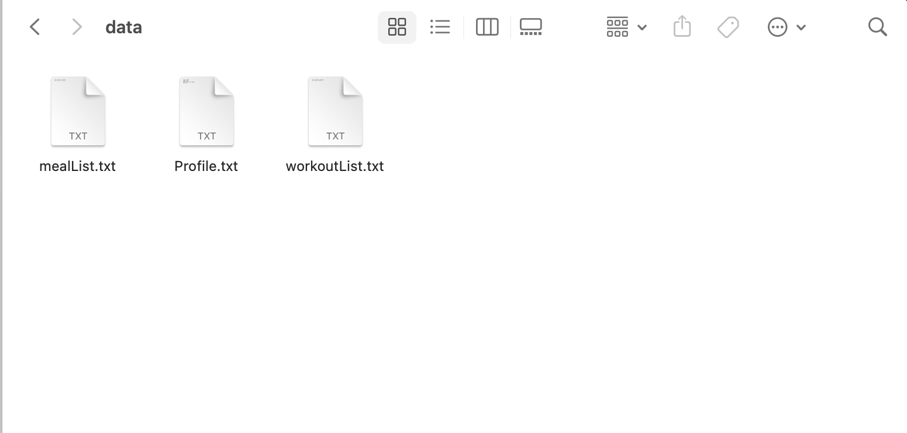
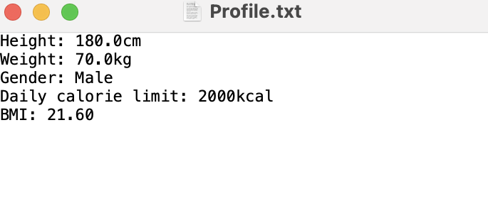
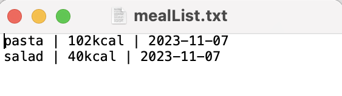
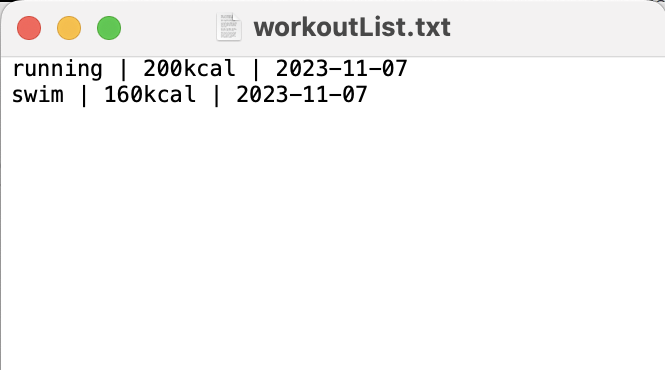

# User Guide

## Introduction

Are you ready to embark on a journey towards a healthier, more active lifestyle?
Introducing FitTrack, your ultimate fitness and nutrition companion.
FitTrack is more than just an app; 
it's your personal tracker to help you to achieve your health and fitness goals.

FitTrack is a Command Line Interface (CLI) application for tracking your fitness conveniently. 
It is targeted at people who wish to live a healthy lifestyle. Using the CLI helps to optimise usage for 
fast typing and one-stop interface to access a plethora of features to track your fitness.

## Quick Start

1. Ensure that you have Java 11 or above installed.
2. Download the latest version of `fittrack.jar` from [here](https://github.com/AY2324S1-CS2113-W12-4/tp/releases).
3. Place the jar file into a separate folder that will be used as your "home folder".
This step is not necessary, but recommended because the app will automatically create some files for the features.
4. Open a command terminal, and change the current working directory to the "home folder".
5. Type `java -jar fittrack.jar` in the terminal to open the application.
You should see the welcome message.
6. First time using the product, you have to enter your height, weight, gender, and daily calorie limit.
Please click [here](#first-time-users) for more details.
7. The application is now ready for you to use! 
Type `help` to see a list of commands that you will be able to use in the application.
8. Please follow the format given in the user guide. If the format is `bmi`, just use `bmi` and not `BMI`.


## Features 

* [Viewing help guide: `help`](#viewing-help-guide-help)
* [Editing your profile: `editprofile`](#editing-your-profile-editprofile)
* [Viewing your profile: `viewprofile`](#viewing-your-profile-viewprofile)
* [Checking your current bmi: `bmi`](#checking-your-current-bmi-bmi)
* [Checking your ideal weight range given height: `checkrecommendedweight`](#checking-your-ideal-weight-range-given-current-height-checkrecommendedweight)
* [Adding a meal: `addmeal`](#adding-a-meal-addmeal)
* [Deleting a meal: `deletemeal`](#deleting-a-meal-deletemeal)
* [Viewing list of all meals: `viewmeal`](#viewing-list-of-all-meals-viewmeal)
* [Finding meals by a keyword: `findmeal`](#finding-meals-by-a-keyword-findmeal)
* [Checking total calories consumed on a specific date: `caloriesconsumed`](#checking-total-calories-consumed-on-a-specific-date-caloriesconsumed)
* [Adding a workout: `addworkout`](#adding-a-workout-addworkout)
* [Deleting a workout: `deleteworkout`](#deleting-a-workout-deleteworkout)
* [Viewing list of workout: `viewworkout`](#viewing-list-of-all-workouts-viewworkout)
* [Finding workouts by a keyword: `findworkout`](#finding-workouts-by-a-keyword-findworkout)
* [Checking total calories burnt on a specific date: `caloriesburnt`](#checking-total-calories-burnt-on-a-specific-date-caloriesburnt)
* [Checking calorie balance on a specific date: `caloriebalance`](#checking-calorie-balance-on-a-specific-date-caloriebalance)
* [Adding steps: `addsteps`](#Adding-steps-addsteps)
* [Deleting a step entry: `deletesteps`](#Deleting-a-step-entry-deletesteps)
* [Viewing the total number of steps on a specific date: `totalsteps`](#Viewing-the-total-number-of-steps-on-a-specific-date-totalsteps)
* [Viewing list of all steps: `viewsteps`](#Viewing-list-of-all-steps-viewsteps)
* [Exiting the application : `exit`](#exiting-the-application-exit)

### First Time Users
If you are using FitTrack for the first time, you are required to enter your height, weight, gender and daily calorie limit before being 
able to access all features.

**Format**
- `h/<HEIGHT> w/<WEIGHT> g/<GENDER> l/<CARLORIELIMIT>`

**Example of usage**
```
Welcome to FitTrack!
___________.__  __ ___________                     __
\_   _____/|__|/  |\__    ___/___________    ____ |  | __
 |    __)  |  \   __\|    |  \_  __ \__  \ _/ ___\|  |/ /
 |     \   |  ||  |  |    |   |  | \/ __ \  \___|    <
 \___  /   |__||__|  |____|   |__|  (____  /\___  >__|_ \
____________________________________________________________
Please enter your height (in cm), weight (in kg), gender (M or F), and daily calorie limit (in kcal):
h/180 w/70 g/M l/2000
```

**Expected Output**
```
Here are your profile settings.
Height: Height: 180.0cm
Weight: 70.0kg
Gender: Male
Daily calorie limit: 2000kcal
BMI: 21.60
____________________________________________________________

```
**Note:** Adding a space after each keyword is not accepted.

### Viewing help guide: `help`
Shows the list of commands you can use.
With a command as an argument, it shows the format and explanation of the command.

**Format**
- `help`
- `help <COMMAND>`

**Example of usage**
```
help
```

**Expected output**
```
help
`help` shows help message of the command.
Existing commands:
help, exit,
editprofile, viewprofile, bmi, checkrecommendedweight, 
addmeal, deletemeal, viewmeal, findmeal, caloriesconsumed
addworkout, deleteworkout, viewworkout, findworkout, caloriesburnt
Type `help` or `help <COMMAND>` to view help.
```


### Editing your profile: `editprofile`
Allows user to edit their profile details.

**Format**
- `editprofile h/<HEIGHT> w/<WEIGHT> g/<GENDER> l/<CALORIE_LIMIT>`

**Example of usage**
```
editprofile h/170 w/70 g/M l/100
```

**Expected output**
```
Here is your updated profile:
Height: 170.0cm
Weight: 70.0kg
Gender: Male
Daily calorie limit: 1500kcal
BMI: 24.22
```

### Viewing your profile: `viewprofile`
Lists all profile settings and details.

**Example of usage**
```
viewprofile
```

**Expected output**
```
Your Profile:
Height: 170.0cm
Weight: 70.0kg
Gender: Male
Daily calorie limit: 1500kcal
BMI: 24.22
```


### Checking your current BMI: `bmi`
Calculates BMI based on the profile given, and tells the category which the BMI falls under.

**Example of usage**
```
bmi
```

**Expected output**
```
Your current BMI is 24.22
BMI falls under NORMAL WEIGHT category
```


### Checking your ideal weight range given current height: `checkrecommendedweight`
Allows the user to check the ideal weight range given their current height. This is calculate based
on a standard formula.

**Example of usage**
```
checkrecommendedweight
```

**Expected output**
```
Recommended Weight: 66.02 kg
```


### Adding a meal: `addmeal`
Allows user to add meals they have consumed.
The date is treated as today if it is not specified.

**Format**
- `addmeal <MEAL_NAME> c/<CALORIES>`
- `addmeal <MEAL_NAME> c/<CALORIES> d/<DATE>`
- You should type `<DATE>` in format of `yyyy-MM-dd`.

**Example of usage**
```
addmeal pasta c/200 d/2023-10-23
```

**Expected output**
```
I've added the following meal:
[M] pasta (200kcal, 2023-10-23)
```


### Deleting a meal: `deletemeal`
Allows user to delete a meal they have added.

**Format**
`deletemeal <INDEX>`

**Example of usage**
```
deletemeal 1
```

**Expected output**
```
I've deleted the following meal:
[M] pasta (200kcal, 2023-10-23)
```


### Viewing list of all meals: `viewmeal`
Lists all the meals.

**Example of usage**
```
viewmeal
```

**Expected output**
```
These are the meals you have consumed:
1.[M] aglio alio pasta (100kcal, 2023-10-29)
2.[M] chips (50kcal, 2023-10-29)
3.[M] carbonara pasta (100kcal, 2023-10-29)
```


### Finding meals by a keyword: `findmeal`
Allows user to search for a meal in their meal list.

**Format**
- `findmeal <KEYWORD>`

**Example of usage**
```
findmeal pasta
```

**Expected output**
```
These meals contain the keyword pasta:
1.[M] aglio alio pasta (100kcal, 2023-10-29)
2.[M] carbonara pasta (100kcal, 2023-10-29)
There are 2 meals that contains pasta.
```


### Checking total calories consumed on a specific date: `caloriesconsumed`
Allows user to check total calories consumed by meals on a specific date.

**Format**
- `caloriesconsumed <DATE>`
- You should type `<DATE>` in format of `yyyy-MM-dd`.

**Example of usage**
```
caloriesconsumed 2023-10-23
```

**Expected output**
```
[M] pasta (200kcal, 2023-10-23)
Total calories consumed on 2023-10-23: 200kcal
```


### Adding a workout: `addworkout`
Allows user to add workouts they have done.

**Format**
- `addworkout <WORKOUT_NAME> c/<CALORIES>`
- `addworkout <WORKOUT_NAME> c/<CALORIES> d/<DATE>`
- You should type `<DATE>` in format of `yyyy-MM-dd`.

**Example of usage**
```
addworkout running c/400 d/2023-10-23
```

**Expected output**
```
I've added the following workout:
[W] running (400kcal, 2023-10-23)
```


### Deleting a workout: `deleteworkout`
Allows user to delete a workout they have added.

**Format**
- `deleteworkout <INDEX>`

**Example of usage**
```
deleteworkout 1
```

**Expected output**
```
I've deleted the following workout:
[W] running (400kcal, 2023-10-23)
```


### Viewing list of all workouts: `viewworkout`
Lists all the workouts.

**Example of usage:**
```
viewworkout
```

**Expected output:**
```
These are the workouts you have done:
1.[W] running (400kcal, 2023-10-23)
```


### Finding workouts by a keyword: `findworkout`
Allows user to search for a workout in their workout list.

**Format**
- `findworkout <KEYWORD>`

**Example of usage**
```
findworkout run
```

**Expected output**
```
These workouts contain the keyword run:
1. [W] fast run (100kcal, 2023-10-29)
2. [W] slow run (20kcal, 2023-10-29)
```


### Checking total calories burnt on a specific date: `caloriesburnt`
Allows user to check total calories burnt by workouts on a specific date.

**Format**
- `caloriesburnt <DATE>`
- You should type `<DATE>` in format of `yyyy-MM-dd`.

**Example of usage**
```
caloriesburnt 2023-11-04
```

**Expected output**
```
[W] running (100kcal, 2023-11-04)
[W] swimming (200kcal, 2023-11-04)
[W] walking (30kcal, 2023-11-04)
Total calories burnt on 2023-11-04: 230kcal
```

### Checking calorie balance on a specific date: `caloriebalance`
Allows user to check their calorie balance (surplus/deficit) on a specific date.

Format
- caloriebalance <DATE>
- You should type <DATE> in format of yyyy-MM-dd.

**Example of usage**
```
caloriebalance 2023-11-04
```

**Expected output**

- If the user is in a calorie surplus:
```
  You have exceeded your calorie limit on 2023-11-07 by: 4910.0kcal
  You are in a calorie surplus!
  Try doing more exercises if you want to eat!
```

- If the user is left with 0 in his calorie balance:
```
  Your calorie balance on 2023-11-07 is: 0.0kcal
  Try doing more exercise if you want to eat!
```

- If the user is in a calorie deficit:
```
  Your calorie balance on 2023-11-07 is: 200.0kcal
  You are in a calorie deficit!
  You can try to eat more!
```


### Adding steps: `addsteps`
Allows user to add their steps walked for a particular day.

**Format**
- `addsteps <NUMBER_OF_STEPS> d/<DATE>`
- You should type `<DATE>` in format of `yyyy-MM-dd`.

**Example of usage**
```
addsteps 2000 d/2023-10-23
```

**Expected output**
```
I've added the following steps:
[S] 2000 steps (2023-10-23)
```

### Deleting a step entry: `deletesteps`
Allows user to delete a step entry they have added.

**Format**
- `deletesteps <INDEX>`

**Example of usage**
```
deletesteps 1
```

**Expected output**
```
I've deleted the following step entry:
[S] 100 steps (2023-10-02)
```

### Viewing the total number of steps on a specific date: `totalsteps`
Calculates the total number of steps on a specific date and shows to user.

**Format**
- `totalsteps <DATE>`
- You should type `<DATE>` in format of `yyyy-MM-dd`.

**Example of usage:**
```
totalsteps 2023-10-02
```

**Expected output:**
```
Total steps taken: 200 steps
```


### Viewing list of all steps: `viewsteps`
Lists all the steps entries made.

**Example of usage:**
```
viewsteps
```

**Expected output:**
```
These are the steps you have done:
1.[S] 100 steps (2023-10-02)
2.[S] 100 steps (2023-10-02)
```

### Getting a suggestion based on the steps walked: `getstepssuggestion`
This will give you a suggestion on how many steps you need to walk in order to reach your daily calorie goal.
This looks at meeting your calorie goal through walking only.

**Example of usage:**
```
getstepssuggestion 2023-10-10
```

**Expected output:**
```
You have not exceeded your daily calorie limit. You should walk 49900.0 more steps.
```
OR
```
You have exceeded your daily calorie limit. You can take a break.
```
If no steps have been walked, then:
```
You have not walked any steps on this day.
```


### Exiting the application: `exit`
Exits the application.

**Example of usage**
```
exit
```

**Expected output**
```
Goodbye! Hope to see you again soon!
```
Upon exiting the application, there should be three files in the data folder will 
that contains the profile data, meals and workouts as shown below.



The contents of profile.txt:



The contents of mealList.txt:


The contents of workoutList.txt:



## FAQ

**Q**: How do I edit my profile? 

**A**: Simply type `editprofile`, specify your height, weight and daily calories and hit enter. The App will update your details accordingly.

**Q**: How do I check if my bmi is normal?

**A**: Type bmi into the console, and it will show you your current bmi and category.

**Q**: How do I save my data that I have added?

**A**: The program automatically saves all your data upon exiting.


## Command Summary

| Features                                             | Commands                                                    |
|:-----------------------------------------------------|:------------------------------------------------------------|
| Viewing help guide                                   | `help`                                                      |
| Exiting the application                              | `exit`                                                      |
| Editing your profile                                 | `editprofile h/<HEIGHT> w/<WEIGHT> g/<GENDER> l/<CALORIES>` |
| Viewing your profile                                 | `viewprofile`                                               |
| Checking your current bmi                            | `bmi`                                                       |
| Checking your recommended weight                     | `checkrecommendedweight`                                    |
| Adding a Meal                                        | `addmeal <NAME> c/<CALORIES> d/<DATE>`                      |
| Deleting a Meal                                      | `deletemeal <INDEX>`                                        |
| Viewing list of all meals                            | `viewmeal`                                                  |
| Finding meals by a keyword                           | `findmeal <KEYWORD>`                                        |
| Checking total calories consumed on a specific date  | `caloriesconsumed <DATE>`                                   |
| Adding a workout                                     | `addworkout <NAME> c/<CALORIES> d/<DATE>`                   |
| Deleting a Workout                                   | `deleteworkout <INDEX>`                                     |
| Viewing list of workout                              | `viewworkout`                                               |
| Find workouts by a keyword                           | `findworkout <KEYWORD>`                                     |
| Checking total calories burnt on a specific date     | `caloriesburnt <DATE>`                                      |
| Checking calorie balance on a specific date          | `caloriebalance <DATE>`                                     |
| Adding a step entry                                  | `addsteps <NUM_OF_STEPS> d/<DATE>`                          |
| Deleting a step entry                                | `deletesteps <INDEX>`                                       |
| Viewing the total number of steps on a specific date | `totalsteps <DATE>`                                         |
| Viewing the list of steps                            | `viewsteps`                                                 |
| Getting a suggestion on your steps walked            | `getstepssuggestion <DATE>`                                 |
