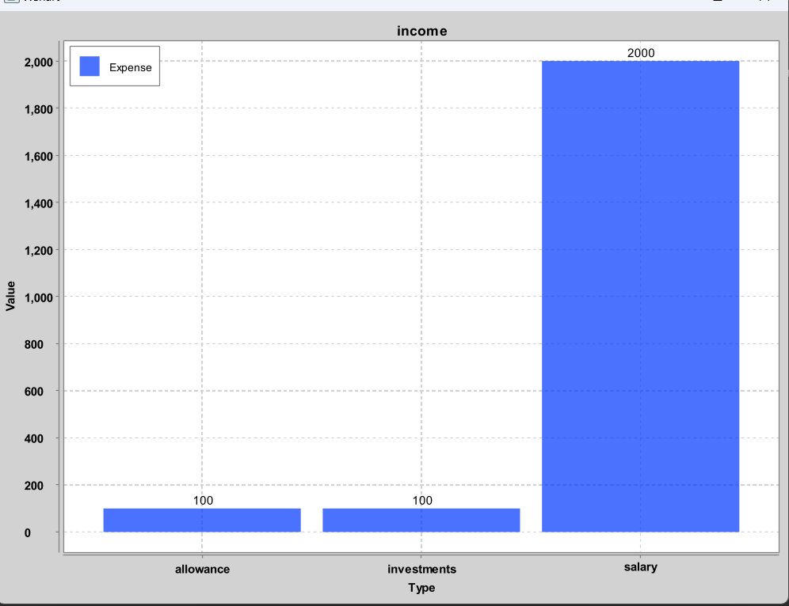

# User Guide

## Table of contents

* [Introduction](#introduction)
* [Quick start](#quick-start)
* [Features](#features)
  * [Add cashflow](#add-cashflow)
    * [Add income](#add-income-add-income)
    * [Add expense](#add-expense-add-expense)
  * [Delete cashflow](#delete-cashflow-delete)
    * [Delete income](#delete-income-delete-income)
    * [Delete expense](#delete-expense-delete-expense)
    * [Delete recurring cashflow](#delete-recurring-delete-recurring)
  * [List](#list)
    * [List all](#list-all-list)
    * [List income](#list-income-list-income)
    * [List expense](#list-expense-list-expense)
    * [List recurring](#list-recurring-list-recurring)
  * [Budget](#budget)
    * [Setting budget](#setting-a-budget-budget-set)
    * [Updating budget](#updating-budget-budget-update)
    * [Resetting budget](#resetting-budget-budget-reset)
    * [Deleting budget](#deleting-budget-budget-delete)
    * [Viewing budget](#viewing-budget-budget-view)
  * [Displaying Overview](#displaying-overview-overview)
  * [View Balance](#viewing-balance-balance)
  * [WatchList](#viewing-watchlist-watchlist)
    * [Adding Stock](#adding-stock-to-watchlist-addstock)
    * [Deleting Stock](#deleting-budget-budget-delete)
  * [Visualization](#Visualization)
  * [Exiting the program](#exiting-the-program-exit)
  * [Saving data](#saving-the-data)
  * [Loading data](#loading-the-data)
* [FAQ](#faq)
* [Command Summary](#command-summary)

## Introduction

Financial Planner is a Command Line Interface (CLI) application for managing your finances conveniently. 
It is optimized for use via the CLI and leverages your expertise in CLI and your ability to type fast and gives 
you a one-stop interface to access a plethora of features to manage your finances.

## Quick Start

{Give steps to get started quickly}

1. Ensure that you have Java 11 or above installed.
2. Download the latest version of `Financial Planner` from [here](http://link.to/duke).
3. Copy the file to the folder you want to use as the *home folder* for Financial Planner.
4. Open a command terminal, `cd` into the folder you put the jar file in, and use the `java -jar ip.jar` command to run the application.
5. Refer to the **Features** section below for details of each command.

## Features

{Give detailed description of each feature}
### Notes about the command format
- Words in `UPPER_CASE` are parameters to be supplied by the user.

  e.g. in `add income /a AMOUNT`, `AMOUNT` is a parameter which can be used as `add income /a 100`.
- Items in square brackets are optional.

  e.g. `[/r DAYS]` can be used as `/r 30` or left empty.

### Add cashflow

#### Add income: `add income`
Adds an income source to the Financial Planner.

Format: `add income /a AMOUNT /t TYPE [/r DAYS] [/d DESCRIPTION]`

- `/r` is used to denote a recurring income, with the period to the next addition is specified by `DAYS`.
- `/d` is used to give a description to the income.
- `/t` is used to specify the income type, where the list of acceptable types is given below

| Income Types  |
|---------------|
| `salary`      | 
| `investments` |
| `allowance`   | 
| `others`      |

Example of usage: `add income /a 5000 /t salary /r 30 /d work`

Example output:

```
You have added an Income
   Type: Salary
   Amount: 5000.00
   Recurring every: 30 days, starting from: Oct 30 2023
   Description: work
to the Financial Planner.
Balance: 5000.00
```
- Note: Balance displayed above is just an example. Your actual balance may differ.
#### Add expense: `add expense`
Adds an expense to the Financial Planner

Format: `add expense /a AMOUNT /t TYPE [/r DAYS] [/d DESCRIPTION]`

- `/r` is used to denote a recurring expense, with the period to the next addition is specified by `DAYS`.
- `/d` is used to give a description to the expense.
- `/t` is used to specify the expense type, where the list of acceptable types is given below

| Expense         |
|-----------------|
| `dining`        |
| `entertainment` |
| `shopping`      |
| `travel`        |
| `insurance`     |
| `necessities`   |
| `others`        |

Example of usage: `add expense /a 300 /t necessities /r 30 /d groceries`

Example output:
```
You have added an Expense
   Type: Necessities
   Amount: 300.00
   Recurring every: 30 days, starting from: Oct 30 2023
   Description: groceries
to the Financial Planner.
Balance: 4700.00
```
- Note: Balance displayed above is just an example. Your actual balance may differ.
### Delete cashflow: `delete`
Deletes a cashflow from the Financial Planner.

Format: `delete INDEX [/r]`

- `INDEX` refers to the index number shown in the displayed list when [`list`](#list-all-list) command is used.
- `/r` is used to delete all **future** cashflows **only**.

Example of usage: `delete 1 /r`

Example output:
```
You have removed future recurrences of this cashflow.
Updated cashflow:
Income
   Type: Salary
   Amount: 5000.00
   Description: work
```
Example of usage: `delete 1`

Example output:
```
You have removed an Income
   Type: Salary
   Amount: 5000.00
   Description: work
from the Financial Planner.
Balance: -1130.00
```
- Note: Balance displayed above is just an example. Your actual balance may differ.

#### Delete income: `delete income`
Deletes an income from the Financial Planner.

Format: `delete income INDEX [/r]`

- `INDEX` refers to the index number shown in the displayed list when [`list income`](#list-income-list-income) command is used.
- `/r` is used to delete all **future** incomes **only**.

Example of usage: `delete income 2 /r`

Example output:
```
You have removed future recurrences of this cashflow.
Updated cashflow:
Income
   Type: Allowance
   Amount: 500.00
   Description: parents
```
Example of usage: `delete income 2`

Example output:
```
You have removed an Income
   Type: Allowance
   Amount: 500.00
   Description: parents
from the Financial Planner.
Balance: 5170.00
```
- Note: Balance displayed above is just an example. Your actual balance may differ.

#### Delete expense: `delete expense`
Deletes an expense from the Financial Planner.

Format: `delete expense INDEX [/r]`

- `INDEX` refers to the index number shown in the displayed list when [`list expense`](#list-expense-list-expense) command is used.
- `/r` is used to delete all **future** expenses **only**.

Example of usage: `delete expense 2 /r`

Example output:
```
You have removed future recurrences of this cashflow.
Updated cashflow:
Expense
   Type: Insurance
   Amount: 800.00
   Description: ntuc income
```
Example of usage: `delete expense 2`

Example output:
```
You have removed an Expense
   Type: Insurance
   Amount: 800.00
   Description: ntuc income
from the Financial Planner.
Balance: -330.00
```
- Note: Balance displayed above is just an example. Your actual balance may differ.

#### Delete recurring: `delete recurring`
Deletes a recurring cashflow from the Financial Planner.

Format: `delete recurring INDEX [/r]`

- `INDEX` refers to the index number shown in the displayed list when [`list recurring`](#list-recurring-list-recurring) command is used.
- `/r` is used to delete all **future** recurring cashflows **only**.

Example of usage: `delete recurring 2 /r`

Example output:
```
You have removed future recurrences of this cashflow.
Updated cashflow:
Expense
   Type: Insurance
   Amount: 800.00
   Description: ntuc income
```
Example of usage: `delete recurring 1`

Example output:
```
You have removed an Expense
   Type: Necessities
   Amount: 300.00
   Recurring every: 30 days, starting from: Oct 30 2023
   Description: groceries
from the Financial Planner.
Balance: -830.00
- Note: Balance displayed above is just an example. Your actual balance may differ.

```
### List

#### List all: `list`
// TODO

Example output:

```
You have 4 matching cashflows:
1: Income
   Type: Salary
   Amount: 5000.00
   Recurring every: 30 days, starting from: Oct 30 2023
   Description: work
2: Expense
   Type: Dining
   Amount: 30.00
   Description: Genki Sushi
3: Expense
   Type: Insurance
   Amount: 800.00
   Recurring every: 365 days, starting from: Oct 30 2023
   Description: ntuc income
4: Expense
   Type: Necessities
   Amount: 300.00
   Recurring every: 30 days, starting from: Oct 30 2023
   Description: groceries
```
#### List income: `list income`
//TODO

Example output:
```
You have 3 matching cashflows:
1: Income
   Type: Salary
   Amount: 5000.00
   Recurring every: 30 days, starting from: Oct 30 2023
   Description: work
2: Income
   Type: Allowance
   Amount: 500.00
   Recurring every: 30 days, starting from: Oct 30 2023
   Description: parents
3: Income
   Type: Investments
   Amount: 1000.00
```
#### List expense: `list expense`
//TODO

Example output:
```
You have 3 matching cashflows:
1: Expense
   Type: Dining
   Amount: 30.00
   Description: Genki Sushi
2: Expense
   Type: Insurance
   Amount: 800.00
   Recurring every: 365 days, starting from: Oct 30 2023
   Description: ntuc income
3: Expense
   Type: Necessities
   Amount: 300.00
   Recurring every: 30 days, starting from: Oct 30 2023
   Description: groceries
```
#### List recurring: `list recurring`
Lists all recurring cashflows.

Format: `list recurring`

- This list will not include any cashflow that has already recurred.

Example of usage: `list recurring`

Example output:
```
You have 2 matching cashflows:
1: Expense
   Type: Insurance
   Amount: 800.00
   Recurring every: 365 days, starting from: Oct 30 2023
   Description: ntuc income
2: Expense
   Type: Necessities
   Amount: 300.00
   Recurring every: 30 days, starting from: Oct 30 2023
   Description: groceries
```

### Budget

#### Setting a budget: `budget set`

Sets a monthly budget.

Format: `budget set /b BUDGET`

* `BUDGET` has to be a positive number.

Example of usage: `budget set /b 500`

Example output:

```
A monthly budget of 500.00 has been set.
```

#### Updating budget: `budget update`

Updates budget to a new value.

Format: `budget update /b BUDGET`

* `Budget` has to be a positive number.
* There has to be an existing budget.

Example of usage: `budget update /b 1000`

Example output:

```
Budget has been updated:
Old initial budget: 500.00
Old current budget: 500.00
New initial budget: 1000.00
New current budget: 1000.00
```

#### Resetting budget: `budget reset`

Resets current budget to initial budget if they are different.

Format: `budget reset`

* Budget will be reset to initial budget or current balance, whichever is lower.

Example of usage: `budget reset`

Example output:

```
Budget has been reset to 1000.00.
```

#### Deleting budget: `budget delete`

Deletes existing budget.

Format: `budget delete`

Example of usage: `budget delete`

Example output:

```
Budget has been deleted.
```

#### Viewing budget: `budget view`

View existing budget.

Format: `budget view`

Example of usage: `budget view`

Example output:

```
You have a remaining budget of 1000.00.
```

### Displaying overview: `overview`

Displays an overview of user's financials.

Format: `overview`

Example of usage: `overview`

Example output:

```
Here is an overview of your financials:
Total balance: 3790.00
Highest income: 5000.00    Category: Salary
Highest expense: 500.00    Category: Others
Remaining budget for the month: 1000.00

Reminders:
No reminders added yet.
```

### Viewing balance: `balance`

View user's current balance.

Format: `balance`

Example of usage: `balance`

Example output:

```
Balance: 3790.00
```

### Viewing Watchlist: `watchlist`

View your current watchlist with stocks that you are interested in with the exchanges shown as well

Default watchlist: AAPL, GOOGL 

These stocks will be added to the watchlist automatically if:
- your watchlist file is corrupted, and you chose to override it
- your watchlist is empty on startup

Format: `watchlist`

Example of usage: `watchlist`

Example of output:

```
Symbol    Market    Price     Daily High     Daily Low     EquityName                    Last Updated     
GOOGL     NASDAQ    124.46    125.4          122.75        Alphabet Inc - Class A        Tue, Oct 31 2023 04:00:03
AAPL      NASDAQ    170.29    171.17         168.87        Apple Inc                     Tue, Oct 31 2023 04:00:02
```

Format of watchlist output:

| Symbol                                                 | Market                                | Price                                          | Daily High                     | Daily Low                     | Equity Name            | Last Updated                                                            |
|--------------------------------------------------------|---------------------------------------|------------------------------------------------|--------------------------------|-------------------------------|------------------------|-------------------------------------------------------------------------|
| Ticker Symbol<br/>(Abbreviation for Company 's Stocks) | Exchange at which the stock is traded | Current latest price of stock (before closing) | Intraday Highest trading price | Intraday Lowest trading price | Name of equity product | Last time at which the information of the stocks was updated by the API |

- Note: To prevent overloading of the stock API, we will only be allowing watchlist updates every 5 minutes. 
Any request within the 5-minute window will only show the last updated watchlist

### Adding Stock to Watchlist: `addstock`

Add a stock that you are interested in monitoring into your personal WatchList

Format: `addstock /s STOCKCODE`

Example of usage: `addstock /s META`

Example of output:

```
You have successfully added:
Meta Platforms Inc - Class A
Use Watchlist to view it!
```

- Note: Due to the free nature of the API (Alphpa Vantage and FMP), only US stock prices quote will be provided by
this application. Sorry for the inconvenience caused.
- Note: Due to the free nature of the API, there will be a cap of **five** stocks in the watchlist

### Deleting Stock from Watchlist: `deletestock`

Delete a stock that you are no longer interested in monitoring from your personal WatchList

Format: `deletestock /s STOCKCODE`

Example of usage: `deletestock /s META`

Example of output:

```
You have successfully deleted: 
Meta Platforms Inc - Class A
Use watchlist command to view updated Watchlist
```

- Note: Your watchlist information is saved under the file path `data/watchlist.json` in JSON format

### Visualizing your cashflow: `vis`

Using this command to visualize your income or expenses in a pie chart or bar chart

Format: `vis /t TYPE /c TOOL`

| Type `/t`                   |
|-----------------------------|
| Income Cashflows `Income`   |
| Expense Cashflows `Expense` |

| Tool `/c`      |
|----------------|
| PieChart `pie` |
| BarChart `bar` |

Example of usage: `vis /t expense /c pie`

Example of output:

```
Displaying piechart for expense
```


Example of usage: `vis /t expense /c bar`

```
Displaying barchart for income
```



### Exiting the program: `exit`

Exits the program.

Format: `exit`

### Saving the data

Data is automatically saved upon exiting the program using the `exit` command. Closing the program without exiting 
will not save the data.

### Loading the data

Existing data will be automatically loaded when the program starts up.

## FAQ

**Q**: How do I transfer my data to another computer? 

**A**: {your answer here}

## Command Summary

{Give a 'cheat sheet' of commands here}

| Action                           | Format                                                     |
|----------------------------------|------------------------------------------------------------|
| **Add income**                   | `add income /a AMOUNT /t TYPE [/r DAYS] [/d DESCRIPTION]`  |
| **Add expense**                  | `add expense /a AMOUNT /t TYPE [/r DAYS] [/d DESCRIPTION]` |
| **Delete cashflow**              | `delete INDEX [/r]`                                        |
| **Delete income**                | `delete income INDEX [/r]`                                 |
| **Delete expense**               | `delete expense INDEX [/r]`                                |
| **Delete recurrence**            | `delete recurrence INDEX [/r]`                             |
| **list all cashflows**           | `list`                                                     |
| **list all incomes**             | `list income`                                              |
| **list all expenses**            | `list expense`                                             |
| **list all recurring cashflows** | `list recurrence`                                          |
| **Set budget**                   | `budget set /b BUDGET`                                     |
| **Update budget**                | `budget update /b BUDGET`                                  |
| **Reset budget**                 | `budget reset`                                             |
| **Delete budget**                | `budget delete`                                            |
| **View budget**                  | `budget view`                                              |
| **Display Overview**             | `overview`                                                 |
| **View balance**                 | `balance`                                                  |
| **View Watchlist**               | `watchlist`                                                |
| **Add to watchlist**             | `addstock /s STOCKCODE`                                    |
| **Delete from watchlist**        | `deletestock /s STOCKCODE`                                 |
| **Visualization**                | `vis /t TYPE /c CHART`                                     |
| **Exit program**                 | `exit`                                                     |

- Note: Cashflow is referring to an income or expense

**Income and Expense types**

| Income        | Expense         |
|---------------|-----------------|
| `salary`      | `dining`        |
| `investments` | `entertainment` |
| `allowance`   | `shopping`      |
| `others`      | `travel`        |
|               | `insurance`     |
|               | `necessities`   |
|               | `others`        |
