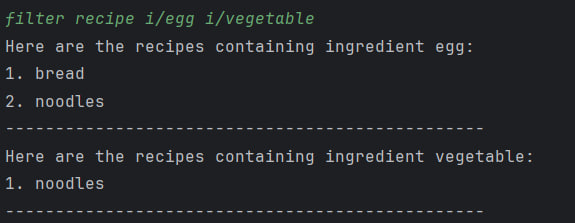

EssenMakanan is a **desktop app for managing recipes and ingredients in your inventory, optimized for use via a Command Line Interface** (CLI) while still having the benefits of a Graphical User Interface (GUI). 
If you can type fast, EssenMakanan can get your recipes and ingredients management tasks done faster than traditional GUI apps.

* Table of Contents
  {:toc}

--------------------------------------------------------------------------------------------------------------------
# User Guide

## Introduction

EssenMakanan is an app that keeps track of ingredients that a user has in the kitchen, stores recipes and provides steps on how to cook a specific recipe. This app will include a command line interface to use the available commands in the app.

## Quick Start

{Give steps to get started quickly}

1. The app requires Java 11 to be installed into your computer or laptop.
2. Download the latest `Essenmakanan.jar` from [here](http://link.to/EssenMakanan)
3. Copy and move the file into the selected folder you want to put the app in.
4. Open your command line and input the command below to run the app:
`java -jar Essenmakanan.jar`

## Features 

{Give detailed description of each feature}

| Action                                                    | Format                                              | Example                                 |
|-----------------------------------------------------------|-----------------------------------------------------|-----------------------------------------|
| Add recipe                                                | add r/RECIPE_TITLE                                  | add r/scramble egg                      |
| Add ingredient                                            | add i/INGREDIENT_NAME                               | add i/bread                             |
| Delete Recipe                                             | delete r/RECIPE_TITLE                               |
| Delete Ingredient                                         | delete r/INGREDIENT_NAME                            | 
| View all ingredients                                      | view i                                              |
| View all recipes                                          | view r                                              |
| View specific ingredient                                  | view i/INGREDIENT_NAME   view i/INGREDIENT_ID | view i/bread   view i/1           |
| View specific recipe                                      | view r/RECIPE_ID                                    | view r/1                                |
| Filter recipe by ingredients                              | filter recipe i/INGREDIENT_NAME [i/...]             | filter recipe i/chicken i/noodles       |
| Start recipe  (view missing ingredients from a recipe) | start RECIPE_TITLE   start RECIPE_ID          | start dumpling noodles    start 1 |
| Help  (list all commands available)                    | help                                                | help                                    |

----
### System

1. Viewing help – `help`

    List all commands and the format and brief description of each command.

---
### Recipes 
2. View all recipes -  `view r`

   List all recipes available inside the app.

3. View specific recipe - `view r/RECIPE_ID`

   View the steps of a specified recipe with RECIPE_ID
  
      Examples :
  
    * `view r/1` to show a recipe at index ‘1’ of the list.

4. Add new recipe - `add r/RECIPE_NAME`

   1. Message will appear to prompt user input for steps 
   2. To confirm step input, ENTER key 
   3. To end steps input: `end`
   4. Message will appear to prompt user input to add ingredients needed for recipe 
   5. Each ingredient input followed by an “enter” is one ingredient 
   6. To end input: `end`

      Example :
   
   * `add r/toast` to add a ‘toast’ recipe 
   * `add r/toast s/Put bread in toaster s/Wait until the toaster is done s/Take out the toast and enjoy i/bread`
   
      Ingredients:
     * Bread only
     
       Steps:
     * Step 1: “Put bread in toaster”
     * Step 2:“Wait until the toaster is done”
     * Step 3: “Take out the toast and enjoy” ENTER 

5. Delete a specific recipe - `delete r/RECIPE_ID`

   Delete the recipe from the recipe list.

      Example :
   
   * `delete r/1` to delete a recipe at index ‘1’

6. Start a recipe - `start RECIPE_TITLE` or `start RECIPE_ID`

   Use the start command to check if you are all set to start on the recipe.This command will list all missing ingredients from the recipe you want to start on.

     Example:

   * `start bread`
      
      To check if you have all ingredients needed for the recipe named "bread".
   
     
   

   * `start 1`

     To check if you have all ingredients needed for the recipe with id 1.

     

7. Filter recipe based by ingredients - `filter recipe i/INGREDIENT_NAME` or `filter recipe i/INGREDIENT_ID`
   
   Filter your recipes by ingredients you are craving for that meal.
   
     Example:

   * `filter recipe i/egg`
   
      All recipes containing the ingredient egg will be printed
   
   * `filter recipe i/egg i/vegetable`
   
      

   * `filter recipe i/1 i/vegetable`
      
      if egg is the first item in our ingredient inventory list, the same output will be produced.

---
### Ingredients
6. View all ingredients - `view i`
    
   List all ingredients available inside the app.

7. Add ingredients - `add i/INGREDIENT_NAME,QUANTITY,UNIT`

   Adds a new item to the list of todo items. Here are our registered unit in the app:
    * g (Gram)
    * kg (Kilogram)
    * ml (Milliliter)
    * l (Liter)
    * tsp (Teaspoon)
    * tbsp (Tablespoon)
    * cup (Cup)
    * pc (Piece)
   
    When entering your unit, a user is required to use any one of the units above.
    
       Example :

    * `add i/bread,2,pc` to add `2 pieces of bread` into the list
    * `add i/cooking oil,5,l` to add `5 liters of cooking oil` into the list
   

8. Edit ingredient - `edit i/INGREDIENT_NAME edit i/INGREDIENT_NAME n/NEW_NAME q/NEW_QUANTITY u/NEW_UNIT`

   Edit an ingredient to change the name, quantity or unit. A user is able to edit more than one property of an 
   ingredient.

      Example :

    * `edit i/bread n/toast` to change `bread` to `toast`
    * `edit i/egg q/10 u/kg` to change the quantity to `10` and the unit to `kg`

9. Delete ingredient - `delete i/INGREDIENT_INDEX` OR `[delete i/INGREDIENT_NAME]`

   Delete an ingredient based on the selected index in the list or the ingredient's name.

      Example :

    * `delete i/2` to delete the `second` ingredient on the list
    * `delete i/egg` to delete `egg` ingredient

---
## FAQ

**Q**: How do I transfer my data to another computer? 

**A**: {your answer here}

## Command Summary

{Give a 'cheat sheet' of commands here}

* Add todo `todo n/TODO_NAME d/DEADLINE`

Action | Format, Examples
--------|------------------
**Add** | `add n/NAME p/PHONE_NUMBER e/EMAIL a/ADDRESS [t/TAG]…​`   e.g., `add n/James Ho p/22224444 e/jamesho@example.com a/123, Clementi Rd, 1234665 t/friend t/colleague`
**Clear** | `clear`
**Delete** | `delete INDEX`  e.g., `delete 3`
**Edit** | `edit INDEX [n/NAME] [p/PHONE_NUMBER] [e/EMAIL] [a/ADDRESS] [t/TAG]…​`  e.g.,`edit 2 n/James Lee e/jameslee@example.com`
**Find** | `find KEYWORD [MORE_KEYWORDS]`  e.g., `find James Jake`
**List** | `list`
**Help** | `help`

