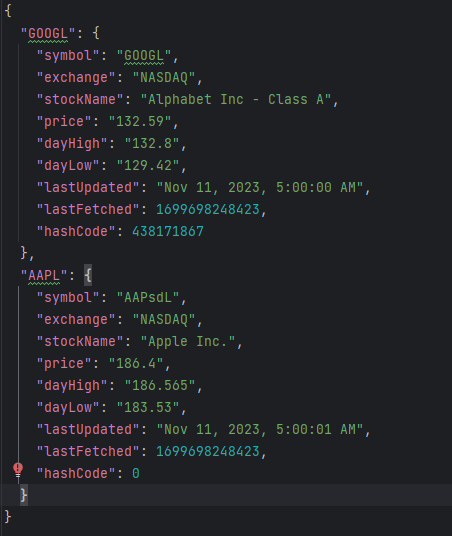

# User Guide

## Table of contents

* [Introduction](#introduction)
* [Quick start](#quick-start)
* [Features](#features)
  * [Add cashflow](#add-cashflow)
    * [Add income](#add-income-add-income)
    * [Add expense](#add-expense-add-expense)
  * [List](#list)
    * [List all](#list-all-list)
    * [List income](#list-income-list-income)
    * [List expense](#list-expense-list-expense)
    * [List recurring](#list-recurring-list-recurring)
  * [Delete cashflow](#delete-cashflow-delete)
    * [Delete income](#delete-income-delete-income)
    * [Delete expense](#delete-expense-delete-expense)
    * [Delete recurring cashflow](#delete-recurring-delete-recurring)
  * [Find cashflow](#find-cashflow-find)
  * [View Balance](#viewing-balance-balance)
  * [Budget](#budget)
    * [Setting budget](#setting-a-budget-budget-set)
    * [Updating budget](#updating-budget-budget-update)
    * [Resetting budget](#resetting-budget-budget-reset)
    * [Deleting budget](#deleting-budget-budget-delete)
    * [Viewing budget](#viewing-budget-budget-view)
  * [Displaying Overview](#displaying-overview-overview)
  * [WatchList](#viewing-watchlist-watchlist)
    * [Adding Stock](#adding-stock-to-watchlist-addstock)
    * [Deleting Stock](#deleting-budget-budget-delete)
  * [ReminderList](#view-reminder-list-reminderlist)
    * [Adding Reminder](#add-reminder-addreminder)
    * [Deleting Reminder](#delete-reminder-deletereminder)
    * [Marking Reminder as Done](#mark-reminder-as-done-markreminder)
  * [WishList](#view-goal-list-wishlist)
    * [Adding Goal](#set-goal-set-goal)
    * [Deleting Goal](#delete-goal-deletegoal)
    * [Marking Goal as Achieved](#mark-goal-as-achieved-markgoal)
  * [Visualization](#visualizing-your-cashflow-vis)
  * [Exiting the program](#exiting-the-program-exit)
  * [Get command help and example usage](#getting-command-help-and-example-usage-help)
  * [Saving data](#saving-the-data)
  * [Loading data](#loading-the-data)
* [FAQ](#faq)
* [Command Summary](#command-summary)

## Introduction

Financial Planner is a Command Line Interface (CLI) application for managing your finances conveniently. 
It is optimized for use via the CLI and leverages your expertise in CLI and your ability to type fast and gives 
you a one-stop interface to access a plethora of features to manage your finances.

## Quick Start

1. Ensure that you have Java 11 or above installed.
2. Download the latest version of `Financial Planner` from [here](https://github.com/AY2324S1-CS2113-T18-2/tp/releases).
3. Copy the file to the folder you want to use as the *home folder* for Financial Planner.
4. Open a command terminal, `cd` into the folder you put the jar file in, and use the `java -jar tp.jar` command to run the application.
5. Refer to the **Features** section below for details of each command.

## Features

### Notes about the command format
- Words in `UPPER_CASE` are parameters to be supplied by the user.

  e.g. in `add income /a AMOUNT`, `AMOUNT` is a parameter which can be used as `add income /a 100`.
- Items in square brackets are optional.

  e.g. `[/r DAYS]` can be used as `/r 30` or left empty.

### Notes about naming convention
- Cashflow refers to an income or expense.

### Notes about program limitations
- Maximum amount for each cashflow and total balance that the program can hold is 999,999,999,999.99
- Minimum amount for each cashflow and total balance that the program can hold is -999,999,999,999.99
- Total Balance, Income balance, and Expense balance are different entities where the latter two do not have the same limitations.
- Maximum value for recurrences and indexes is 2,147,483,647, the maximum number an `int` can hold.

**Important:** Data is automatically loaded on start up and saved when exited. You must exit the program using the `exit` command in order to save your data.

### Add cashflow

#### Add income: `add income`
Adds an income source to the Financial Planner.

Format: `add income /a AMOUNT /t TYPE [/r DAYS] [/d DESCRIPTION]`

- `/a` is used to specify the amount of the income, where an **integer** or **double** is expected.
- `/r` is used to denote a recurring income, with the period to the next addition is specified by an **integer** representing the number of `DAYS`.
- `/d` is used to give a description to the income, where any **String** is expected.
- `/t` is used to specify the income type, where the list of acceptable types is given below. The types are case-insensitive.

| Income Types  |
|---------------|
| `salary`      | 
| `investments` |
| `allowance`   | 
| `others`      |

Example of usage: `add income /a 5000 /t salary /r 30 /d work`

Example output:

```
You have added an Income
   Type: Salary
   Amount: 5000.00
   Recurring every: 30 days, date added: Nov 04 2023, recurring on: Dec 04 2023
   Description: work
to the Financial Planner.
Balance: 5000.00
```
- Note: Balance displayed above is just an example. Your actual balance may differ.
- Note: Date displayed above is just an example. Your actual date may differ.

#### Add expense: `add expense`
Adds an expense to the Financial Planner

Format: `add expense /a AMOUNT /t TYPE [/r DAYS] [/d DESCRIPTION]`

- `/a` is used to specify the amount of the expense, where an **integer** or **double** is expected.
- `/r` is used to denote a recurring expense, with the period to the next addition is specified by an **integer** representing the number of `DAYS`.
- `/d` is used to give a description to the expense, where any **String** is expected.
- `/t` is used to specify the expense type, where the list of acceptable types is given below. The types are case-insensitive.

| Expense         |
|-----------------|
| `dining`        |
| `entertainment` |
| `shopping`      |
| `travel`        |
| `insurance`     |
| `necessities`   |
| `others`        |

Example of usage: `add expense /a 300 /t necessities /r 30 /d groceries`

Example output:
```
You have added an Expense
   Type: Necessities
   Amount: 300.00
   Recurring every: 30 days, date added: Nov 04 2023, recurring on: Dec 04 2023
   Description: groceries
to the Financial Planner.
Balance: 4700.00
```
- Note: Balance displayed above is just an example. Your actual balance may differ.
- Note: Date displayed above is just an example. Your actual date may differ.

### List

#### List all: `list`
Lists all cashflows.

Format: `list`

Example of usage: `list`

Example output:

```
You have 4 matching cashflows:
1: Expense
   Type: Dining
   Amount: 30.00
   Description: Genki Sushi
2: Expense
   Type: Necessities
   Amount: 300.00
   Recurring every: 30 days, date added: Nov 04 2023, recurring on: Dec 04 2023
   Description: groceries
3: Income
   Type: Allowance
   Amount: 500.00
   Recurring every: 30 days, date added: Nov 04 2023, recurring on: Dec 04 2023
4: Income
   Type: Investments
   Amount: 1000.00
Balance: 1170.00
```

- Note: Balance displayed above is just an example. Your actual balance may differ.
- Note: Date displayed above is just an example. Your actual date may differ.

#### List income: `list income`
Lists all incomes.

Format: `list income`

Example of usage: `list income`

Example output:
```
You have 3 matching cashflows:
1: Income
   Type: Allowance
   Amount: 500.00
   Recurring every: 30 days, date added: Nov 04 2023, recurring on: Dec 04 2023
2: Income
   Type: Investments
   Amount: 1000.00
3: Income
   Type: Salary
   Amount: 100.00
Income Balance: 1600.00
```
- Note: Balance displayed above is just an example. Your actual balance may differ.
- Note: Date displayed above is just an example. Your actual date may differ.

#### List expense: `list expense`
Lists all expenses.

Format: `list expense`

Example of usage: `list expense`

Example output:
```
You have 3 matching cashflows:
1: Expense
   Type: Dining
   Amount: 30.00
   Description: Genki Sushi
2: Expense
   Type: Necessities
   Amount: 300.00
   Recurring every: 30 days, date added: Nov 04 2023, recurring on: Dec 04 2023
   Description: groceries
3: Expense
   Type: Others
   Amount: 0.23
Expense Balance: 330.23
```
- Note: Balance displayed above is just an example. Your actual balance may differ.
- Note: Date displayed above is just an example. Your actual date may differ.

#### List recurring: `list recurring`
Lists all recurring cashflows.

Format: `list recurring`

- This list will not include any cashflow that has already recurred.

Example of usage: `list recurring`

Example output:
```
You have 4 matching cashflows:
1: Expense
   Type: Necessities
   Amount: 300.00
   Recurring every: 30 days, date added: Nov 04 2023, recurring on: Dec 04 2023
   Description: groceries
2: Income
   Type: Salary
   Amount: 5000.00
   Recurring every: 30 days, date added: Nov 04 2023, recurring on: Dec 04 2023
   Description: work
3: Expense
   Type: Necessities
   Amount: 300.00
   Recurring every: 30 days, date added: Nov 04 2023, recurring on: Dec 04 2023
   Description: groceries
4: Income
   Type: Allowance
   Amount: 500.00
   Recurring every: 30 days, date added: Nov 04 2023, recurring on: Dec 04 2023
```
- Note: Date displayed above is just an example. Your actual date may differ.

### Delete cashflow: `delete`
Deletes a cashflow from the Financial Planner.

Format: `delete INDEX [/r]`

- `INDEX` refers to the index number shown in the displayed list when [`list`](#list-all-list) command is used.
- `/r` is used to delete all **future** cashflows **only**.

Example of usage: `delete 1 /r`

Example output:
```
You have removed future recurrences of this cashflow.
Updated cashflow:
Income
   Type: Salary
   Amount: 5000.00
   Description: work
```
Example of usage: `delete 1`

Example output:
```
You have removed an Income
   Type: Salary
   Amount: 5000.00
   Description: work
from the Financial Planner.
Balance: -1130.00
```
- Note: Balance displayed above is just an example. Your actual balance may differ.

#### Delete income: `delete income`
Deletes an income from the Financial Planner.

Format: `delete income INDEX [/r]`

- `INDEX` refers to the index number shown in the displayed list when [`list income`](#list-income-list-income) command is used.
- `/r` is used to delete all **future** incomes **only**.

Example of usage: `delete income 2 /r`

Example output:
```
You have removed future recurrences of this cashflow.
Updated cashflow:
Income
   Type: Allowance
   Amount: 500.00
   Description: parents
```
Example of usage: `delete income 2`

Example output:
```
You have removed an Income
   Type: Allowance
   Amount: 500.00
   Description: parents
from the Financial Planner.
Balance: 5170.00
```
- Note: Balance displayed above is just an example. Your actual balance may differ.

#### Delete expense: `delete expense`
Deletes an expense from the Financial Planner.

Format: `delete expense INDEX [/r]`

- `INDEX` refers to the index number shown in the displayed list when [`list expense`](#list-expense-list-expense) command is used.
- `/r` is used to delete all **future** expenses **only**.

Example of usage: `delete expense 2 /r`

Example output:
```
You have removed future recurrences of this cashflow.
Updated cashflow:
Expense
   Type: Insurance
   Amount: 800.00
   Description: ntuc income
```
Example of usage: `delete expense 2`

Example output:
```
You have removed an Expense
   Type: Insurance
   Amount: 800.00
   Description: ntuc income
from the Financial Planner.
Balance: -330.00
```
- Note: Balance displayed above is just an example. Your actual balance may differ.

#### Delete recurring: `delete recurring`
Deletes a recurring cashflow from the Financial Planner.

Format: `delete recurring INDEX [/r]`

- `INDEX` refers to the index number shown in the displayed list when [`list recurring`](#list-recurring-list-recurring) command is used.
- `/r` is used to delete all **future** recurring cashflows **only**.

Example of usage: `delete recurring 2 /r`

Example output:
```
You have removed future recurrences of this cashflow.
Updated cashflow:
Expense
   Type: Insurance
   Amount: 800.00
   Description: ntuc income
```
Example of usage: `delete recurring 1`

Example output:
```
You have removed an Expense
   Type: Necessities
   Amount: 300.00
   Recurring every: 30 days, starting from: Oct 30 2023
   Description: groceries
from the Financial Planner.
Balance: -830.00
```

- Note: Balance displayed above is just an example. Your actual balance may differ.
- Note: Date displayed above is just an example. Your actual date may differ.

### Find cashflow: `find`
Finds a cashflow using keywords

Format: `find <keyword>`

Example of usage: `find buy coffee`

### Viewing balance: `balance`

View user's current balance.

Format: `balance`

Example of usage: `balance`

Example output:

```
Balance: 3790.00
```

### Budget

#### Setting a budget: `budget set`

Sets a monthly budget.

Format: `budget set /b BUDGET`

* `BUDGET` has to be a positive number.

Example of usage: `budget set /b 500`

Example output:

```
A monthly budget of 500.00 has been set.
```

#### Updating budget: `budget update`

Updates initial budget to a new value. Current(remaining) budget will be updated accordingly. If new initial budget is 
lower(higher), the new current budget will be lower(higher) by the same amount.

Format: `budget update /b BUDGET`

* `Budget` has to be a positive number.
* There has to be an existing budget.

Example of usage: `budget update /b 1000`

Example output:

```
Budget has been updated:
Old initial budget: 500.00
Old current budget: 500.00
New initial budget: 1000.00
New current budget: 1000.00
```

#### Resetting budget: `budget reset`

Resets current budget to initial budget if they are different.

Format: `budget reset`

* Budget will be reset to initial budget or current balance, whichever is lower.

Example of usage: `budget reset`

Example output:

```
Budget has been reset to 1000.00.
```

#### Deleting budget: `budget delete`

Deletes existing budget.

Format: `budget delete`

Example of usage: `budget delete`

Example output:

```
Budget has been deleted.
```

#### Viewing budget: `budget view`

View existing budget.

Format: `budget view`

Example of usage: `budget view`

Example output:

```
You have a remaining budget of 1000.00.
```

### Displaying overview: `overview`

Displays an overview of user's financials.

Format: `overview`

Example of usage: `overview`

Example output:

```
Here is an overview of your financials:
Total balance: 5450.00
Highest income: 5000.00    Category: Salary
Highest expense: 50.00    Category: Others
Remaining budget for the month: 50.00

Reminders:
No reminders added yet.

Wishlist:
No goals added yet.
```

### Viewing Watchlist: `watchlist`

- Note: Stockcode and symbol will be used interchangeably and have the same meaning
- Note: Watchlist feature requires a stable internet connection

View your current watchlist with stocks that you are interested in with the exchanges shown as well

Default watchlist: AAPL, GOOGL 

These stocks will be added to the watchlist automatically if:
- your watchlist file is corrupted, and you chose to override it
- your watchlist is empty on startup

Format: `watchlist`

Example of usage: `watchlist`

Example of output:


- Note: Your watchlist information is saved under the file path `data/watchlist.json` in JSON format
- Note: the watchlist in memory is saved to the file whenever you run `watchlist` command or `exit` command

Format of watchlist output:

| Symbol                                                 | Market                                | Price                                          | Daily High                     | Daily Low                     | Equity Name            | Last Updated                                                            |
|--------------------------------------------------------|---------------------------------------|------------------------------------------------|--------------------------------|-------------------------------|------------------------|-------------------------------------------------------------------------|
| Ticker Symbol<br/>(Abbreviation for Company 's Stocks) | Exchange at which the stock is traded | Current latest price of stock (before closing) | Intraday Highest trading price | Intraday Lowest trading price | Name of equity product | Last time at which the information of the stocks was updated by the API |

- Note: To prevent overloading of the stock API, we will only be making watchlist updates every 10 minutes. 
Any request within the 10-minute window will only show the last updated watchlist

### Adding Stock to Watchlist: `addstock`

Add a stock that you are interested in monitoring into your personal WatchList

Format: `addstock /s STOCKCODE`

- `STOCKCODE` is case-insensitive.

Example of usage: `addstock /s META`

Example of output:

```
You have successfully added:
Meta Platforms Inc - Class A
Use Watchlist to view it!
```

- Note: Due to the free nature of the API (Alpha Vantage and FMP), only US stock prices quote will be provided by
this application. Sorry for the inconvenience caused.
- Note: Due to the free nature of the API, there will be a cap of **five** stocks in the watchlist
- Note: StockCode should not have any spaces

### Deleting Stock from Watchlist: `deletestock`

Delete a stock that you are no longer interested in monitoring from your personal WatchList

Format: `deletestock /s STOCKCODE`

Example of usage: `deletestock /s META`

Example of output:

```
You have successfully deleted: 
Meta Platforms Inc - Class A
Use watchlist command to view updated Watchlist
```

- Note: Delete stock command is case-sensitive. Please enter the exact stock code of the stock that you have added.
- Note: StockCode should not have any spaces

### watchlist.json 

You are able to read the watchlist.json populated by the Financial Planner to see the stock prices even when
the application is not running 

Example file content of watchlist.json:



**Editing of watchlist.json**

WARNING: Do not edit the json file unless you are familiar with the format of the JSON file.
Incorrect format of JSON file may lead to:
- Corrupted file (user will be prompted to repair the file if he wants to)
- Deletion of stock entries that are erroneous (Financial Planner has a built-in method to remove
stock entries that does not match the format specified above)
- erroneous entries present in the watchlist

**Adding stock**

If you would like to add stock directly using the file, do provide accurate (we do not check for accuracy of information 
due to free nature of api) information for only the symbol (in uppercase) and stockName as shown below. 
If the format is not followed, the stock might not be loaded to watchlist upon start up.


### View Reminder List: `reminderlist`
View your current reminder list with reminders that you have added.

Format: `reminderlist`

Example of usage: `reminderlist`

Example of output:

```
Here is your reminder list:
1. Reminder 
   Type: debt
   Date: Dec 11 2023
   Status: Not Done
   Left Days: 28
2. Reminder 
   Type: loan
   Date: Dec 18 2023
   Status: Not Done
   Left Days: 35
```

### Add reminder: `addreminder`
Adds a reminder to the Financial Planner.

Format: `addreminder /t TYPE /d DATE`
- `/t` is used to specify the reminder type, which describes what is the reminder used for.
- `/d` is used to give a deadline date to the reminder. The date must be in the format of `DD/MM/YYYY`.

Example of usage: `addreminder /t debt /d 11/12/2023`

Example output:
```
You have added Reminder 
   Type: debt
   Date: Dec 11 2023
   Status: Not Done
   Left Days: 28
```

### Delete reminder: `deletereminder`
Deletes a reminder from the Financial Planner.

Format: `deletereminder INDEX`

- `INDEX` refers to the index number shown in the displayed list when [`reminderlist`](#view-reminder-list-reminderlist) command is used.

Example of usage: `deletereminder 1`

Example output:
```
You have deleted Reminder 
   Type: debt
   Date: Dec 12 2023
   Status: Not Done
   Left Days: 29
```

### Mark reminder as done: `markreminder`
Marks a reminder as done in the Financial Planner.

Format: `markreminder INDEX`

- `INDEX` refers to the index number shown in the displayed list when [`reminderlist`](#view-reminder-list-reminderlist) command is used.

Example of usage: `markreminder 1`

Example output:
```
You have marked Reminder 
   Type: debt
   Date: Dec 12 2023
   Status: Done
   Left Days: 29
```

### View Goal List: `wishlist`
View your current goal list with goals that you have added.

Format: `wishlist`

Example of usage: `wishlist`

Example of output:
```
Here is your wish list:
1. Goal 
   Label: car
   Amount: 5000
   Status: Not Achieved
2. Goal 
   Label: ipad
   Amount: 2000
   Status: Not Achieved
```

### Set goal: `set goal`
Adds a goal to the Financial Planner.

Format: `set goal /g GOAL /l LABEL`
- `/g` is used to specify the goal amount.
- `/l` is used to give a label to the goal.

Example of usage: `set goal /g 5000 /l car`

Example output:
```
You have added Goal 
   Label: car
   Amount: 5000
   Status: Not Achieved
```

### Delete goal: `deletegoal`
Deletes a goal from the Financial Planner.

Format: `deletegoal INDEX`
- `INDEX` refers to the index number shown in the displayed list when [`wishlist`](#view-goal-list-wishlist) command is used.

Example of usage: `deletegoal 1`

Example output:
```
You have deleted Goal 
   Label: car
   Amount: 5000
   Status: Not Achieved
```

### Mark goal as achieved: `markgoal`
Marks a goal as achieved in the Financial Planner. This operation will automatically create a corresponding expense.

Format: `markgoal INDEX`
- `INDEX` refers to the index number shown in the displayed list when [`wishlist`](#view-goal-list-wishlist) command is used.

Example of usage: `markgoal 1`

Example output:
```
You have achieved Goal 
   Label: ipad
   Amount: 2000
   Status: Achieved
Congratulations!
You have added an Expense
   Type: Others
   Amount: 2000.00
   Description: ipad
to the Financial Planner.
Balance: -2000.00
```

### Visualizing your cashflow: `vis`

Using this command to visualize your income or expenses in a pie chart, bar chart or radar chart

Format: `vis /t TYPE /c TOOL`

| Type `/t`                   |
|-----------------------------|
| Income Cashflows `Income`   |
| Expense Cashflows `Expense` |

| Tool `/c`          |
|--------------------|
| PieChart `pie`     |
| BarChart `bar`     |
| RadarChart `radar` |

Example of usage: `vis /t expense /c pie`

Example of output:

```
Displaying piechart for expense
```


Example of usage: `vis /t income /c bar`

Example of output:

```
Displaying barchart for income
```


Example of usage: `vis /t income /c radar`

Example of output:

```
Displaying radarchart for income
```


### Exiting the program: `exit`

Exits the program.

Format: `exit`

### Getting command help and example usage: `help`

Get command help and example usage. Specify the command to find help and example usage for exactly that command.

Format: `help [COMMAND]`

Example of usage: `help budget`

### Saving the data

Data is automatically saved upon exiting the program using the `exit` command. Closing the program inappropriately 
will not save the data.

### Loading the data

Existing data will be automatically loaded when the program starts up.

## FAQ

**Q**: How do I transfer my data to another computer? 

**A**: Copy the /data/ folder from the home folder to the other computer.

**Q**: Should I edit the watchlist.json file?

**A**: You should not edit the watchlist.json file unless you are very familiar with the format used.
If you would like to edit the watchlist.json file directly to manipulate your watchlist, please follow the instructions
above in the watchlist feature section. However, do note that there is risk of file corruption.

**Q**: How is the radar chart derived? 

**A**: To obtain the radar chart in our application, the income/expense category with the highest amount is noted.
After which, amounts of all other categories are taken as a ratio of the maximum category. The ratios are then displayed
in the radar chart

**Q**: Why can't I add Singapore exchange stocks or other exchange stocks using the add stock command? 

**A**: Due to the restrictions of the free API provided, only US-exchange stocks are provided. Sorry for the
inconvenience caused

**Q**: Why is it saying that API limit is reached, not working or something like that when I use watchlist 
features? 🤬

**A**: Due to the free nature of the API, there is a restriction in the number of requests allowed in a specific time
window. Sorry for the inconvenience caused. 🥲

## Command Summary

| Action                           | Format                                                     |
|----------------------------------|------------------------------------------------------------|
| **Add income**                   | `add income /a AMOUNT /t TYPE [/r DAYS] [/d DESCRIPTION]`  |
| **Add expense**                  | `add expense /a AMOUNT /t TYPE [/r DAYS] [/d DESCRIPTION]` |
| **Delete cashflow**              | `delete INDEX [/r]`                                        |
| **Delete income**                | `delete income INDEX [/r]`                                 |
| **Delete expense**               | `delete expense INDEX [/r]`                                |
| **Delete recurrence**            | `delete recurring INDEX [/r]`                              |
| **list all cashflows**           | `list`                                                     |
| **list all incomes**             | `list income`                                              |
| **list all expenses**            | `list expense`                                             |
| **list all recurring cashflows** | `list recurring`                                           |
| **Set budget**                   | `budget set /b BUDGET`                                     |
| **Update budget**                | `budget update /b BUDGET`                                  |
| **Reset budget**                 | `budget reset`                                             |
| **Delete budget**                | `budget delete`                                            |
| **View budget**                  | `budget view`                                              |
| **Display Overview**             | `overview`                                                 |
| **View balance**                 | `balance`                                                  |
| **View Watchlist**               | `watchlist`                                                |
| **Add to watchlist**             | `addstock /s STOCKCODE`                                    |
| **Delete from watchlist**        | `deletestock /s STOCKCODE`                                 |
| **Visualization**                | `vis /t TYPE /c CHART`                                     |
| **Exit program**                 | `exit`                                                     |
| **Add Reminder**                 | `addreminder /t TYPE /d DATE`                              |
| **Delete Reminder**              | `deletereminder INDEX`                                     |
| **Mark Reminder as Done**        | `markreminder INDEX`                                       |
| **Add Goal**                     | `set goal /g GOAL /l LABEL`                                |
| **Delete Goal**                  | `deletegoal INDEX`                                         |
| **Mark Goal as Achieved**        | `markgoal INDEX`                                           |
| **List all reminders**           | `reminderlist`                                             |
| **List all goals**               | `wishlist`                                                 |

- Note: Cashflow is referring to an income or expense

**Income and Expense types**

| Income        | Expense         |
|---------------|-----------------|
| `salary`      | `dining`        |
| `investments` | `entertainment` |
| `allowance`   | `shopping`      |
| `others`      | `travel`        |
|               | `insurance`     |
|               | `necessities`   |
|               | `others`        |
