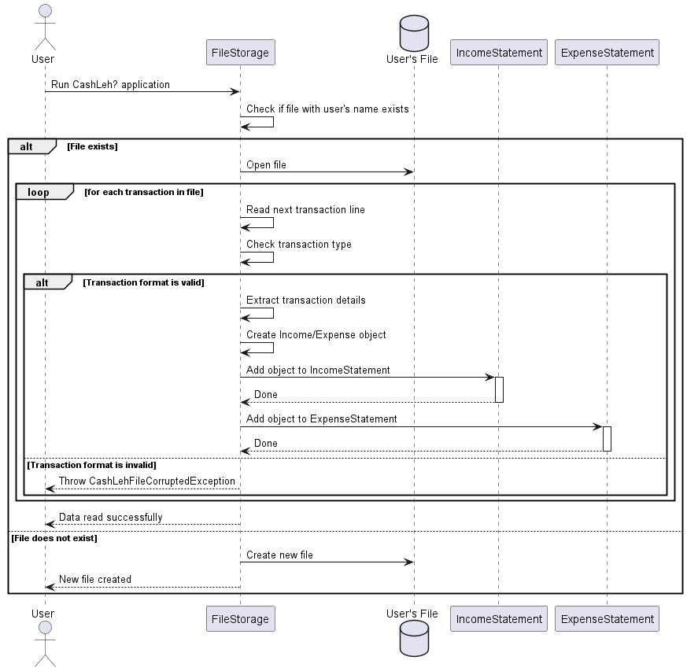
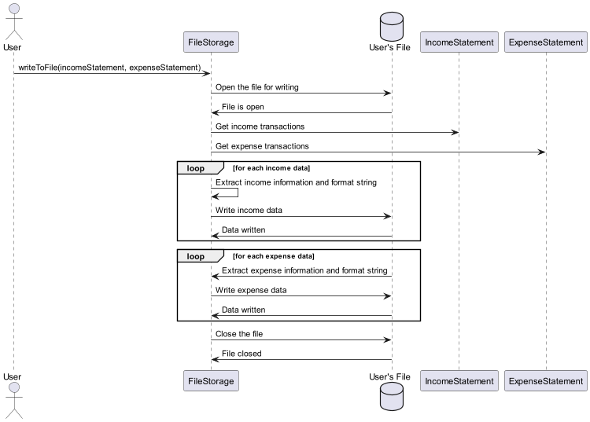

# Benedict Chan - Project Portfolio Page

## Overview

CashLeh? is a CLI application mainly supporting working adults and students who struggle with managing finances.
It allows them to set a budget and track both their earnings and spending habits in a seamless way to have a
neat overview of their financial situation.

### Summary of Contributions
* **Code Contributed**: [RepoSense link](https://nus-cs2113-ay2324s1.github.io/tp-dashboard/?search=benedictchannn&breakdown=false&sort=groupTitle%20dsc&sortWithin=title&since=2023-09-22&timeframe=commit&mergegroup=&groupSelect=groupByRepos)
* **Features**:
    * Implemented the file storage capability specific to the user's name to allow users to save their financial transaction data into a text file with the name as part of the file path.
    * Implemented the basic structure of the parser to process user inputs and create the corresponding Command objects.
    * Restructured the UI of the print statements for the expense transactions, income transactions, and overall financial transactions for better readability and greater visual appeal.
* **Documentation**:
    * User Guide:
        * Added documentation for the exit command and touch documentation for other commands like viewIncomes and viewExpenses.
    * Developer Guide:
        * Added implementation details for the FileStorage class and included sequences diagram for the `readFromFile` and `writeToFile` methods.
           
* **Community**:
    * PR reviewed (with non-trivial review comments): [#31](https://github.com/AY2324S1-CS2113-W12-2/tp/pull/31)
    * Report bugs and suggestions for other teams in the class (refer to [repo](https://github.com/BenedictChannn/ped/issues))