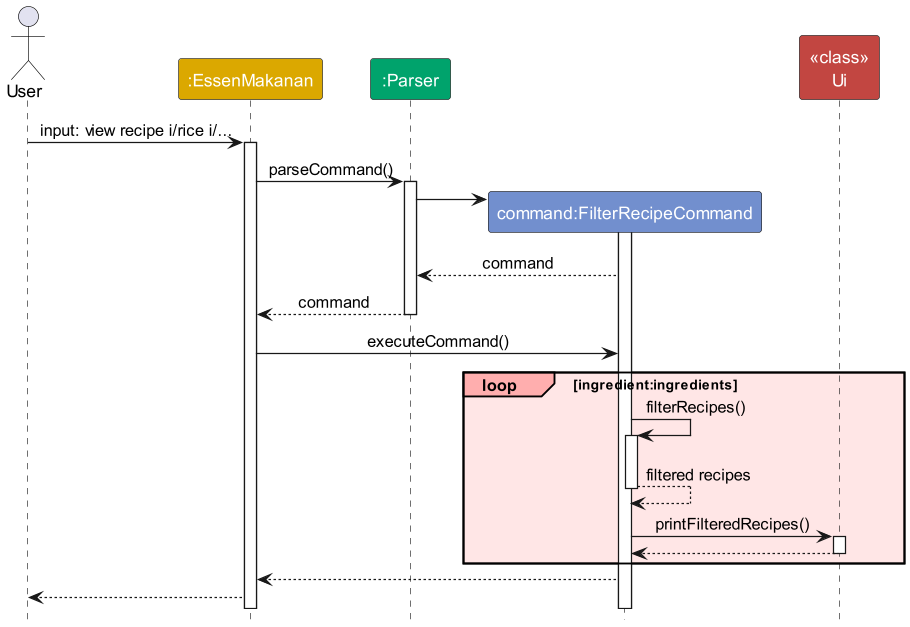

# EssenMakanan
EssenMakanan is a **desktop app for managing recipes and ingredients in your inventory, optimized for use via a Command Line Interface** (CLI) while still having the benefits of a Graphical User Interface (GUI).
If you can type fast, EssenMakanan can get your recipes and ingredients management tasks done faster than traditional GUI apps.

The following are some relevant links

- [EssenMakanan](https://github.com/nus-cs2113-AY2324S1/tp/pulls?utf8=%E2%9C%93&q=is%3Apr+is%3Aopen+CS2113-F11-2)
Github Repository

- Charkty's [Pull Requests](https://github.com/AY2324S1-CS2113-F11-2/tp/pulls?q=is%3Apr+author%3Acharkty)

- Charkty's
[Code Contribution](https://nus-cs2113-ay2324s1.github.io/tp-dashboard/?search=charkty&breakdown=false&sort=groupTitle%20dsc&sortWithin=title&since=2023-09-22&timeframe=commit&mergegroup=&groupSelect=groupByRepos&tabOpen=true&tabType=authorship&tabAuthor=charkty&tabRepo=AY2324S1-CS2113-F11-2%2Ftp%5Bmaster%5D&authorshipIsMergeGroup=false&authorshipFileTypes=docs~functional-code~test-code~other&authorshipIsBinaryFileTypeChecked=false&authorshipIsIgnoredFilesChecked=false)

---

## Enhancements Implemented

### Ingredients

- Implemented Ingredient, IngredientList and IngredientParser classes

| Command                    | User Story                                                                                  | 
|----------------------------|---------------------------------------------------------------------------------------------|
| View a specific ingredient | For user to check how much ingredient is available in their ingredient inventory            | 
| Delete an ingredient       | For user to remove an ingredient when added wrongly or when it has been used up completely  | 

### Recipes

| Command                       | User Story                                                                                                                     | 
|-------------------------------|--------------------------------------------------------------------------------------------------------------------------------|
| Delete a Recipe               |User wants to delete a recipe added| delete r/RECIPE_TITLE OR  delete r/RECIPE_ID | Recipe deleted from database|
| Filter Recipes by Ingredients | User has cravings for a ingredient item (such as rice or fish) and wants to see which recipes contain that specific ingredient | 
| Check Recipe                  |User wants to check if they have all the ingredients needed to start a recipe| 
| Plan Recipe                   |User wants to plan their groccery shopping for the week and wants to know ingredients needed for the week|
| View All Available Recipes| User wants to see what which recipes they can execute based on availability of ingredients in the ingredient inventory| 

---

## Contributions to UG and DG

### Standardisation work that I did:
- Set up the skeleton of both UG and DG
  - Identified and added all sections needed to the skeleton
  - Ensured the consistent flow of UG and DG 
  - Created the skeleton of summary tables for commands
- Distribute work for UG and DG
- Settle bugs related to UG and DG
- Standardise format for DG and UG 
  - Color scheme in `style.puml`
  - Class diagram format standardisation of arrows, boxes and words
  - Sequence diagram format standardiation of formatting by referencing AddressBook3

### Documentation Guide implementation work:

- Sequence diagram for my commands (below is an example)

- RecipeList Class Diagram
- RecipeList Object Diagram
- Architecture Diagram

### User Guide implementation work:

- CheckRecipe, PlanRecipe, FilterRecipe, ViewSpecificIngredient, DeleteIngredient, DeleteRecipe Commands (including screenshots)
- Summary table 

---

## Contributions to team based tasks

- Set up Github Team Org and Repo together with the team
- Assisted in maintaining the issue tracker
- Assisted in planning for meetings and distributing work
- Assisted in checking PRs frequently

---

## Review/Mentoring Contributions

In general, I review PRs as soon as possible to allow for a fast and smooth flow of the project, ensuring that our team repo is up to date and bugs and solved as soon as possible.

Here are some links to PRs I have reviewed:
1. A [pull request](https://github.com/AY2324S1-CS2113-F11-2/tp/pull/228) by Kai Jie
2. A [pull request](https://github.com/AY2324S1-CS2113-F11-2/tp/pull/241) by Haoyu
3. A [pull request](https://github.com/AY2324S1-CS2113-F11-2/tp/pull/104) by Stanley

To view more of my comments on PRs, do take a look at this [tp comments dashboard](https://nus-cs2113-ay2324s1.github.io/dashboards/contents/tp-comments.html) and search for `charkty`.

---

