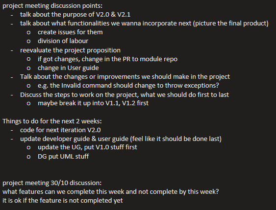
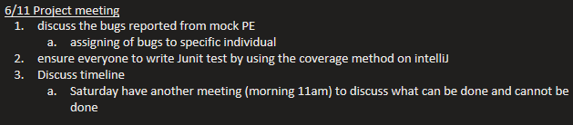
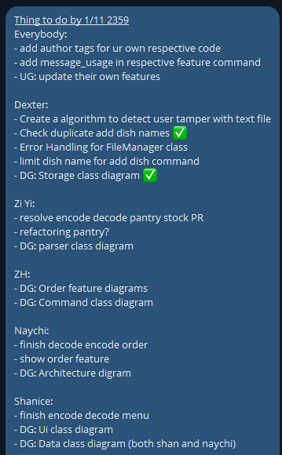
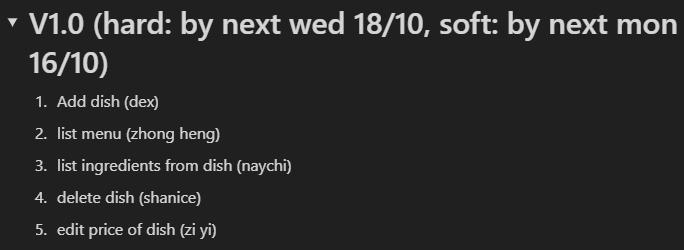

# Dexter Hoon's Project Portfolio Page
## Project: CafeCRTL

-----------------------------------------------------------------------------------------------
### **Overview**
CaféCTRL aims to optimize managing of inventory and cash flow in a restaurant. Our CLI platform also empowers users to streamline stock inventory, menu and orders. The user interacts with it using a CLI. It is written in Java, and has about 6 kLoC.

-----------------------------------------------------------------------------------------------

## **Summary of Contributions**

### Code Contribution
[RepoSense Link](https://nus-cs2113-ay2324s1.github.io/tp-dashboard/?search=&sort=groupTitle&sortWithin=title&timeframe=commit&mergegroup=&groupSelect=groupByRepos&breakdown=true&checkedFileTypes=docs~functional-code~test-code&since=2023-09-22&tabOpen=true&tabType=authorship&tabAuthor=DextheChik3n&tabRepo=AY2324S1-CS2113-T17-2%2Ftp%5Bmaster%5D&authorshipIsMergeGroup=false&authorshipFileTypes=docs~functional-code~test-code&authorshipIsBinaryFileTypeChecked=false&authorshipIsIgnoredFilesChecked=false)

### Enhancements implemented
#### Feature
* **Add Dish**  
    Function: To allow the user to add a dish with the price and its ingredients to the menu 
  * The most crucial feature in the application in order for all the other features to perform their functions, which had to handle many arguments such as the names, price and quantity.
* **Exit**  
    Function: To exit from the application
  * Implemented the backend logic in the main class in order to detect the user entered the `bye` keyword in order to exit from the application which was important to allow the storage to text file functionality to work

### Enhancement
* Created the methods for reading and writing files in FileManager.java
* Created the regex patterns for most of the command features  
  * Required effort in learning how to format the regex string in order to get the specific intended user inputs 
* Created a ParserException class to allow for the use of handling specific errors 
e.g checking for repeated dish/ingredient name, invalid price type, missing arguments, etc.

### Contributions to the UG
* Added documentation for the features: "add dish" and "exit" application
* Added "Quick Start", "Notes about command format" and "Known Issues" section

### Contributions to the DG
* Add implementation for "Add dish" feature
* Add implementation for the Storage class

### Contributions to team-based tasks
* Setting up the GitHub team org/repo
* Created the main `CafeCtrl` class and the basic data objects such as `Menu`, `Ingredient` and `Dish`
* Maintaining a bit of Gradle file
* Maintaining the issue tracker, specifically creating the tags and assigning issues to team members with Zi Yi
* Managed releases v1.0, v2.0
* Approving and merging PRs

### Review/mentoring contributions
* Examples of PRs reviewed:
[#98](https://github.com/AY2324S1-CS2113-T17-2/tp/pull/98), [#119](https://github.com/AY2324S1-CS2113-T17-2/tp/pull/119), [#190](https://github.com/AY2324S1-CS2113-T17-2/tp/pull/190)
* Managed the project team discussions by providing a meeting outline  
  
 
* Provided a summary of the division of labour after meetings  
* 
  
   

### Contributions beyond the project team
Reported bugs and suggestions for other teams in the class  
(example: [#19](https://github.com/nus-cs2113-AY2324S1/tp/pull/19))
