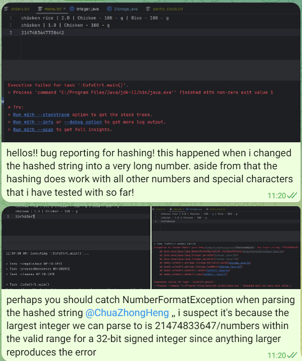

# Naychi Min - Project Portfolio Page
**Project: CafeCRTL**

-----------------------------------------------------------------------------------------------
## **Overview**
CaféCTRL is a software engineering project for CS2113. The user interacts with the application through CLI. It has around 6 kLoC, and it is done in a team of 5.

## **Value Proposition**
CaféCRTL aims to optimize managing of inventory and cash flow in a restaurant. Our CLI platform empowers Café proprietors to streamline inventory and menu management.

## **Target User**
Café proprietors who prefer typing on CLI than any other interaction method and are seeking for a software solution to optimize the management of their café's operations.

-----------------------------------------------------------------------------------------------
## Summary of Contributions

### Code Contribution
[Click here to see my code contribution!](https://nus-cs2113-ay2324s1.github.io/tp-dashboard/?search=&sort=groupTitle&sortWithin=title&timeframe=commit&mergegroup=&groupSelect=groupByRepos&breakdown=true&checkedFileTypes=functional-code~test-code~docs&since=2023-09-22&tabOpen=true&tabType=authorship&zFR=false&tabAuthor=NaychiMin&tabRepo=AY2324S1-CS2113-T17-2%2Ftp%5Bmaster%5D&authorshipIsMergeGroup=false&authorshipFileTypes=functional-code~test-code~docs&authorshipIsBinaryFileTypeChecked=false&authorshipIsIgnoredFilesChecked=false)

### Enhancements implemented

#### Feature

1. **List Ingredient**
    - Function: Allow the user to view the ingredients of the desired dish from the menu.
    - Command Format: `list_ingredient dish/INDEX_OF_DISH_TO_LIST`
    - Error Handling: If the specified index is out of range, of a wrong argument type or is empty.
2. **List Total Sales**
    - Function: Allow the user to view the sale for each day across every day since the cafe has operated.
    - Command Format: `list_total_sales`
    - Error Handling: If the command has unnecessary arguments after the command.
3. **Show Sale By Day** 
    - Function: Allow the user to view the sale for the desired day.  
    - Command Format: `list_sale day/DAY_TO_LIST`  
    - Error Handling: If the specified index is out of range, of a wrong argument type, is empty or the argument tag is missing.
4. **Data processing of 'add_order'**
   - My group mate (Cazh1) did the parsing of the command, along with the implementation of needed classes such as Order, OrderList and Chef.
   - My role was to seamlessly handle the logic of the data being processed after an order was added to an orderList for the following purposes:
     - Order completion determination and Restocking ingredient identification

#### Enhancements
1. **Pantry Class**
    - Collaborated with my group mate (ShaniceTang) to develop the Pantry class.
    - ShaniceTang focused on the buying and restocking of pantry ingredients, as detailed in her PPP.
    - My role, outlined in point 4 above, involved implementing key functions, including:
        - `isDishCooked`:
            - Implemented to determine the success of an order.
            - The accurate execution of this function is crucial for the overall success of order processing as it affects other operations of the cafe, such as the amount of total sales to be displayed to users.
        - `calculateDishAvailability`:
            - Informs the user of the available quantity for each dish in the menu after each order.
            - Provides essential insights into the real-time status of dish availability, alerting users of the availability of each dish in the menu.
        - `calculateMaxDishes`:
            - Handles the logic for calculating the number of dishes made.
            - Manages the complex logic for determining restocked ingredients and their required quantities.
    - Pantry Class Development:
      - Creating the Pantry class was a significant learning opportunity, especially given my initial unfamiliarity with Object-Oriented Programming (OOP) concepts. Developing the Pantry class presented a challenge as I had to navigate a crucial learning curve of OOP, and try to ensure the modularity of functions while interacting with various classes. 
      - The exploration of Java stream filter, a concept introduced in lectures, notably enhanced the efficiency of implemented functionality and prevented arrow-head style code.
    - Order and Pantry Coordination:
      - My role served as the link between the add_order and buy_ingredients commands, serving as a cohesive link that unified the data(ingredients) processing aspect of order management.
         - Order Processing: Seamlessly integrating logic for order success determination and the need for Pantry's ingredient stock management.
         - Pantry Stock Management: My active contribution to the Pantry class connected the use of add_order command with subsequent use of the buy_ingredients command, making it a central hub for order processing, dish availability checks, and ingredient restocking prompts.

2. **Encoding of Sales**
    - Implemented encoding for the Sales object, involving:
        - Parsing through various attributes of the Sales object using the delimiter `|`.
        - Storing the data in a text file.

3. **Decoding of Sales**
    - Executed decoding for the Sales object, encompassing:
        - Parsing through the text file and separating contents using the delimiter `|`.
        - Using parsed attributes to instantiate the Sales object for use in other command classes.
    - Implemented error handling during decoding: lines with missing delimiters or incorrect formatting in the text file are filtered out (collaboration with Cazh1).

4. **Parser**
    - Implemented parsing and error handling for the commands listed in the section above.

### Contributions to UG
[UserGuide](https://ay2324s1-cs2113-t17-2.github.io/tp/UserGuide.html)

1. [List Ingredients](https://ay2324s1-cs2113-t17-2.github.io/tp/UserGuide.html#listing-ingredients-needed-for-the-selected-dish--list_ingredients)
2. [List Total Sales](https://ay2324s1-cs2113-t17-2.github.io/tp/UserGuide.html#showing-total-sales--list_total_sales)
3. [List Sale by day](https://ay2324s1-cs2113-t17-2.github.io/tp/UserGuide.html#showing-sales-for-a-chosen-day--list_sale)

### Contributions to DG
[DeveloperGuide](https://ay2324s1-cs2113-t17-2.github.io/tp/DeveloperGuide.html)
1. Worked with ShaniceTang on the following:
   - [Architecture diagram](https://ay2324s1-cs2113-t17-2.github.io/tp/DeveloperGuide.html#architecture) and overall description of the architecture. 
   - Sequence diagram of [interactions of various components](https://ay2324s1-cs2113-t17-2.github.io/tp/DeveloperGuide.html#how-the-architecture-components-interact-with-each-other) shown in the architecture diagram
   - Drafting data Component class diagram and [description](https://ay2324s1-cs2113-t17-2.github.io/tp/DeveloperGuide.html#data-component)
2. [List Ingredient](https://ay2324s1-cs2113-t17-2.github.io/tp/DeveloperGuide.html#list-ingredients) 
3. [List Sale By Day](https://ay2324s1-cs2113-t17-2.github.io/tp/DeveloperGuide.html#list-sale-by-day)
4. [Pantry - isDishCooked()](https://ay2324s1-cs2113-t17-2.github.io/tp/DeveloperGuide.html#pantry---isdishcooked)
5. [Pantry - calculateMaxDish()](https://ay2324s1-cs2113-t17-2.github.io/tp/DeveloperGuide.html#pantry---calculatemaxdish)

### Other Contributions to Team-based Task
1. Maintaining the issue tracker
2. Testing of application and reporting bugs found. 
   - example:  

### Review / Mentoring Contributions
1. Reviewed and merged some PRs such as [#313](https://github.com/AY2324S1-CS2113-T17-2/tp/pull/313), ...
2. Consulting the group when clarification is needed and actively participating in weekly meetings.

### Contributions Beyond the Project Team
1. Reported bugs in other teams' application: [#157](https://github.com/AY2324S1-CS2113T-W11-2/tp/issues/157), [#141](https://github.com/AY2324S1-CS2113T-W11-2/tp/issues/141), [#172](https://github.com/AY2324S1-CS2113T-W11-2/tp/issues/172), [#145](https://github.com/AY2324S1-CS2113T-W11-2/tp/issues/145)
2. Reviewed other groups tp PRs : [#11](https://github.com/nus-cs2113-AY2324S1/tp/pull/11/files)
