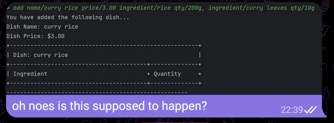
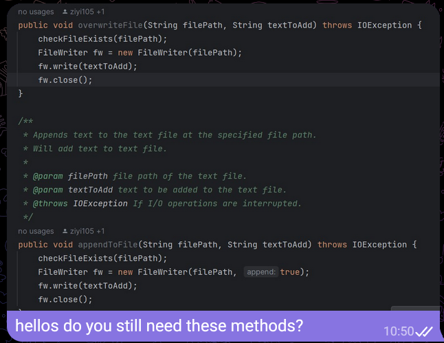

# Shanice Tang - Project Portfolio Page

**Project: CafeCRTL**
-----------------------------------------------------------------------------------------------
## **Overview**
CaféCTRL is a software engineering project for CS2113. The user interacts with the application through CLI. It has around 6 kLoC, and it is done in a team of 5.

## **Value Proposition**
CaféCRTL aims to optimize managing of inventory and cash flow in a restaurant. Our CLI platform empowers Café proprietors to streamline inventory and menu management.

## **Target User**
Café proprietors who prefer typing on CLI than any other interaction method and are seeking for a software solution to optimize the management of their café's operations.

-----------------------------------------------------------------------------------------------
## Summary of Contributions

### Code Contributed
[Click here to see my code contribution :)](https://nus-cs2113-ay2324s1.github.io/tp-dashboard/?search=&sort=groupTitle&sortWithin=title&timeframe=commit&mergegroup=&groupSelect=groupByRepos&breakdown=true&checkedFileTypes=docs~functional-code~test-code&since=2023-09-22&tabOpen=true&tabType=authorship&tabAuthor=ShaniceTang&tabRepo=AY2324S1-CS2113-T17-2%2Ftp%5Bmaster%5D&authorshipIsMergeGroup=false&authorshipFileTypes=docs~functional-code~test-code&authorshipIsBinaryFileTypeChecked=false&authorshipIsIgnoredFilesChecked=false)

### Enhancements Implemented
#### Features
1.  **Delete Dish**  
   - Function: Allow user to delete a specific dish on the menu
   - Command Format: `delete DISH_INDEX` 
   - Error Handling: This command is able to detect missing argument tag, missing argument, and invalid index. The error message will be shown to the user.
         
2.  **Buy Ingredient**  
   - Function: Allow user to add ingredients to the Pantry. If ingredients have been previously added, its quantity will update accordingly 
   - Command Format: `buy_ingredient ingredient/INGREDIENT1_NAME qty/INGREDIENT1_QTY[, ingredient/INGREDIENT2_NAME qty/INGREDIENT2_QTY, ...]` 
   - Error Handling: This command is able to detect the following user errors and outputs the appropriate error messages 
     - Missing argument tag / Missing arguments
     - Quantity value less than 1 or greater than 1,000,000
     - Empty / Invalid Units
         
3.  **View Total Stock**  
   - Function: Allows user to view the total stock currently in the Pantry
   - Command Format: `view_stock`

### Enhancement
1. **Storage** 
- Encoding of Menu object to a readable text file menu.txt
- Decoding of data in menu.txt to Menu object
    
2. **Parser** 
- Implemented parsing for the features listed above
- Improved precision of error handling by adding some checking methods: `isInvalidQty`, `isEmptyUnit`, `isValidUnit`, `checkForMismatchUnit`
    
3. **Pantry** 
- Implemented pantry class together with @NaychiMin which helps user to keep track of their current stock. This enhancement plays a huge role to several commands as it allows the user to smoothly interact with the pantry, hence it is important to ensure its completeness by ensuring it is able to seamlessly handle pantry-related operations.
- Allows user to add ingredients to pantry (through `buy_ingredient`) and updates the quantity of existing ingredients.
- Ensures user uses the same unit for existing ingredients as well as the menu. To allow this to be implemented, I helped modified the Ingredient class to accept units as a separate attribute and helped modify other classes/methods that instantiates an Ingredient object and create a method in Parser `checkForMismatchUnit` to reject mismatching units.
    
4. **Messages & ErrorMessages** 
- Provided meaningful messages that can be easily understood by the user

### Contributions to UG
[UserGuide](https://ay2324s1-cs2113-t17-2.github.io/tp/UserGuide.html)
- Added documentation for the following features: Delete Dish from Menu, Buy Ingredients, View Total Stock, Add Order, Previous Day, Next Day
- Author tagged feature documentation to their respective contributors <3

### Contributions to DG
[DeveloperGuide](https://ay2324s1-cs2113-t17-2.github.io/tp/DeveloperGuide.html)
- Designed various UML diagrams: Architecture Diagram, Ui Component Class Diagram, Data Component Class Diagram, Delete Sequence Diagram
- Added descriptions for Ui component, Delete Command, View Total Stock Command, and Buy Ingredient Command

#### Team-based Task
1. Logging
   - This was challenging as I encountered the issue of the log messages being printed out to system console which ruined the Ui. :( I had to do external research and found a solution to store log messages into a log file without displaying at runtime. :)
2. Maintaining issue tracker
3. Testing application and report bugs found
     

### Review / Mentoring Contributions
1. Reviewed and merged some PRs [#300](https://github.com/AY2324S1-CS2113-T17-2/tp/pull/300), [#322](https://github.com/AY2324S1-CS2113-T17-2/tp/pull/322), [#283](https://github.com/AY2324S1-CS2113-T17-2/tp/pull/283), ...
2. Clarified and updated the team before making major changes to ensure everyone is on the same page <3
   - Ensuring unused methods can be safely deleted with permission from the team member who wrote it
   

### Contributions Beyond the Project Team
1. Reported bugs in other teams' application: [#105](https://github.com/AY2324S1-CS2113-W12-3/tp/issues/105), [#101](https://github.com/AY2324S1-CS2113-W12-3/tp/issues/101)
2. Reviewed other course ip / tp PRs: [#10](https://github.com/nus-cs2113-AY2324S1/ip/pull/10), [#63](https://github.com/nus-cs2113-AY2324S1/ip/pull/63), [#35](https://github.com/nus-cs2113-AY2324S1/tp/pull/35)