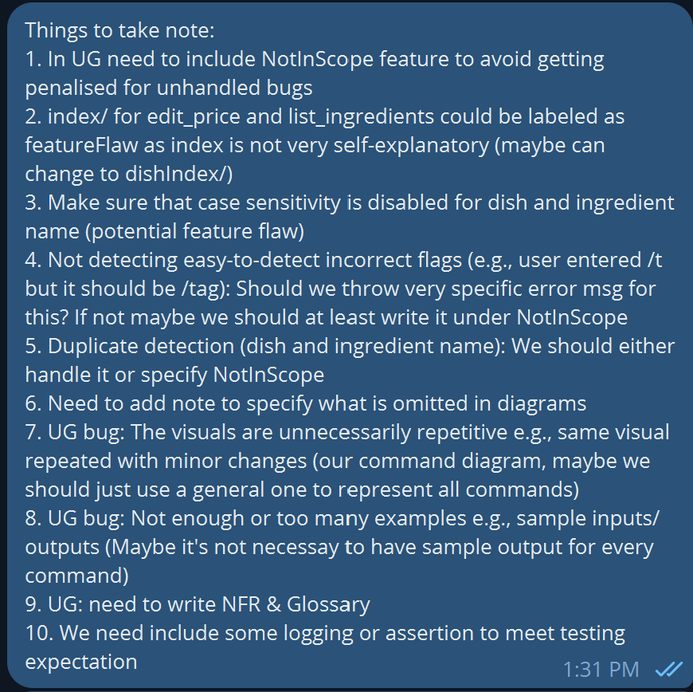

# Wendelin Wemhoener - Project Portfolio Page

## Overview

TaskLinker is a CLI-tool for helping university students memorize flashcards
and track their flashcard and general academic progress in the courses they are
taking.

## Summary of Contributions

### Code Contribution

See my code contribution [here on the tP Code Dashboard](https://nus-cs2113-ay2324s1.github.io/tp-dashboard/?search=wendelinwemhoener&breakdown=true).

I implemented the `flashcard` package and coded all flashcard-related 
features (except for storing the flashcards in a text file for persistence).

I came up with the architecture of having a separate Parser and Ui component 
that work together to process input and create commands from a `command` 
subpackage that consists of the different commands inheriting from either a 
normal `Command` or `DualCommand` abstract class.

After I had developed this architecture for the `flashcard` package, the 
other team members copied my architecture and reused it for the `calendar` 
package. Also, in many cases, they reused my source code: e.g. the source code
of `DualEventCommand.java` in the `calendar.command` package is basically a 
perfect copy of the `DualFlashcardCommand.java` class I created in my 
`flashcard.command` package.

To make understanding my code and architecture easier, I wrote Javadoc for all 
the classes and methods (excluding getters, setters and constructors) I 
developed.

In total, I implemented 1241 lines of functional code, thus accounting for more 
than 44% of functional code produced by the entire team.

Also, I ensured that the build process runs without errors and that the 
text-ui-test passes.

Additionally, I implemented tests for the `flashcard` package and achieved 
100% class coverage with my tests, see here:

#### Enhancements implemented

- **Flashcards**
  - **What it does**: Gives the ability to create, delete, list, and review 
    user-generated flashcards. Spaced repetition review mode allows even 
    more efficient studying than analog flashcards because more difficult 
    flashcards are automatically shown more often until, while easier 
    flashcards are shown fewer times. Handles invalid user input and other 
    potentially occuring exceptions to prevent program crash and allow for 
    graceful recovery. So-called "dual commands" give users the ability to 
    choose between entering commands in an easier, but more time-consuming way
    (for beginner users who want as much guidance as possible) or in a less
    time-consuming, but more complicated way (for expert users who don't need
    additional guidance).
  - **Justification**: Flashcards are first feature we thought of and agreed 
    upon when we planned out TaskLinker. The efficient use of flashcards is 
    the main value proposition of our app and greatly influenced our target 
    user profile. As such, flashcards are the primary component of TaskLinker.
  - **Highlights**: Integrating "dual commands" and ensuring that the 
    program could process the different syntax for beginner and expert mode 
    without duplicating code was challenging, but using inheritance and 
    abstract base classes allowed me to find a neat solution.

### Contributions to the UG

I documented all flashcard-related features: I documented each single 
command with a description, command format and a usage example and 
additionally wrote an explanation about what flashcards are and what the 
"dual commands" are. 

Also, I implemented a structure and formatting that the other team members 
reused.

Moreover, I wrote parts of the UG that are not specific to a feature: I 
wrote the "Introduction", "Quick Start" and "Notes about the command format and 
sample output format" sections and started the "Command Summary". 

In total, I wrote 335 lines of the UG, thus accounting for over 60% of the 
entire user guide.

All in all, the sections written by me are:

- "Introduction"
- "Quick Start"
- "Notes about the command format and sample output format"
- "Flashcard-related features"
- part of "Command Summary"

### Contributions to the DG

I documented all flashcard-related features.

I created three UML diagrams to visualize the structure of the `flashcards` 
package (two class diagrams and one sequence diagram); thus accounting for 
about 43% of UML diagrams in the developer guide.

I also wrote all the flashcard-related user stories.

All in all, the sections written by me are:

- "`flashcard` package" section with all its subsections: "Package structure
  overview", "Rough control flow overview", "`flashcard.command` package",
  "`flashcard.exceptions` package" and "`flashcard.review` package" subsections
- "Target user profile"
- "Value proposition"
- part of "User Stories" 

### Contributions to team-based tasks

- I set up the GitHub team org, created the project board on GitHub and set 
  up the "developers" team on GitHub
- I set up the repo and set up GitHub Pages
- I set up the issue tracker 
- I was responsible for release management (as well as setting up milestones)
- I documented target user profile and value proposition in UG/DG
- I set up the Google Doc we used for coordinating the project in the 
  initial phase and kept it updated with the ongoing changes
- I set up and administrated our Telegram chat group to allow for 
  efficient communication
- I created the majority of user stories for the DG
- I coordinated the weekly meetings

### Review/mentoring contributions: 

Helped my team members with the tasks during the tutorial.

Reviewed team members' code for style guide violations and gave them 
feedback on it (or fixed it myself for them).

### Contributions beyond the project team

I have created multiple forum posts to clarify questions and allow others to 
also profit from the answers. I currently sit at spot 8 on the forum 
activities dashboard, see [link](https://nus-cs2113-ay2324s1.github.io/dashboards/contents/forum-activities.html).
