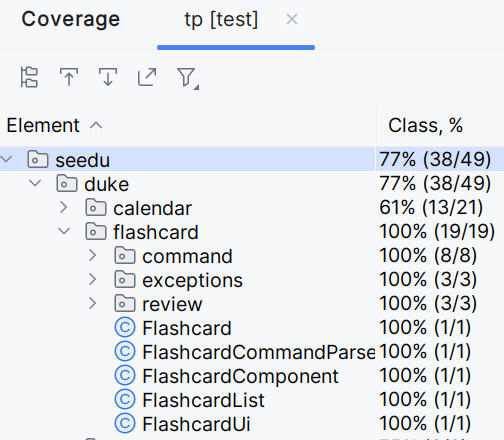

# Wendelin Wemhoener - Project Portfolio Page

## Overview

TaskLinker is a CLI-tool for helping university students memorize flashcards
and track their flashcard and general academic progress in the courses they are
taking.

## Summary of Contributions

### Code Contribution

See my code contribution [here on the tP Code Dashboard](https://nus-cs2113-ay2324s1.github.io/tp-dashboard/?search=wendelinwemhoener&breakdown=true).

I implemented the `flashcard` package and coded all flashcard-related 
features (except for storing the flashcards in a text file for persistence).

I came up with the architecture of having a separate Parser and Ui component 
that work together to process input and create commands from a `command` 
subpackage that consists of the different commands inheriting from either a 
normal `Command` or `DualCommand` abstract class.

After I had developed this architecture for the `flashcard` package, the 
other team members copied my architecture and reused it for the `calendar` 
package. Also, in many cases, they reused my source code: e.g. the source code
of `DualEventCommand.java` in the `calendar.command` package is basically a 
perfect copy of the `DualFlashcardCommand.java` class I created in my 
`flashcard.command` package.

To make understanding my code and architecture easier, I wrote Javadoc for all 
the classes and methods (excluding getters, setters and constructors) I 
developed.

In total, I implemented 1241 lines of functional code, thus accounting for more 
than 44% of functional code produced by the entire team.

Also, I ensured that the build process runs without errors and that the 
text-ui-test passes.

Additionally, I implemented tests for the `flashcard` package and achieved 
100% class coverage with my tests, see here:


### Contributions to the UG

I documented all flashcard-related features: I documented each single 
command with a description, command format and a usage example and 
additionally wrote an explanation about what flashcards are and what the 
"dual commands" are. 

Also, I implemented a structure and formatting that the other team members 
reused.

Moreover, I wrote parts of the UG that are not specific to a feature: I 
wrote the `Introduction`, `Quick Start` and `Notes about the command format and 
sample output format` sections and started the `Command Summary` 

In total, I wrote 335 lines of the UG, thus accounting for over 60% of the 
entire user guide.

### Contributions to the DG

did hyperlinks to make navigation easier

product scope


posted on the forum repeatedly: https://nus-cs2113-ay2324s1.github.io/dashboards/contents/forum-activities.html

### Contributions to team-based tasks

- I set up the GitHub team org, created the project board on GitHub and set 
  up the "developers" team on GitHub
- I set up the repo and set up GitHub Pages
- I set up the issue tracker 
- I was responsible for release management (as well as setting up milestones)
- I documented target user profile and value proposition in UG/DG
- I set up the Google Doc we used for coordinating the project in the 
  initial phase and kept it updated with the ongoing changes
- I set up and administrated our Telegram chat group to allow for 
  efficient communication
- I created the majority of user stories for the DG
- I coordinated the weekly meetings

### Review/mentoring contributions: 

Helped my team members with the tasks during the tutorial.

Reviewed team members' code for style guide violations and gave them 
feedback on it (or fixed it myself for them).

### Contributions beyond the project team

I have created multiple forum posts to clarify questions and allow others to 
also profit from the answers. I currently sit at spot 8 on the forum 
activities dashboard, see [link](https://nus-cs2113-ay2324s1.github.io/dashboards/contents/forum-activities.html).

### Contributions to the User Guide (Extracts)

```markdown
# **User Guide**

## **Introduction**

TaskLinker is a CLI-tool for helping university students memorize flashcards 
and track their flashcard progress as well as general academic progress in 
the courses they are taking.

## **Quick Start**

1. Ensure that you have Java 11 or above installed.
2. Download the latest jar from [the latest release on GitHub](https://github.com/AY2324S1-CS2113-F11-3/tp/releases).
3. Run the jar file via `java -jar duke.jar`

## **Features**

### **Notes about the command format and sample output format:**

#### **Command format**

In the command format, words in UPPER_CASE are the parameters to be 
supplied by the user. e.g. in `delete flashcard FLASHCARD_ID`, FLASHCARD_ID 
is a parameter whose value shall be supplied by the user, e.g. as `delete 
flashcard 3`.

#### **Sample output format**

When sample output is provided, it is shown as a code block.

User input within the example is shown in bold, text printed by the program 
is shown in normal thickness.

E.g. in the following example, the user inputted the command "list 
flashcards" and the program printed out a list of the available flashcards.
<pre>
Enter your command: <b>list flashcards</b>
    Here is a list of all your flashcards: 

--------------------------------------------------------------------------------
front text: How long is a meter in cm?
back text: 100
id: 20
difficulty: 4
--------------------------------------------------------------------------------
front text: What does UML stand for?
back text: Unified Modelling Language
id: 21
difficulty: 6
--------------------------------------------------------------------------------

    Those were all your flashcards.
</pre>

### **Flashcard-related features**

#### **General explanation of flashcards**

Flashcards are two-sided cards that have a question on the front and its 
answer on the back. They are used for revising information and helping with 
memorization. As such, they are often used by students; e.g. medicine students often use 
flashcards to memorize the anatomy of the human body.

TaskLinker implements virtual flashcards that you can create, review and 
delete on the go, without being bound to physical copies.

In TaskLinker, every flashcard has a front text (the question) and a back 
text (the answer). Also, every flashcard has a difficulty attribute that shows 
how hard it is for you to remember this particular flashcard (The higher the
difficulty number, the harder). Every flashcard is identified by a unique id 
(Flashcard ids don't necessarily start at zero and are not necessarily
consecutive. Don't worry, this is totally fine and the planned behavior!).

#### **"Dual Commands": Different input options for beginner vs expert users**

We know that not all users want the same. Same want more simplicity, whilst 
others want more sophisticated tools that speed up their working speed.
To cater to both groups of users, TaskLinker's flashcards features offer
so-called "dual commands" that can be invoked in two different ways: an easy,
but more time-consuming way for beginner users who want as much guidance as
possible; or a less time-consuming, but more complicated way for expert users
who don't need additional guidance.

Currently, the following commands are dual commands:

- [`review flashcards`](#reviewing-your-flashcards-review-flashcards)
- [`delete flashcard`](#deleting-a-flashcard-delete-flashcard)

For more information, see the respective sections explaining their usage.

#### **Listing all flashcards: `list flashcards`**

Prints out a list of all flashcards that shows each flashcard's front text 
and back text as well as its id and current difficulty level.

Command Format: `list flashcards`

Example of usage: 
<pre>
Enter your command: <b>list flashcards</b>
    Here is a list of all your flashcards: 

--------------------------------------------------------------------------------
front text: How long is a meter in cm?
back text: 100
id: 20
difficulty: 4
--------------------------------------------------------------------------------
front text: What does UML stand for?
back text: Unified Modelling Language
id: 21
difficulty: 6
--------------------------------------------------------------------------------

    Those were all your flashcards.
</pre>

#### **Creating a new flashcard: `create flashcard`**

Starts the process of creating a new flashcard.

After entering this command, you are prompted to first input the front page
text (once you have typed it out, submit it by pressing ENTER) and then the
back page text (once you have typed it out, submit it by pressing ENTER) of
your new flashcard.

After you've done this, a success message will be printed out. This
indicates that your new flashcard has been successfully created and saved.

Command Format: `create flashcard`

Example of usage:
<pre>
Enter your command: <b>create flashcard</b>
Enter the front page text: <b>What is a banana?</b>
Enter the back page text: <b>A kind of fruit</b>

Success! Flashcard has been added to your collection.
</pre>

#### **Reviewing your flashcards: `review flashcards`**

Starts the process of reviewing your flashcards.

The `review flashcards` command is a so-called "Dual Command" that can be 
invoked in two different ways: an easy, but more time-consuming way for 
beginner users who want as much guidance as possible; or a less 
time-consuming, but more complicated way for expert users who don't need 
additional guidance.

There are two review modes to choose from: 

- **random mode:** The flashcards to be reviewed are randomly chosen.
- **spaced repetition mode:** Which flashcards are chosen to be reviewed 
  depends on 
  how well you previously knew their contents. Flashcards which you couldn't 
  remember well are shown more often, while flashcards which you remembered well
  are shown less often.

How you chose your review mode differs between the beginner mode and expert 
mode:

- **Choosing review mode in beginner mode:** After you've inputted the 
  `review flashcards` command, in a separate step, you are prompted to select 
  your desired review mode by inputting its respective letter: Input `a` to 
  choose random mode, or input `b` to choose spaced repetition mode.
- **Choosing review mode in expert mode:** You have to already choose the 
  review mode when you input the `review flashcards` command. Thus, you have 
  to use the `review flashcards REVIEW_MODE` format, where REVIEW_MODE has 
  to be either an `a` (for random mode) or a `b` (for spaced repetition mode)
  . Unlike in the beginner mode, there is no separate step for you to 
  choose a review mode from a list of available options as you have already 
  supplied which review mode you want to use via the REVIEW_MODE parameter 
  of the `review flashcards REVIEW_MODE` command format; thus saving you time.

Once you've selected a review mode, the actual review begins.

Firstly, the front page of a flashcard is shown to you. You should now try and
think of the answer (the text on the back page of the flashcard); and once 
you're ready, press ENTER to be shown the back page of the flashcard so you can
compare what you expected to be the answer to the actual answer.

In spaced repetition mode, after you have revealed the back page of a 
flashcard, you are prompted to rate how to difficult it was to remember. 
Select `E` if it was easy, `M` if it was moderately hard and `H` if it was 
quite hard. This information is used to adjust the difficulty of the 
flashcard you just reviewed.

(In random mode, no such process of rating the flashcard's difficulty takes 
place.)

Now, the process repeats and the front page of the next flashcard is shown to 
you.

If you ever want to quit the review process, simply input `q` or `quit` instead
of pressing ENTER to reveal the back page.

##### **Command format and example of usage in beginner mode**

Command Format: `review flashcards`

Example of usage:
<pre>
Enter your command: <b>review flashcards</b>
    How do you want to review your flashcards?
        a) random mode
        b) spaced repetition mode
<b>a</b>
    You have started a review session in random review mode

    ----------------------------------------------------------------------------
    The front text is: What is the boiling point of water?

    Think of the answer (the back text) in your head.
    Press ENTER when you are ready to compare it,
    or enter q or quit to end this review session.

    The actual back text is: 100 degrees Celsius

    ----------------------------------------------------------------------------
    The front text is: What is the boiling point of water?

    Think of the answer (the back text) in your head.
    Press ENTER when you are ready to compare it,
    or enter q or quit to end this review session.
<b>quit</b>
    Success! You have ended this review session.
</pre>

##### **Command format and example of usage in expert mode**

Command Format: `review flashcards REVIEW_MODE` (where REVIEW_MODE has to be 
either an `a` or a `b`)

Example of usage:
<pre>
Enter your command: <b>review flashcards b</b>
    You have started a review session in spaced repetition mode

    ----------------------------------------------------------------------------
    The front text is: What is the boiling point of water?

    Think of the answer (the back text) in your head.
    Press ENTER when you are ready to compare it,
    or enter q or quit to end this review session.

    The actual back text is: 100 degrees Celsius

    How hard was it to remember the back page of this flashcard?
    Input E if it was easy, M if it was moderately challenging 
    or H if it was quite hard.
<b>H</b>
    ----------------------------------------------------------------------------
    The front text is: What is the boiling point of water?

    Think of the answer (the back text) in your head.
    Press ENTER when you are ready to compare it,
    or enter q or quit to end this review session.
<b>q</b>
    Success! You have ended this review session.
</pre>

#### **Deleting a flashcard: `delete flashcard`**

Starts the process of deleting a flashcard.

The `delete flashcard` command is a so-called "Dual Command" that can be
invoked in two different ways: an easy, but more time-consuming way for
beginner users who want as much guidance as possible; or a less
time-consuming, but more complicated way for expert users who don't need
additional guidance.

How you chose which flashcard to delete differs between the beginner mode and
expert mode:

- **Choosing review mode in beginner mode:** After you've inputted the
  `delete flashcard` command, in a separate step, you are prompted to select
  the flashcard you want to delete by inputting its id.
- **Choosing review mode in expert mode:** You have to already choose the
  flashcard you want to delete when you input the `delete flashcard` command.
  Thus, you have to use the `delete flashcards FLASHCARD_ID` format, where
  FLASHCARD_ID is the id of the flashcard you want to delete. Unlike in the
  beginner mode, there is no separate step for you to choose which flashcard you
  want to delete as you have already informed TaskLinker about which flashcard
  you want to delete via the FLASHCARD_ID parameter of the
  `delete flashcards FLASHCARD_ID` command format; thus saving you time.


If the id you provided was a valid id, the flashcard with that id is deleted; 
otherwise, an error message is shown, and you are prompted to retry.

##### **Command format and example of usage in beginner mode**

Command format: `delete flashcard` 

Example of usage:
<pre>
Enter your command: <b>delete flashcard</b>
    Enter id of the flashcard you want to delete: <b>2</b>
    Flashcard with id 2 has been successfully deleted.
</pre>

##### **Command format and example of usage in expert mode**

Command format: `delete flashcard FLASHCARD_ID` (where FLASHCARD_ID is the 
id of the flashcard you want to delete)

Example of usage:
<pre>
Enter your command: <b>delete flashcard 34</b>
    Couldn't find a flashcard with id 34
    No deletion has been performed. Please try again with a valid id.
</pre>

#### **Deleting all flashcards: `delete all flashcards`**

Deletes all flashcards currently stored by TaskLinker.

Format: `delete all flashcards`

Example of usage:
<pre>
Enter your command: <b>delete all flashcards</b>
    All your flashcards have been successfully deleted.
</pre>

## **Command Summary**

* [Listing all flashcards](#listing-all-flashcards-list-flashcards): `list
  flashcards`
* [Creating a new flashcard](#creating-a-new-flashcard-create-flashcard):
  `create flashcard`
* [Reviewing your flashcards](#reviewing-your-flashcards-review-flashcards):
  `review flashcards`
* [Deleting a flashcard](#deleting-a-flashcard-delete-flashcard) `delete
  flashcard`
* [Deleting all flashcards](#deleting-all-flashcards-delete-all-flashcards)
  `delete all flashcards`
```

### Contributions to the Developer Guide (Extracts)

```markdown

```