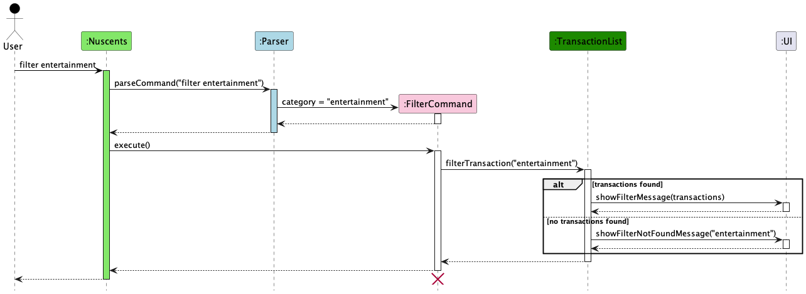

# Kai Ning - Project Portfolio Page

## Overview

CashLeh? is a CLI application mainly supporting working adults and students who struggle with managing finances.
It allows them to set a budget and track both their earnings and spending habits in a seamless way to have a
neat overview of their financial situation.

### Summary of Contributions

* **Code contributed**: [RepoSense link](https://nus-cs2113-ay2324s1.github.io/tp-dashboard/?search=&sort=groupTitle&sortWithin=title&timeframe=commit&mergegroup=&groupSelect=groupByRepos&breakdown=true&checkedFileTypes=docs~functional-code~test-code&since=2023-09-22&tabOpen=true&tabType=authorship&zFR=false&tabAuthor=WooKaiNing&tabRepo=AY2324S1-CS2113-W12-2%2Ftp%5Bmaster%5D&authorshipIsMergeGroup=false&authorshipFileTypes=docs~functional-code~test-code&authorshipIsBinaryFileTypeChecked=false&authorshipIsIgnoredFilesChecked=false)
* **Features**:
    
    * Implemented the basic structure for expense class and related commands (add, delete and view).
    * Implemented the basic structure for the expense statement
    * Added the ability to filter incomes, expenses and transactions.
      * This implementation allows the user to have flexibility in their specified criteria, but minimally 1 criterion must be provided
* **Documentation**:
    * User Guide:
        * Added documentation for expense related commands (add, delete, view), and filter commands (filterIncome, filterExpense, filter)
        * Added expected output for usage examples throughout the entire UG
    * Developer Guide:
        * Added implementation details for the Filter class and included sequence diagram
          
* **Community**:
    * PRs reviewed (with non-trivial review comments): [#33](https://github.com/AY2324S1-CS2113-W12-2/tp/pull/33), [#46](https://github.com/AY2324S1-CS2113-W12-2/tp/pull/46)
    * Report bugs and suggestions for other teams in the class (refer to [repo](https://github.com/WooKaiNing/ped/issues))