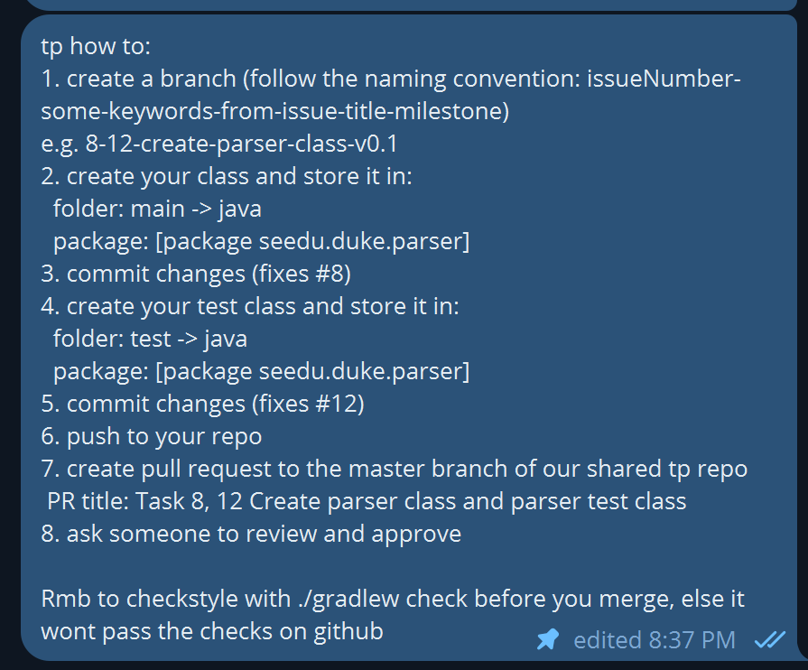
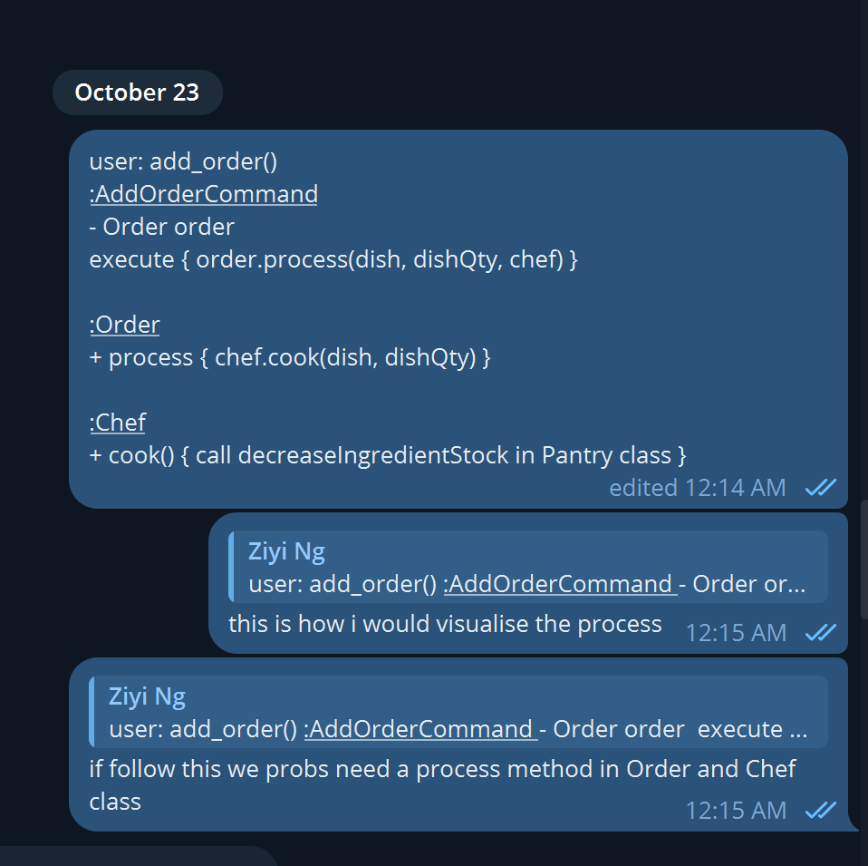
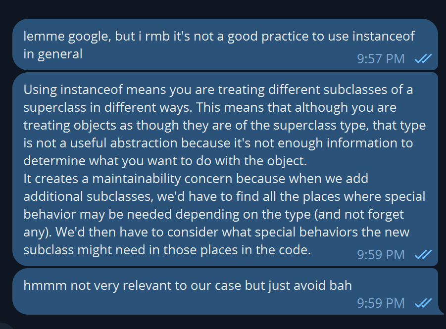
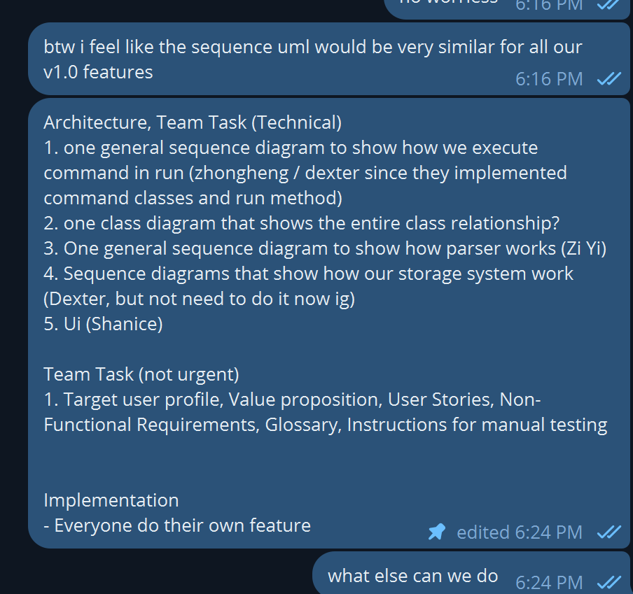
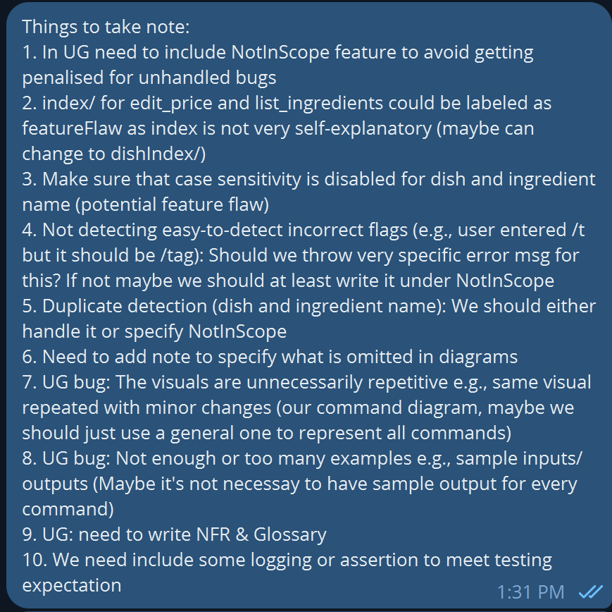

# Zi Yi - Project Portfolio Page

**Project: CafeCRTL**

-----------------------------------------------------------------------------------------------
## **Overview**
CaféCTRL is a software engineering project for CS2113. The user interacts with the application through CLI. It has around 6 kLoC, and it is done in a team of 5.

## **Value Proposition**
CaféCRTL aims to optimize managing of inventory and cash flow in a restaurant. Our CLI platform empowers Café proprietors to streamline inventory and menu management.

-----------------------------------------------------------------------------------------------

## **Summary of Contributions**
### Code Contribution

[Follow here to see code written by me](https://nus-cs2113-ay2324s1.github.io/tp-dashboard/?search=ziyi105&breakdown=false&sort=groupTitle%20dsc&sortWithin=title&since=2023-09-22&timeframe=commit&mergegroup=&groupSelect=groupByRepos&tabOpen=true&tabType=authorship&tabAuthor=ziyi105&tabRepo=AY2324S1-CS2113-T17-2%2Ftp%5Bmaster%5D&authorshipIsMergeGroup=false&authorshipFileTypes=docs~functional-code~test-code&authorshipIsBinaryFileTypeChecked=false&authorshipIsIgnoredFilesChecked=false)

### Enhancements implemented

#### Feature

1.  **Edit Price**  
    Function: Allow user to edit price of the dish on the menu
    Command Format: `edit_price dish/DISH_INDEX price/NEW_PRICE` 
    Error Handling: This command is able to detect missing argument tag, argument, wrong argument type, empty argument and same price. Specific error message will be shown to give user hint.
     
   2.  **Help**  
       Function: Print out a list of commands and their usages to the user  
       Extra info: This feature requires constant updating whenever a new feature is added. It is also very tedious to implement Junit test as the output is very long and keeps changing. Hence, I removed the Junit test in the last iteration as I feel that it is not necessary to have Junit test for a trivial `help` command.
     
3.  **Encoding & Decoding of Pantry Stock Storage File**  
    Error Handling: This command will still check for the validity of each argument (e.g., length of ingredient name, type of unit), and skip the particular ingredient if any of the arguments is not valid. This can prevent the user from accidentally adding invalid ingredients to the text file.

### Enhancements
1. **Storage** 
   [Relevant PR](https://github.com/AY2324S1-CS2113-T17-2/tp/pull/143)  
   - Read and learned from the storage system in addressbook level 3 and adopted it in our project.
   - Implemented `Encoder.java`, `Decoder.java` and `Storage.java` with skeleton methods for my teammates to implement. 
     
2. **Parser** 
   Created `Parser.java` for other teammates to use. Implemented ParserUtil interface to reduce coupling of Parser.java and CafeCRTL.java.
    
3. **Messages & ErrorMessages** 
   Created classes to store all messages to the user as static constant.
     
4. **Parser Regex**  
   [Relevant PR](https://github.com/AY2324S1-CS2113-T17-2/tp/pull/51)  
   - Learned `Pattern` and `Matcher` API by referring to addressbook and online documentations.
   - Created regex `COMMAND_ARGUMENT_FORMAT`, `ADD_ARGUMENT_STRING`, `LIST_INGREDIENT_ARGUMENT_STRING`, `DELETE_ARGUMENT_STRING` and `EDIT_PRICE_ARGUMENT_STRING`. 
   - Created a skeleton method body of `prepare_add` method using pattern and matcher, and added some basic explanations on how to use them for Dexter to follow and implement the feature.

### Contributions to UG
[UserGuide](https://ay2324s1-cs2113-t17-2.github.io/tp/UserGuide.html)

#### Individual Task
1. Edit price
2. Help

#### Team-based Task
1. Table of Contents
2. Introduction
3. Known Issues
4. Glossary
5. General formatting

### Contributions to DG
[DeveloperGuide](https://ay2324s1-cs2113-t17-2.github.io/tp/DeveloperGuide.html)
#### Individual Task
1. Parser component
2. Edit Price
3. Help
4. Future Enhancements

#### Team-based Task
1. Table of Contents
2. Acknowledgement
3. Setting up, getting started
4. Product Scope
5. Non-Functional Requirements
6. Glossary
7. General formatting
   - Ensure consistency of features descriptions and diagrams
   - Correct typos and grammar errors
8. Manual testing guide

### Other Contributions to Team-based Task
1. Maintaining issue tracker with Dexter by labeling issues
2. Approving and merging PRs
3. Checking coding standard for most of the classes ([PR #351](https://github.com/AY2324S1-CS2113-T17-2/tp/pull/351))
4. Reminding team members to use github effectively (although some of my reminders were ignored :")
    - I encouraged my team members to report bugs using issue tracker on Github instead of using Telegram. (e.g., [#323](https://github.com/AY2324S1-CS2113-T17-2/tp/issues/323))
5. Testing of features done my other team members
    - [#382](https://github.com/AY2324S1-CS2113-T17-2/tp/issues/382), [#381](https://github.com/AY2324S1-CS2113-T17-2/tp/issues/381). [#372](https://github.com/AY2324S1-CS2113-T17-2/tp/issues/372), [#349](https://github.com/AY2324S1-CS2113-T17-2/tp/issues/349)

### Review/Mentoring Contributions
1. Reviewed and approved 52 PRs in total.
   Some examples of PR reviewed: [#167](https://github.com/AY2324S1-CS2113-T17-2/tp/pull/167), [#106](https://github.com/AY2324S1-CS2113-T17-2/tp/pull/106), [#57](https://github.com/AY2324S1-CS2113-T17-2/tp/pull/57),
   [#96](https://github.com/AY2324S1-CS2113-T17-2/tp/pull/96)
2. Created a tp howto to guide teammates on how to start coding tp 
   
3. Shared my opinions in Telegram group.
   
   
   
4. Read and compile important information on course website 
   

### Contributions beyond the Project Team
1. Posted 9 posts in the forum.
   Examples of forum posts: [#37](https://github.com/nus-cs2113-AY2324S1/forum/issues/37), [#19](https://github.com/nus-cs2113-AY2324S1/forum/issues/19), [#31](https://github.com/nus-cs2113-AY2324S1/forum/issues/31)
2. Reviews on PR from other teams: [T18-1](https://github.com/nus-cs2113-AY2324S1/tp/pull/19#discussion_r1379823357), [F11-3](https://github.com/nus-cs2113-AY2324S1/tp/pull/28)